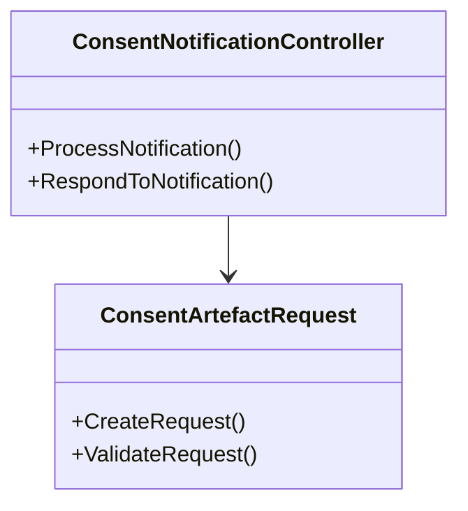

# What is Consent Management

Consent management refers to the process of managing patient permissions for accessing and sharing their health information. It involves creating, storing, and handling consent artifacts, which are digital records of the patient's consent.

# How Consent Management is Implemented

The <SwmToken path="src/In.ProjectEKA.HipService/Consent/ConsentNotificationController.cs" pos="5:8:8" line-data="namespace In.ProjectEKA.HipService.Consent">`Consent`</SwmToken> namespace includes various classes and methods to handle consent-related operations. Key components include `ConsentRepository`, `ConsentController`, and <SwmToken path="src/In.ProjectEKA.HipService/Consent/ConsentArtefactRequest.cs" pos="5:5:5" line-data="    public class ConsentArtefactRequest">`ConsentArtefactRequest`</SwmToken>.

<SwmSnippet path="/src/In.ProjectEKA.HipService/Consent/ConsentNotificationController.cs" line="1">

---

The <SwmToken path="src/In.ProjectEKA.HipService/Consent/ConsentNotificationController.cs" pos="19:5:5" line-data="    public class ConsentNotificationController : ControllerBase">`ConsentNotificationController`</SwmToken> handles notifications related to consent, ensuring that all parties are informed about the consent status. It includes methods to process and respond to consent notifications.

```c#
// ReSharper disable MemberCanBePrivate.Global

using In.ProjectEKA.HipService.Common;

namespace In.ProjectEKA.HipService.Consent
{
    using System;
    using System.Threading.Tasks;
    using Common.Model;
    using Gateway;
    using Gateway.Model;
    using Hangfire;
    using HipLibrary.Patient.Model;
    using Microsoft.AspNetCore.Mvc;
    using Model;
    using static Common.Constants;

    [ApiController]
    public class ConsentNotificationController : ControllerBase
    {
```

---

</SwmSnippet>

# Key Classes and Their Roles

The <SwmToken path="src/In.ProjectEKA.HipService/Consent/ConsentNotificationController.cs" pos="5:8:8" line-data="namespace In.ProjectEKA.HipService.Consent">`Consent`</SwmToken> class in the <SwmToken path="src/In.ProjectEKA.HipService/Consent/ConsentNotificationController.cs" pos="9:5:5" line-data="    using Common.Model;">`Model`</SwmToken> namespace represents the consent artifact, including properties like `ConsentArtefactId`, `ConsentManagerId`, and <SwmToken path="src/In.ProjectEKA.HipService/Consent/ConsentArtefactRequest.cs" pos="12:1:1" line-data="            Status = status;">`Status`</SwmToken>.

<SwmSnippet path="/src/In.ProjectEKA.HipService/Consent/ConsentArtefactRequest.cs" line="1">

---

The <SwmToken path="src/In.ProjectEKA.HipService/Consent/ConsentArtefactRequest.cs" pos="5:5:5" line-data="    public class ConsentArtefactRequest">`ConsentArtefactRequest`</SwmToken> class is used to create and manage requests for consent artifacts. It includes properties and methods to handle the creation and validation of consent requests.

```c#
namespace In.ProjectEKA.HipService.Consent
{
    using Common.Model;

    public class ConsentArtefactRequest
    {
        public ConsentArtefactRequest(string signature, ConsentArtefact consentDetail, ConsentStatus status,
            string consentId)
        {
            Signature = signature;
            ConsentDetail = consentDetail;
            Status = status;
            ConsentId = consentId;
        }

        public string Signature { get; set; }
        public ConsentArtefact ConsentDetail { get; set; }
        public ConsentStatus Status { get; set; }
        public string ConsentId { get; set; }
    }
```

---

</SwmSnippet>



&nbsp;

*This is an auto-generated document by Swimm 🌊 and has not yet been verified by a human*

<SwmMeta version="3.0.0" repo-id="Z2l0aHViJTNBJTNBaGlwLXNlcnZpY2UlM0ElM0FTd2ltbS1EZW1v" repo-name="hip-service"><sup>Powered by [Swimm](/)</sup></SwmMeta>
