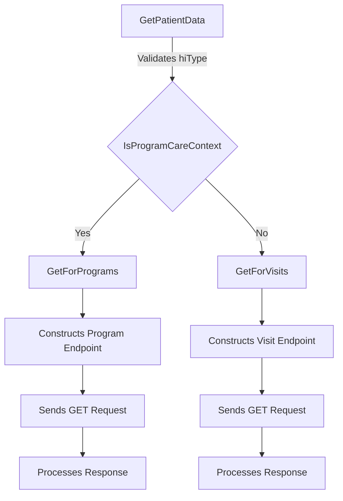

# Overview of Data Flow in HIP Service

Data flow refers to the process of collecting, processing, and transferring health information within the HIP Service. It ensures that data is managed efficiently and securely throughout its lifecycle.

# Data Flow Components

The data flow process involves several components: `DataFlowMessageHandler` handles data flow messages, <SwmToken path="src/In.ProjectEKA.HipService/DataFlow/DataFlowClient.cs" pos="16:5:5" line-data="    public class DataFlowClient">`DataFlowClient`</SwmToken> communicates with external services, `DataFlowRepository` manages data storage and retrieval, `DataFlowController` handles API endpoints, `DataFlowConfiguration` contains configuration settings, `DataFlowContext` defines the database context, and `DataFlowRequest` and `DataFlowRequestResponse` represent data structures for requests and responses.

# Data Flow in Action

The <SwmToken path="src/In.ProjectEKA.HipService/DataFlow/DataFlowClient.cs" pos="16:5:5" line-data="    public class DataFlowClient">`DataFlowClient`</SwmToken> class demonstrates how data flow is used to communicate with external services to facilitate the data transfer process.

<SwmSnippet path="/src/In.ProjectEKA.HipService/DataFlow/DataFlowClient.cs" line="16">

---

The <SwmToken path="src/In.ProjectEKA.HipService/DataFlow/DataFlowClient.cs" pos="16:5:5" line-data="    public class DataFlowClient">`DataFlowClient`</SwmToken> class is responsible for sending data to the Health Information User (HIU). It uses an HTTP client to post data to the specified URL.

```c#
    public class DataFlowClient
    {
        private readonly DataFlowNotificationClient dataFlowNotificationClient;
        private readonly GatewayConfiguration gatewayConfiguration;
        private readonly HttpClient httpClient;

        public DataFlowClient(HttpClient httpClient,
            DataFlowNotificationClient dataFlowNotificationClient,
            GatewayConfiguration gatewayConfiguration)
        {
            this.httpClient = httpClient;
            this.dataFlowNotificationClient = dataFlowNotificationClient;
            this.gatewayConfiguration = gatewayConfiguration;
        }

        public virtual async Task SendDataToHiu(TraceableDataRequest dataRequest,
            IEnumerable<Entry> data,
            KeyMaterial keyMaterial)
        {
            await PostTo(dataRequest.ConsentId,
                dataRequest.DataPushUrl,
```

---

</SwmSnippet>

# Data Flow Endpoints

The <SwmToken path="src/In.ProjectEKA.HipService/DataFlow/OpenMrsPatientData.cs" pos="40:12:12" line-data="        public async Task&lt;List&lt;string&gt;&gt; GetPatientData(string patientUuid, string careContextReference, string toDate,">`GetPatientData`</SwmToken> method retrieves patient data based on the provided parameters such as patient UUID, care context reference, date range, and health information type. It checks if the health information type is valid and determines whether the care context is a program or a visit. Depending on the care context, it calls either <SwmToken path="src/In.ProjectEKA.HipService/DataFlow/OpenMrsPatientData.cs" pos="45:5:5" line-data="                return await GetForVisits(hiType, patientUuid, careContextReference, toDate, fromDate);">`GetForVisits`</SwmToken> or <SwmToken path="src/In.ProjectEKA.HipService/DataFlow/OpenMrsPatientData.cs" pos="54:5:5" line-data="            return await GetForPrograms(hiType, patientUuid, programName, programId, toDate, fromDate);">`GetForPrograms`</SwmToken> to fetch the data.

<SwmSnippet path="/src/In.ProjectEKA.HipService/DataFlow/OpenMrsPatientData.cs" line="40">

---

The <SwmToken path="src/In.ProjectEKA.HipService/DataFlow/OpenMrsPatientData.cs" pos="40:12:12" line-data="        public async Task&lt;List&lt;string&gt;&gt; GetPatientData(string patientUuid, string careContextReference, string toDate,">`GetPatientData`</SwmToken> method validates the health information type and determines the care context to fetch the appropriate data.

```c#
        public async Task<List<string>> GetPatientData(string patientUuid, string careContextReference, string toDate,
            string fromDate, string hiType)
        {
            if (!hiTypeToRootElement.ContainsKey(hiType)) return new List<string>();
            if (!IsProgramCareContext(careContextReference))
                return await GetForVisits(hiType, patientUuid, careContextReference, toDate, fromDate);
            var programName = careContextReference
                .Substring(0, careContextReference.IndexOf("(", StringComparison.Ordinal))
                .Trim();
            var indexOfClosingBracket = careContextReference.IndexOf(")", StringComparison.Ordinal);
            var indexOfColon = careContextReference.IndexOf(":", StringComparison.Ordinal);
            var programId = careContextReference
                .Substring(indexOfColon + 1, indexOfClosingBracket - indexOfColon - 1)
                .Trim();
            return await GetForPrograms(hiType, patientUuid, programName, programId, toDate, fromDate);
        }
```

---

</SwmSnippet>

## <SwmToken path="src/In.ProjectEKA.HipService/DataFlow/OpenMrsPatientData.cs" pos="45:5:5" line-data="                return await GetForVisits(hiType, patientUuid, careContextReference, toDate, fromDate);">`GetForVisits`</SwmToken>

The <SwmToken path="src/In.ProjectEKA.HipService/DataFlow/OpenMrsPatientData.cs" pos="45:5:5" line-data="                return await GetForVisits(hiType, patientUuid, careContextReference, toDate, fromDate);">`GetForVisits`</SwmToken> method constructs the endpoint URL for fetching visit-related data. It builds a query string with the necessary parameters and logs the endpoint being called. The method then sends a GET request to the constructed URL using the <SwmToken path="src/In.ProjectEKA.HipService/DataFlow/OpenMrsPatientData.cs" pos="27:7:7" line-data="        private readonly IOpenMrsClient openMrsClient;">`openMrsClient`</SwmToken> and processes the response to extract the required data.

<SwmSnippet path="/src/In.ProjectEKA.HipService/DataFlow/OpenMrsPatientData.cs" line="57">

---

The <SwmToken path="src/In.ProjectEKA.HipService/DataFlow/OpenMrsPatientData.cs" pos="57:12:12" line-data="        private async Task&lt;List&lt;string&gt;&gt; GetForVisits(string hiType, string consentId, string grantedContext,">`GetForVisits`</SwmToken> method constructs the endpoint URL, sends a GET request, and processes the response to fetch visit-related data.

```c#
        private async Task<List<string>> GetForVisits(string hiType, string consentId, string grantedContext,
            string toDate,
            string fromDate)
        {
            var pathForVisit = $"{Constants.PATH_OPENMRS_HITYPE}{hiTypeToRootElement[hiType]}/visit/";
            var query = HttpUtility.ParseQueryString(string.Empty);
            if (
                !string.IsNullOrEmpty(consentId) &&
                !string.IsNullOrEmpty(grantedContext) &&
                !string.IsNullOrEmpty(toDate) &&
                !string.IsNullOrEmpty(fromDate)
            )
            {
                var careContexReference = grantedContext.Split(":");
                query["patientId"] = consentId;
                query["visitUuid"] = careContexReference[1];
                query["fromDate"] = DateTime.Parse(fromDate).ToString("yyyy-MM-dd");
                query["toDate"] = DateTime.Parse(toDate).AddDays(1).ToString("yyyy-MM-dd");
            }

            if (query.ToString() != "")
```

---

</SwmSnippet>



&nbsp;

*This is an auto-generated document by Swimm 🌊 and has not yet been verified by a human*

<SwmMeta version="3.0.0" repo-id="Z2l0aHViJTNBJTNBaGlwLXNlcnZpY2UlM0ElM0FTd2ltbS1EZW1v" repo-name="hip-service"><sup>Powered by [Swimm](/)</sup></SwmMeta>
