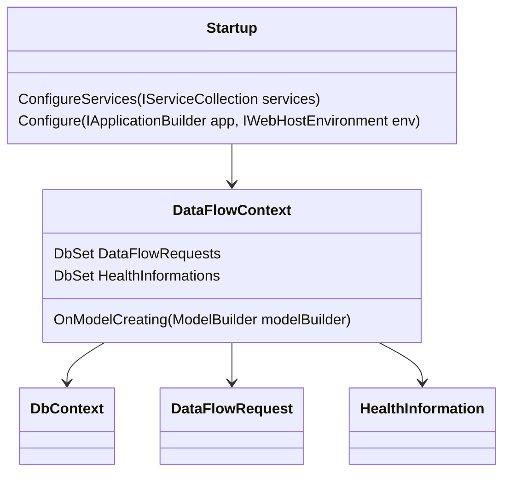

# Overview of Database in Data Flow

The database is used to store and manage data related to data flow requests and health information. This document provides an overview of how the database is integrated and utilized within the data flow process.

# <SwmToken path="src/In.ProjectEKA.HipService/DataFlow/Database/Migrations/20200226055335_AddHealthInformationTable.Designer.cs" pos="12:6:6" line-data="    [DbContext(typeof(DataFlowContext))]">`DataFlowContext`</SwmToken> Class

The <SwmToken path="src/In.ProjectEKA.HipService/DataFlow/Database/Migrations/20200226055335_AddHealthInformationTable.Designer.cs" pos="12:6:6" line-data="    [DbContext(typeof(DataFlowContext))]">`DataFlowContext`</SwmToken> class, which inherits from <SwmToken path="src/In.ProjectEKA.HipService/DataFlow/Database/Migrations/20200226055335_AddHealthInformationTable.Designer.cs" pos="12:2:2" line-data="    [DbContext(typeof(DataFlowContext))]">`DbContext`</SwmToken>, is the primary class responsible for interacting with the database. It contains `DbSet` properties for <SwmToken path="src/In.ProjectEKA.HipService/DataFlow/Database/Migrations/20200226055335_AddHealthInformationTable.Designer.cs" pos="24:16:16" line-data="            modelBuilder.Entity(&quot;In.ProjectEKA.HipService.DataFlow.Model.DataFlowRequest&quot;, b =&gt;">`DataFlowRequest`</SwmToken> and <SwmToken path="src/In.ProjectEKA.HipService/DataFlow/Database/Migrations/20200226055335_AddHealthInformationTable.Designer.cs" pos="37:16:16" line-data="            modelBuilder.Entity(&quot;In.ProjectEKA.HipService.DataFlow.Model.HealthInformation&quot;, b =&gt;">`HealthInformation`</SwmToken>, which represent tables in the database.

# Configuring the Model

The `OnModelCreating` method in <SwmToken path="src/In.ProjectEKA.HipService/DataFlow/Database/Migrations/20200226055335_AddHealthInformationTable.Designer.cs" pos="12:6:6" line-data="    [DbContext(typeof(DataFlowContext))]">`DataFlowContext`</SwmToken> configures the model and its relationships using the <SwmToken path="src/In.ProjectEKA.HipService/DataFlow/Database/Migrations/20200226055335_AddHealthInformationTable.Designer.cs" pos="16:9:9" line-data="        protected override void BuildTargetModel(ModelBuilder modelBuilder)">`ModelBuilder`</SwmToken>. This method is crucial for defining the schema and relationships between different entities in the database.

# Database Initialization and Migration

The database is initialized and migrated in the `Startup` class to ensure the schema is up-to-date. Migrations are used to create and update the database schema, as seen in the <SwmToken path="src/In.ProjectEKA.HipService/DataFlow/Database/Migrations/20200226055335_AddHealthInformationTable.Designer.cs" pos="6:6:6" line-data="using Microsoft.EntityFrameworkCore.Migrations;">`Migrations`</SwmToken> folder.

<SwmSnippet path="/src/In.ProjectEKA.HipService/DataFlow/Database/Migrations/20200226055335_AddHealthInformationTable.Designer.cs" line="3">

---

The migration files, such as `AddHealthInformationTable.Designer.cs`, are used to manage changes to the database schema. These files are located in the <SwmToken path="src/In.ProjectEKA.HipService/DataFlow/Database/Migrations/20200226055335_AddHealthInformationTable.Designer.cs" pos="6:6:6" line-data="using Microsoft.EntityFrameworkCore.Migrations;">`Migrations`</SwmToken> folder and are essential for keeping the database schema in sync with the application's data model.

```c#
using In.ProjectEKA.HipService.DataFlow.Database;
using Microsoft.EntityFrameworkCore;
using Microsoft.EntityFrameworkCore.Infrastructure;
using Microsoft.EntityFrameworkCore.Migrations;
using Microsoft.EntityFrameworkCore.Storage.ValueConversion;
using Npgsql.EntityFrameworkCore.PostgreSQL.Metadata;

namespace In.ProjectEKA.HipService.DataFlow.Database.Migrations
```

---

</SwmSnippet>



&nbsp;

*This is an* <SwmToken path="src/In.ProjectEKA.HipService/DataFlow/Database/Migrations/20200226055335_AddHealthInformationTable.Designer.cs" pos="1:4:6" line-data="// &lt;auto-generated /&gt;">`auto-generated`</SwmToken> *document by Swimm 🌊 and has not yet been verified by a human*

<SwmMeta version="3.0.0" repo-id="Z2l0aHViJTNBJTNBaGlwLXNlcnZpY2UlM0ElM0FTd2ltbS1EZW1v" repo-name="hip-service"><sup>Powered by [Swimm](/)</sup></SwmMeta>
