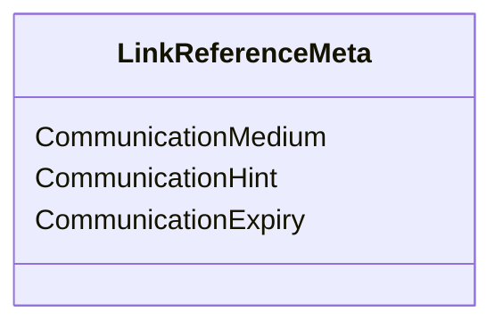

# What is Link Reference Metadata

Link Reference Metadata is encapsulated in the <SwmToken path="src/In.ProjectEKA.HipLibrary/Patient/Model/LinkReferenceMeta.cs" pos="5:3:3" line-data="        public LinkReferenceMeta(string communicationMedium, string communicationHint, string communicationExpiry)">`LinkReferenceMeta`</SwmToken> class. This class contains metadata related to the communication medium used for linking a patient's account. It includes details such as the medium of communication, a hint for the communication, and the expiry time for the communication.

# Properties of <SwmToken path="src/In.ProjectEKA.HipLibrary/Patient/Model/LinkReferenceMeta.cs" pos="5:3:3" line-data="        public LinkReferenceMeta(string communicationMedium, string communicationHint, string communicationExpiry)">`LinkReferenceMeta`</SwmToken>

The <SwmToken path="src/In.ProjectEKA.HipLibrary/Patient/Model/LinkReferenceMeta.cs" pos="5:3:3" line-data="        public LinkReferenceMeta(string communicationMedium, string communicationHint, string communicationExpiry)">`LinkReferenceMeta`</SwmToken> class has three main properties: <SwmToken path="src/In.ProjectEKA.HipLibrary/Patient/Model/LinkReferenceMeta.cs" pos="7:1:1" line-data="            CommunicationMedium = communicationMedium;">`CommunicationMedium`</SwmToken>, <SwmToken path="src/In.ProjectEKA.HipLibrary/Patient/Model/LinkReferenceMeta.cs" pos="8:1:1" line-data="            CommunicationHint = communicationHint;">`CommunicationHint`</SwmToken>, and <SwmToken path="src/In.ProjectEKA.HipLibrary/Patient/Model/LinkReferenceMeta.cs" pos="9:1:1" line-data="            CommunicationExpiry = communicationExpiry;">`CommunicationExpiry`</SwmToken>.

## <SwmToken path="src/In.ProjectEKA.HipLibrary/Patient/Model/LinkReferenceMeta.cs" pos="7:1:1" line-data="            CommunicationMedium = communicationMedium;">`CommunicationMedium`</SwmToken>

The <SwmToken path="src/In.ProjectEKA.HipLibrary/Patient/Model/LinkReferenceMeta.cs" pos="7:1:1" line-data="            CommunicationMedium = communicationMedium;">`CommunicationMedium`</SwmToken> property stores the type of communication medium used, such as MOBILE or EMAIL.

<SwmSnippet path="/src/In.ProjectEKA.HipLibrary/Patient/Model/LinkReferenceMeta.cs" line="12">

---

The <SwmToken path="src/In.ProjectEKA.HipLibrary/Patient/Model/LinkReferenceMeta.cs" pos="12:5:5" line-data="        public string CommunicationMedium { get; }">`CommunicationMedium`</SwmToken> property is defined in the <SwmToken path="src/In.ProjectEKA.HipLibrary/Patient/Model/LinkReferenceMeta.cs" pos="5:3:3" line-data="        public LinkReferenceMeta(string communicationMedium, string communicationHint, string communicationExpiry)">`LinkReferenceMeta`</SwmToken> class.

```c#
        public string CommunicationMedium { get; }
```

---

</SwmSnippet>

## <SwmToken path="src/In.ProjectEKA.HipLibrary/Patient/Model/LinkReferenceMeta.cs" pos="8:1:1" line-data="            CommunicationHint = communicationHint;">`CommunicationHint`</SwmToken>

The <SwmToken path="src/In.ProjectEKA.HipLibrary/Patient/Model/LinkReferenceMeta.cs" pos="8:1:1" line-data="            CommunicationHint = communicationHint;">`CommunicationHint`</SwmToken> property provides a hint or additional information about the communication medium, such as a phone number or email address.

<SwmSnippet path="/src/In.ProjectEKA.HipLibrary/Patient/Model/LinkReferenceMeta.cs" line="14">

---

The <SwmToken path="src/In.ProjectEKA.HipLibrary/Patient/Model/LinkReferenceMeta.cs" pos="14:5:5" line-data="        public string CommunicationHint { get; }">`CommunicationHint`</SwmToken> property is defined in the <SwmToken path="src/In.ProjectEKA.HipLibrary/Patient/Model/LinkReferenceMeta.cs" pos="5:3:3" line-data="        public LinkReferenceMeta(string communicationMedium, string communicationHint, string communicationExpiry)">`LinkReferenceMeta`</SwmToken> class.

```c#
        public string CommunicationHint { get; }
```

---

</SwmSnippet>

## <SwmToken path="src/In.ProjectEKA.HipLibrary/Patient/Model/LinkReferenceMeta.cs" pos="9:1:1" line-data="            CommunicationExpiry = communicationExpiry;">`CommunicationExpiry`</SwmToken>

The <SwmToken path="src/In.ProjectEKA.HipLibrary/Patient/Model/LinkReferenceMeta.cs" pos="9:1:1" line-data="            CommunicationExpiry = communicationExpiry;">`CommunicationExpiry`</SwmToken> property indicates the expiry time for the communication, ensuring that the linking process is time-bound and secure.

<SwmSnippet path="/src/In.ProjectEKA.HipLibrary/Patient/Model/LinkReferenceMeta.cs" line="16">

---

The <SwmToken path="src/In.ProjectEKA.HipLibrary/Patient/Model/LinkReferenceMeta.cs" pos="16:5:5" line-data="        public string CommunicationExpiry { get; }">`CommunicationExpiry`</SwmToken> property is defined in the <SwmToken path="src/In.ProjectEKA.HipLibrary/Patient/Model/LinkReferenceMeta.cs" pos="5:3:3" line-data="        public LinkReferenceMeta(string communicationMedium, string communicationHint, string communicationExpiry)">`LinkReferenceMeta`</SwmToken> class.

```c#
        public string CommunicationExpiry { get; }
```

---

</SwmSnippet>

# Usage of <SwmToken path="src/In.ProjectEKA.HipLibrary/Patient/Model/LinkReferenceMeta.cs" pos="5:3:3" line-data="        public LinkReferenceMeta(string communicationMedium, string communicationHint, string communicationExpiry)">`LinkReferenceMeta`</SwmToken>

The <SwmToken path="src/In.ProjectEKA.HipLibrary/Patient/Model/LinkReferenceMeta.cs" pos="5:3:3" line-data="        public LinkReferenceMeta(string communicationMedium, string communicationHint, string communicationExpiry)">`LinkReferenceMeta`</SwmToken> class is used in the <SwmToken path="src/In.ProjectEKA.HipService/Link/LinkPatient.cs" pos="106:3:3" line-data="                new LinkEnquiryRepresentation(linkRefNumber, &quot;MEDIATED&quot;, meta));">`LinkEnquiryRepresentation`</SwmToken> and <SwmToken path="src/In.ProjectEKA.HipService/Link/LinkPatient.cs" pos="22:5:5" line-data="    public class LinkPatient">`LinkPatient`</SwmToken> classes to provide metadata about the communication medium during the linking process.

## Example Usage

An instance of <SwmToken path="src/In.ProjectEKA.HipLibrary/Patient/Model/LinkReferenceMeta.cs" pos="5:3:3" line-data="        public LinkReferenceMeta(string communicationMedium, string communicationHint, string communicationExpiry)">`LinkReferenceMeta`</SwmToken> is created with the appropriate communication details and used to generate a patient link reference response.

<SwmSnippet path="/src/In.ProjectEKA.HipService/Link/LinkPatient.cs" line="103">

---

In this example, an instance of <SwmToken path="src/In.ProjectEKA.HipService/Link/LinkPatient.cs" pos="104:9:9" line-data="            var meta = new LinkReferenceMeta(nameof(CommunicationMode.MOBILE), patient.PhoneNumber, expiry);">`LinkReferenceMeta`</SwmToken> is created with the communication medium, hint, and expiry time, and used to generate a patient link reference response.

```c#
            var expiry = DateTime.Now.Add(time).ToUniversalTime().ToString(Constants.DateTimeFormat);
            var meta = new LinkReferenceMeta(nameof(CommunicationMode.MOBILE), patient.PhoneNumber, expiry);
            var patientLinkReferenceResponse = new PatientLinkEnquiryRepresentation(
```

---

</SwmSnippet>

# Constructor of <SwmToken path="src/In.ProjectEKA.HipLibrary/Patient/Model/LinkReferenceMeta.cs" pos="5:3:3" line-data="        public LinkReferenceMeta(string communicationMedium, string communicationHint, string communicationExpiry)">`LinkReferenceMeta`</SwmToken>

The constructor initializes the <SwmToken path="src/In.ProjectEKA.HipLibrary/Patient/Model/LinkReferenceMeta.cs" pos="5:3:3" line-data="        public LinkReferenceMeta(string communicationMedium, string communicationHint, string communicationExpiry)">`LinkReferenceMeta`</SwmToken> class with the communication medium, hint, and expiry time.

<SwmSnippet path="/src/In.ProjectEKA.HipLibrary/Patient/Model/LinkReferenceMeta.cs" line="5">

---

The constructor of the <SwmToken path="src/In.ProjectEKA.HipLibrary/Patient/Model/LinkReferenceMeta.cs" pos="5:3:3" line-data="        public LinkReferenceMeta(string communicationMedium, string communicationHint, string communicationExpiry)">`LinkReferenceMeta`</SwmToken> class initializes the properties with the provided values.

```c#
        public LinkReferenceMeta(string communicationMedium, string communicationHint, string communicationExpiry)
        {
            CommunicationMedium = communicationMedium;
            CommunicationHint = communicationHint;
            CommunicationExpiry = communicationExpiry;
        }
```

---

</SwmSnippet>



&nbsp;

*This is an auto-generated document by Swimm 🌊 and has not yet been verified by a human*

<SwmMeta version="3.0.0" repo-id="Z2l0aHViJTNBJTNBaGlwLXNlcnZpY2UlM0ElM0FTd2ltbS1EZW1v" repo-name="hip-service"><sup>Powered by [Swimm](/)</sup></SwmMeta>
