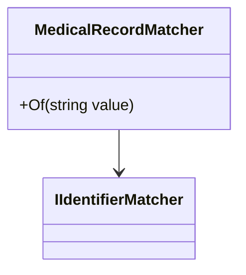

## <SwmToken path="src/In.ProjectEKA.HipLibrary/Matcher/MedicalRecordMatcher.cs" pos="7:5:5" line-data="    public class MedicalRecordMatcher : IIdentifierMatcher">`MedicalRecordMatcher`</SwmToken> Class

The <SwmToken path="src/In.ProjectEKA.HipLibrary/Matcher/MedicalRecordMatcher.cs" pos="7:5:5" line-data="    public class MedicalRecordMatcher : IIdentifierMatcher">`MedicalRecordMatcher`</SwmToken> class is responsible for matching patient records based on a specific identifier. It implements the <SwmToken path="src/In.ProjectEKA.HipLibrary/Matcher/MedicalRecordMatcher.cs" pos="7:9:9" line-data="    public class MedicalRecordMatcher : IIdentifierMatcher">`IIdentifierMatcher`</SwmToken> interface and contains a method called <SwmToken path="src/In.ProjectEKA.HipLibrary/Matcher/MedicalRecordMatcher.cs" pos="9:13:13" line-data="        public Expression&lt;Func&lt;Patient, bool&gt;&gt; Of(string value)">`Of`</SwmToken> which takes a string value as input and returns an expression that checks if a patient's identifier matches the given value.

<SwmSnippet path="/src/In.ProjectEKA.HipLibrary/Matcher/MedicalRecordMatcher.cs" line="7">

---

The <SwmToken path="src/In.ProjectEKA.HipLibrary/Matcher/MedicalRecordMatcher.cs" pos="7:5:5" line-data="    public class MedicalRecordMatcher : IIdentifierMatcher">`MedicalRecordMatcher`</SwmToken> class implements the <SwmToken path="src/In.ProjectEKA.HipLibrary/Matcher/MedicalRecordMatcher.cs" pos="7:9:9" line-data="    public class MedicalRecordMatcher : IIdentifierMatcher">`IIdentifierMatcher`</SwmToken> interface and contains the <SwmToken path="src/In.ProjectEKA.HipLibrary/Matcher/MedicalRecordMatcher.cs" pos="9:13:13" line-data="        public Expression&lt;Func&lt;Patient, bool&gt;&gt; Of(string value)">`Of`</SwmToken> method to match patient records based on a specific identifier.

```c#
    public class MedicalRecordMatcher : IIdentifierMatcher
    {
        public Expression<Func<Patient, bool>> Of(string value)
        {
            return patient => patient.Identifier == value;
        }
    }
```

---

</SwmSnippet>

## Usage in <SwmToken path="src/In.ProjectEKA.HipLibrary/Matcher/StrongMatcherFactory.cs" pos="10:5:5" line-data="    public class StrongMatcherFactory">`StrongMatcherFactory`</SwmToken>

The <SwmToken path="src/In.ProjectEKA.HipLibrary/Matcher/MedicalRecordMatcher.cs" pos="7:5:5" line-data="    public class MedicalRecordMatcher : IIdentifierMatcher">`MedicalRecordMatcher`</SwmToken> is used in the <SwmToken path="src/In.ProjectEKA.HipLibrary/Matcher/StrongMatcherFactory.cs" pos="10:5:5" line-data="    public class StrongMatcherFactory">`StrongMatcherFactory`</SwmToken> to handle matching based on medical record identifiers. This factory is responsible for creating matchers for different identifier types.

<SwmSnippet path="/src/In.ProjectEKA.HipLibrary/Matcher/StrongMatcherFactory.cs" line="15">

---

The <SwmToken path="src/In.ProjectEKA.HipLibrary/Matcher/StrongMatcherFactory.cs" pos="10:5:5" line-data="    public class StrongMatcherFactory">`StrongMatcherFactory`</SwmToken> includes the <SwmToken path="src/In.ProjectEKA.HipLibrary/Matcher/StrongMatcherFactory.cs" pos="16:9:9" line-data="                {IdentifierType.MR, new MedicalRecordMatcher()},">`MedicalRecordMatcher`</SwmToken> to handle matching based on medical record identifiers.

```c#
                {IdentifierType.MOBILE, new PhoneNumberMatcher()},
                {IdentifierType.MR, new MedicalRecordMatcher()},
                {IdentifierType.NDHM_HEALTH_NUMBER, new HealthNumberMatcher()},
```

---

</SwmSnippet>

## Medical Record Matcher Endpoints

The <SwmToken path="src/In.ProjectEKA.HipLibrary/Matcher/MedicalRecordMatcher.cs" pos="7:5:5" line-data="    public class MedicalRecordMatcher : IIdentifierMatcher">`MedicalRecordMatcher`</SwmToken> class is utilized in various endpoints to ensure accurate matching of patient records based on their medical record identifiers.



&nbsp;

*This is an auto-generated document by Swimm 🌊 and has not yet been verified by a human*

<SwmMeta version="3.0.0" repo-id="Z2l0aHViJTNBJTNBaGlwLXNlcnZpY2UlM0ElM0FTd2ltbS1EZW1v" repo-name="hip-service"><sup>Powered by [Swimm](/)</sup></SwmMeta>
