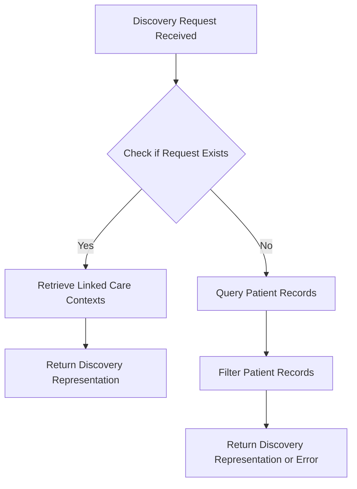

# Overview of Patient Discovery

Patient discovery is a process that identifies and retrieves patient information based on specific criteria provided in a discovery request. The <SwmToken path="src/In.ProjectEKA.HipService/Discovery/PatientDiscovery.cs" pos="20:5:5" line-data="    public class PatientDiscovery : IPatientDiscovery">`PatientDiscovery`</SwmToken> class handles the logic for patient discovery, including checking if a discovery request already exists, retrieving linked care contexts, and querying patient records based on health ID or demographics.

## How Patient Discovery Works

When a discovery request is received, the <SwmToken path="src/In.ProjectEKA.HipService/Discovery/PatientDiscovery.cs" pos="51:17:17" line-data="        public virtual async Task&lt;ValueTuple&lt;DiscoveryRepresentation, ErrorRepresentation&gt;&gt; PatientFor(">`PatientFor`</SwmToken> method first checks if a request with the same transaction ID already exists using the <SwmToken path="src/In.ProjectEKA.HipService/Discovery/PatientDiscovery.cs" pos="54:6:6" line-data="            if (await AlreadyExists(request.TransactionId))">`AlreadyExists`</SwmToken> method. If the request is new, it retrieves linked care contexts for the patient using the <SwmToken path="src/In.ProjectEKA.HipService/Discovery/PatientDiscovery.cs" pos="63:14:14" line-data="            var (linkedAccounts, exception) = await linkPatientRepository.GetLinkedCareContexts(request.Patient.Id);">`linkPatientRepository`</SwmToken> and checks if any linked care contexts are found. If linked care contexts are found, it retrieves the patient information using the <SwmToken path="src/In.ProjectEKA.HipService/Discovery/PatientDiscovery.cs" pos="25:7:7" line-data="        private readonly IPatientRepository patientRepository;">`patientRepository`</SwmToken> and returns a <SwmToken path="src/In.ProjectEKA.HipService/Discovery/PatientDiscovery.cs" pos="45:5:5" line-data="        private ValueTuple&lt;DiscoveryRepresentation, ErrorRepresentation&gt; GetError(ErrorCode errorCode,">`DiscoveryRepresentation`</SwmToken> with the patient's details and unlinked care contexts. If no linked care contexts are found, it queries the patient records based on the provided health ID or demographics and retrieves the care contexts for each patient. The method then filters the patient records to find a matching unique patient and returns the discovery representation or an error if no matching patient is found.

## Main Functions in Patient Discovery

There are several main functions in the <SwmToken path="src/In.ProjectEKA.HipService/Discovery/PatientDiscovery.cs" pos="20:5:5" line-data="    public class PatientDiscovery : IPatientDiscovery">`PatientDiscovery`</SwmToken> class. Some of them are <SwmToken path="src/In.ProjectEKA.HipService/Discovery/PatientDiscovery.cs" pos="45:11:11" line-data="        private ValueTuple&lt;DiscoveryRepresentation, ErrorRepresentation&gt; GetError(ErrorCode errorCode,">`GetError`</SwmToken>, <SwmToken path="src/In.ProjectEKA.HipService/Discovery/PatientDiscovery.cs" pos="51:17:17" line-data="        public virtual async Task&lt;ValueTuple&lt;DiscoveryRepresentation, ErrorRepresentation&gt;&gt; PatientFor(">`PatientFor`</SwmToken>, <SwmToken path="src/In.ProjectEKA.HipService/Discovery/PatientDiscovery.cs" pos="54:6:6" line-data="            if (await AlreadyExists(request.TransactionId))">`AlreadyExists`</SwmToken>, <SwmToken path="src/In.ProjectEKA.HipService/Discovery/PatientDiscovery.cs" pos="74:4:4" line-data="            if (HasAny(linkedCareContexts))">`HasAny`</SwmToken>, and <SwmToken path="src/In.ProjectEKA.HipService/Discovery/PatientDiscovery.cs" pos="88:1:1" line-data="                                GetUnlinkedCareContexts(linkedCareContexts, patient))),">`GetUnlinkedCareContexts`</SwmToken>. We will dive a little into <SwmToken path="src/In.ProjectEKA.HipService/Discovery/PatientDiscovery.cs" pos="51:17:17" line-data="        public virtual async Task&lt;ValueTuple&lt;DiscoveryRepresentation, ErrorRepresentation&gt;&gt; PatientFor(">`PatientFor`</SwmToken> and <SwmToken path="src/In.ProjectEKA.HipService/Discovery/PatientDiscovery.cs" pos="45:11:11" line-data="        private ValueTuple&lt;DiscoveryRepresentation, ErrorRepresentation&gt; GetError(ErrorCode errorCode,">`GetError`</SwmToken>.

### <SwmToken path="src/In.ProjectEKA.HipService/Discovery/PatientDiscovery.cs" pos="51:17:17" line-data="        public virtual async Task&lt;ValueTuple&lt;DiscoveryRepresentation, ErrorRepresentation&gt;&gt; PatientFor(">`PatientFor`</SwmToken>

The <SwmToken path="src/In.ProjectEKA.HipService/Discovery/PatientDiscovery.cs" pos="51:17:17" line-data="        public virtual async Task&lt;ValueTuple&lt;DiscoveryRepresentation, ErrorRepresentation&gt;&gt; PatientFor(">`PatientFor`</SwmToken> function handles the main logic for patient discovery. It checks if a discovery request already exists, retrieves linked care contexts, and queries patient records based on health ID or demographics. It returns a <SwmToken path="src/In.ProjectEKA.HipService/Discovery/PatientDiscovery.cs" pos="45:5:5" line-data="        private ValueTuple&lt;DiscoveryRepresentation, ErrorRepresentation&gt; GetError(ErrorCode errorCode,">`DiscoveryRepresentation`</SwmToken> with the patient's details or an error if no matching patient is found.

<SwmSnippet path="/src/In.ProjectEKA.HipService/Discovery/PatientDiscovery.cs" line="51">

---

The <SwmToken path="src/In.ProjectEKA.HipService/Discovery/PatientDiscovery.cs" pos="51:17:17" line-data="        public virtual async Task&lt;ValueTuple&lt;DiscoveryRepresentation, ErrorRepresentation&gt;&gt; PatientFor(">`PatientFor`</SwmToken> method first checks if a request with the same transaction ID already exists using the <SwmToken path="src/In.ProjectEKA.HipService/Discovery/PatientDiscovery.cs" pos="54:6:6" line-data="            if (await AlreadyExists(request.TransactionId))">`AlreadyExists`</SwmToken> method.

```c#
        public virtual async Task<ValueTuple<DiscoveryRepresentation, ErrorRepresentation>> PatientFor(
            DiscoveryRequest request)
        {
            if (await AlreadyExists(request.TransactionId))
            {
                logger.Log(LogLevel.Error, LogEvents.Discovery,
                    "Discovery Request already exists for {request.TransactionId}.");
                return (null,
                    new ErrorRepresentation(new Error(ErrorCode.DuplicateDiscoveryRequest,
                        "Discovery Request already exists")));
            }
```

---

</SwmSnippet>

<SwmSnippet path="/src/In.ProjectEKA.HipService/Discovery/PatientDiscovery.cs" line="62">

---

If the request is new, it retrieves linked care contexts for the patient using the <SwmToken path="src/In.ProjectEKA.HipService/Discovery/PatientDiscovery.cs" pos="63:14:14" line-data="            var (linkedAccounts, exception) = await linkPatientRepository.GetLinkedCareContexts(request.Patient.Id);">`linkPatientRepository`</SwmToken> and checks if any linked care contexts are found.

```c#

            var (linkedAccounts, exception) = await linkPatientRepository.GetLinkedCareContexts(request.Patient.Id);

            if (exception != null)
            {
                logger.Log(LogLevel.Critical, LogEvents.Discovery, exception, "Failed to get care contexts");
                return (null,
                    new ErrorRepresentation(new Error(ErrorCode.FailedToGetLinkedCareContexts,
                        "Failed to get Linked Care Contexts")));
            }
```

---

</SwmSnippet>

### <SwmToken path="src/In.ProjectEKA.HipService/Discovery/PatientDiscovery.cs" pos="45:11:11" line-data="        private ValueTuple&lt;DiscoveryRepresentation, ErrorRepresentation&gt; GetError(ErrorCode errorCode,">`GetError`</SwmToken>

The <SwmToken path="src/In.ProjectEKA.HipService/Discovery/PatientDiscovery.cs" pos="45:11:11" line-data="        private ValueTuple&lt;DiscoveryRepresentation, ErrorRepresentation&gt; GetError(ErrorCode errorCode,">`GetError`</SwmToken> function is used to generate an error representation with a specific error code and message. It is used within the <SwmToken path="src/In.ProjectEKA.HipService/Discovery/PatientDiscovery.cs" pos="51:17:17" line-data="        public virtual async Task&lt;ValueTuple&lt;DiscoveryRepresentation, ErrorRepresentation&gt;&gt; PatientFor(">`PatientFor`</SwmToken> function to handle various error scenarios.

<SwmSnippet path="/src/In.ProjectEKA.HipService/Discovery/PatientDiscovery.cs" line="45">

---

The <SwmToken path="src/In.ProjectEKA.HipService/Discovery/PatientDiscovery.cs" pos="45:11:11" line-data="        private ValueTuple&lt;DiscoveryRepresentation, ErrorRepresentation&gt; GetError(ErrorCode errorCode,">`GetError`</SwmToken> function generates an error representation with a specific error code and message.

```c#
        private ValueTuple<DiscoveryRepresentation, ErrorRepresentation> GetError(ErrorCode errorCode,
            string errorMessage)
        {
            return (null, new ErrorRepresentation(new Error(errorCode, errorMessage)));
        }
```

---

</SwmSnippet>

## Patient Discovery Endpoints

The <SwmToken path="src/In.ProjectEKA.HipService/Discovery/PatientDiscovery.cs" pos="51:17:17" line-data="        public virtual async Task&lt;ValueTuple&lt;DiscoveryRepresentation, ErrorRepresentation&gt;&gt; PatientFor(">`PatientFor`</SwmToken> method handles the logic for patient discovery. It checks if a discovery request already exists, retrieves linked care contexts, and queries patient records based on health ID or demographics.



&nbsp;

*This is an auto-generated document by Swimm 🌊 and has not yet been verified by a human*

<SwmMeta version="3.0.0" repo-id="Z2l0aHViJTNBJTNBaGlwLXNlcnZpY2UlM0ElM0FTd2ltbS1EZW1v" repo-name="hip-service"><sup>Powered by [Swimm](/)</sup></SwmMeta>
