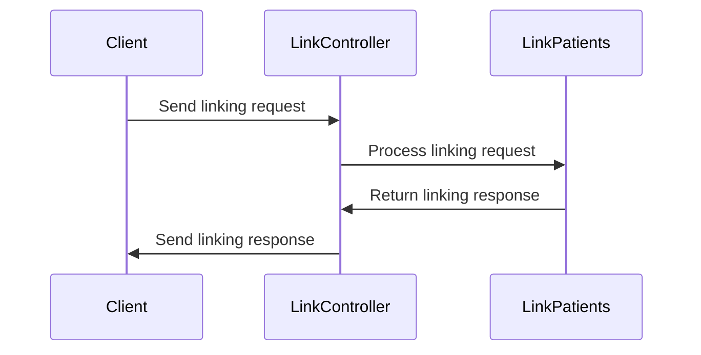

# What is Patient Link Enquiry Model

The Patient Link Enquiry Model encapsulates the details required for linking a patient account. It includes a transaction ID, request ID, and patient information.

## How to use Patient Link Enquiry Model

The <SwmToken path="src/In.ProjectEKA.HipLibrary/Patient/Model/PatientLinkEnquiry.cs" pos="3:5:5" line-data="    public class PatientLinkEnquiry">`PatientLinkEnquiry`</SwmToken> class is constructed with a transaction ID, request ID, and a <SwmToken path="src/In.ProjectEKA.HipLibrary/Patient/Model/PatientLinkEnquiry.cs" pos="5:15:15" line-data="        public PatientLinkEnquiry(string transactionId, string requestId, LinkEnquiry patient)">`LinkEnquiry`</SwmToken> object representing the patient. The <SwmToken path="src/In.ProjectEKA.HipLibrary/Patient/Model/PatientLinkEnquiry.cs" pos="7:1:1" line-data="            TransactionId = transactionId;">`TransactionId`</SwmToken> property holds the unique identifier for the transaction. The <SwmToken path="src/In.ProjectEKA.HipLibrary/Patient/Model/PatientLinkEnquiry.cs" pos="9:1:1" line-data="            RequestId = requestId;">`RequestId`</SwmToken> property holds the unique identifier for the request. The <SwmToken path="src/In.ProjectEKA.HipLibrary/Patient/Model/PatientLinkEnquiry.cs" pos="8:1:1" line-data="            Patient = patient;">`Patient`</SwmToken> property holds the <SwmToken path="src/In.ProjectEKA.HipLibrary/Patient/Model/PatientLinkEnquiry.cs" pos="5:15:15" line-data="        public PatientLinkEnquiry(string transactionId, string requestId, LinkEnquiry patient)">`LinkEnquiry`</SwmToken> object, which contains the patient's details.

<SwmSnippet path="/src/In.ProjectEKA.HipLibrary/Patient/Model/PatientLinkEnquiry.cs" line="3">

---

The <SwmToken path="src/In.ProjectEKA.HipLibrary/Patient/Model/PatientLinkEnquiry.cs" pos="3:5:5" line-data="    public class PatientLinkEnquiry">`PatientLinkEnquiry`</SwmToken> class is constructed with a transaction ID, request ID, and a <SwmToken path="src/In.ProjectEKA.HipLibrary/Patient/Model/PatientLinkEnquiry.cs" pos="5:15:15" line-data="        public PatientLinkEnquiry(string transactionId, string requestId, LinkEnquiry patient)">`LinkEnquiry`</SwmToken> object representing the patient.

```c#
    public class PatientLinkEnquiry
    {
        public PatientLinkEnquiry(string transactionId, string requestId, LinkEnquiry patient)
        {
            TransactionId = transactionId;
            Patient = patient;
            RequestId = requestId;
        }
```

---

</SwmSnippet>

<SwmSnippet path="/src/In.ProjectEKA.HipLibrary/Patient/Model/PatientLinkEnquiry.cs" line="12">

---

The <SwmToken path="src/In.ProjectEKA.HipLibrary/Patient/Model/PatientLinkEnquiry.cs" pos="12:5:5" line-data="        public string TransactionId { get; }">`TransactionId`</SwmToken> property holds the unique identifier for the transaction.

```c#
        public string TransactionId { get; }
```

---

</SwmSnippet>

<SwmSnippet path="/src/In.ProjectEKA.HipLibrary/Patient/Model/PatientLinkEnquiry.cs" line="14">

---

The <SwmToken path="src/In.ProjectEKA.HipLibrary/Patient/Model/PatientLinkEnquiry.cs" pos="14:5:5" line-data="        public string RequestId { get; }">`RequestId`</SwmToken> property holds the unique identifier for the request.

```c#
        public string RequestId { get; }
```

---

</SwmSnippet>

<SwmSnippet path="/src/In.ProjectEKA.HipLibrary/Patient/Model/PatientLinkEnquiry.cs" line="16">

---

The <SwmToken path="src/In.ProjectEKA.HipLibrary/Patient/Model/PatientLinkEnquiry.cs" pos="16:5:5" line-data="        public LinkEnquiry Patient { get; }">`Patient`</SwmToken> property holds the <SwmToken path="src/In.ProjectEKA.HipLibrary/Patient/Model/PatientLinkEnquiry.cs" pos="16:3:3" line-data="        public LinkEnquiry Patient { get; }">`LinkEnquiry`</SwmToken> object, which contains the patient's details.

```c#
        public LinkEnquiry Patient { get; }
    }
```

---

</SwmSnippet>

## Where Patient Link Enquiry Model is used

The <SwmToken path="src/In.ProjectEKA.HipLibrary/Patient/Model/PatientLinkEnquiry.cs" pos="3:5:5" line-data="    public class PatientLinkEnquiry">`PatientLinkEnquiry`</SwmToken> model is used in various parts of the codebase, such as in the <SwmToken path="src/In.ProjectEKA.HipService/Link/LinkPatient.cs" pos="52:17:17" line-data="        public virtual async Task&lt;ValueTuple&lt;PatientLinkEnquiryRepresentation, ErrorRepresentation&gt;&gt; LinkPatients(">`LinkPatients`</SwmToken> method in <SwmPath>[src/In.ProjectEKA.HipService/Link/LinkPatient.cs](src/In.ProjectEKA.HipService/Link/LinkPatient.cs)</SwmPath> and in the <SwmPath>[src/In.ProjectEKA.HipService/Link/LinkController.cs](src/In.ProjectEKA.HipService/Link/LinkController.cs)</SwmPath>.

<SwmSnippet path="/src/In.ProjectEKA.HipService/Link/LinkPatient.cs" line="110">

---

The <SwmToken path="src/In.ProjectEKA.HipService/Link/LinkPatient.cs" pos="111:1:1" line-data="            PatientLinkEnquiry request)">`PatientLinkEnquiry`</SwmToken> model is used in the <SwmToken path="src/In.ProjectEKA.HipService/Link/LinkPatient.cs" pos="110:21:21" line-data="        private async Task&lt;ValueTuple&lt;HipLibrary.Patient.Model.Patient, ErrorRepresentation&gt;&gt; PatientAndCareContextValidation(">`PatientAndCareContextValidation`</SwmToken> method in <SwmPath>[src/In.ProjectEKA.HipService/Link/LinkPatient.cs](src/In.ProjectEKA.HipService/Link/LinkPatient.cs)</SwmPath>.

```c#
        private async Task<ValueTuple<HipLibrary.Patient.Model.Patient, ErrorRepresentation>> PatientAndCareContextValidation(
            PatientLinkEnquiry request)
        {
```

---

</SwmSnippet>

<SwmSnippet path="/src/In.ProjectEKA.HipService/Link/LinkController.cs" line="97">

---

The <SwmToken path="src/In.ProjectEKA.HipService/Link/LinkController.cs" pos="98:3:3" line-data="                    new PatientLinkEnquiry(request.TransactionId, request.RequestId, patient);">`PatientLinkEnquiry`</SwmToken> model is used in the <SwmPath>[src/In.ProjectEKA.HipService/Link/LinkController.cs](src/In.ProjectEKA.HipService/Link/LinkController.cs)</SwmPath> to create a new <SwmToken path="src/In.ProjectEKA.HipService/Link/LinkController.cs" pos="98:3:3" line-data="                    new PatientLinkEnquiry(request.TransactionId, request.RequestId, patient);">`PatientLinkEnquiry`</SwmToken> object.

```c#
                var patientReferenceRequest =
                    new PatientLinkEnquiry(request.TransactionId, request.RequestId, patient);
                var patientLinkEnquiryRepresentation = new PatientLinkEnquiryRepresentation();
```

---

</SwmSnippet>

## Patient Link Enquiry Endpoints

The <SwmToken path="src/In.ProjectEKA.HipService/Link/LinkPatient.cs" pos="52:17:17" line-data="        public virtual async Task&lt;ValueTuple&lt;PatientLinkEnquiryRepresentation, ErrorRepresentation&gt;&gt; LinkPatients(">`LinkPatients`</SwmToken> method in <SwmPath>[src/In.ProjectEKA.HipService/Link/LinkPatient.cs](src/In.ProjectEKA.HipService/Link/LinkPatient.cs)</SwmPath> is responsible for handling the linking of patient accounts. It uses the <SwmToken path="src/In.ProjectEKA.HipLibrary/Patient/Model/PatientLinkEnquiry.cs" pos="3:5:5" line-data="    public class PatientLinkEnquiry">`PatientLinkEnquiry`</SwmToken> model to encapsulate the details required for the linking process.

<SwmSnippet path="/src/In.ProjectEKA.HipService/Link/LinkPatient.cs" line="10">

---

The <SwmToken path="src/In.ProjectEKA.HipService/Link/LinkPatient.cs" pos="52:17:17" line-data="        public virtual async Task&lt;ValueTuple&lt;PatientLinkEnquiryRepresentation, ErrorRepresentation&gt;&gt; LinkPatients(">`LinkPatients`</SwmToken> method in <SwmPath>[src/In.ProjectEKA.HipService/Link/LinkPatient.cs](src/In.ProjectEKA.HipService/Link/LinkPatient.cs)</SwmPath> handles the linking of patient accounts using the <SwmToken path="src/In.ProjectEKA.HipLibrary/Patient/Model/PatientLinkEnquiry.cs" pos="3:5:5" line-data="    public class PatientLinkEnquiry">`PatientLinkEnquiry`</SwmToken> model.

```c#
    using System.Linq;
    using System.Threading.Tasks;
    using System.Transactions;
    using Common;
    using Discovery;
    using HipLibrary.Patient;
    using HipLibrary.Patient.Model;
    using Logger;
    using Microsoft.Extensions.Options;
    using Model;
    using static In.ProjectEKA.HipService.Discovery.DiscoveryReqMap;
```

---

</SwmSnippet>

The <SwmToken path="src/In.ProjectEKA.HipService/Link/LinkController.cs" pos="24:5:5" line-data="    public class LinkController : ControllerBase">`LinkController`</SwmToken> class in <SwmPath>[src/In.ProjectEKA.HipService/Link/LinkController.cs](src/In.ProjectEKA.HipService/Link/LinkController.cs)</SwmPath> manages the endpoints related to patient linking. It utilizes the <SwmToken path="src/In.ProjectEKA.HipLibrary/Patient/Model/PatientLinkEnquiry.cs" pos="3:5:5" line-data="    public class PatientLinkEnquiry">`PatientLinkEnquiry`</SwmToken> model to process the linking requests and responses.

<SwmSnippet path="/src/In.ProjectEKA.HipService/Link/LinkController.cs" line="15">

---

The <SwmToken path="src/In.ProjectEKA.HipService/Link/LinkController.cs" pos="24:5:5" line-data="    public class LinkController : ControllerBase">`LinkController`</SwmToken> class in <SwmPath>[src/In.ProjectEKA.HipService/Link/LinkController.cs](src/In.ProjectEKA.HipService/Link/LinkController.cs)</SwmPath> manages the endpoints related to patient linking and uses the <SwmToken path="src/In.ProjectEKA.HipLibrary/Patient/Model/PatientLinkEnquiry.cs" pos="3:5:5" line-data="    public class PatientLinkEnquiry">`PatientLinkEnquiry`</SwmToken> model.

```c#
    using Microsoft.AspNetCore.Mvc;
    using Microsoft.AspNetCore.Mvc.ModelBinding;
    using static Common.Constants;
    using Model;

    [Authorize]
    [ApiController]
    [Consumes("application/json")]
    [Produces("application/json")]
    public class LinkController : ControllerBase
    {
```

---

</SwmSnippet>



&nbsp;

*This is an auto-generated document by Swimm 🌊 and has not yet been verified by a human*

<SwmMeta version="3.0.0" repo-id="Z2l0aHViJTNBJTNBaGlwLXNlcnZpY2UlM0ElM0FTd2ltbS1EZW1v" repo-name="hip-service"><sup>Powered by [Swimm](/)</sup></SwmMeta>
