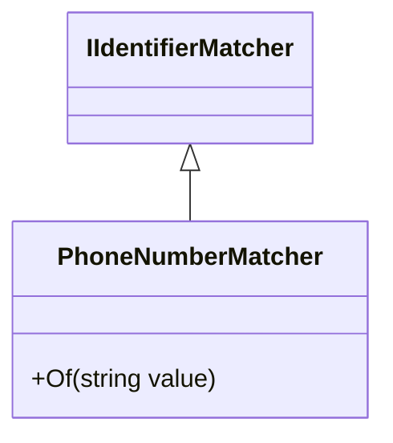

# Overview of <SwmToken path="src/In.ProjectEKA.HipLibrary/Matcher/PhoneNumberMatcher.cs" pos="7:5:5" line-data="    public class PhoneNumberMatcher : IIdentifierMatcher">`PhoneNumberMatcher`</SwmToken>

The <SwmToken path="src/In.ProjectEKA.HipLibrary/Matcher/PhoneNumberMatcher.cs" pos="7:5:5" line-data="    public class PhoneNumberMatcher : IIdentifierMatcher">`PhoneNumberMatcher`</SwmToken> class is designed to match a patient's phone number with a given value. It implements the <SwmToken path="src/In.ProjectEKA.HipLibrary/Matcher/PhoneNumberMatcher.cs" pos="7:9:9" line-data="    public class PhoneNumberMatcher : IIdentifierMatcher">`IIdentifierMatcher`</SwmToken> interface, ensuring that it adheres to a standard structure for matching identifiers.

<SwmSnippet path="/src/In.ProjectEKA.HipLibrary/Matcher/PhoneNumberMatcher.cs" line="7">

---

# Implementation

The <SwmToken path="src/In.ProjectEKA.HipLibrary/Matcher/PhoneNumberMatcher.cs" pos="7:5:5" line-data="    public class PhoneNumberMatcher : IIdentifierMatcher">`PhoneNumberMatcher`</SwmToken> class implements the <SwmToken path="src/In.ProjectEKA.HipLibrary/Matcher/PhoneNumberMatcher.cs" pos="7:9:9" line-data="    public class PhoneNumberMatcher : IIdentifierMatcher">`IIdentifierMatcher`</SwmToken> interface and contains the <SwmToken path="src/In.ProjectEKA.HipLibrary/Matcher/PhoneNumberMatcher.cs" pos="9:13:13" line-data="        public Expression&lt;Func&lt;Patient, bool&gt;&gt; Of(string value)">`Of`</SwmToken> method to match a patient's phone number.

```c#
    public class PhoneNumberMatcher : IIdentifierMatcher
    {
        public Expression<Func<Patient, bool>> Of(string value)
        {
            return patientInfo => patientInfo.PhoneNumber == value;
        }
    }
```

---

</SwmSnippet>

# The Of Method

The <SwmToken path="src/In.ProjectEKA.HipLibrary/Matcher/PhoneNumberMatcher.cs" pos="9:13:13" line-data="        public Expression&lt;Func&lt;Patient, bool&gt;&gt; Of(string value)">`Of`</SwmToken> method in the <SwmToken path="src/In.ProjectEKA.HipLibrary/Matcher/PhoneNumberMatcher.cs" pos="7:5:5" line-data="    public class PhoneNumberMatcher : IIdentifierMatcher">`PhoneNumberMatcher`</SwmToken> class takes a string value as a parameter and returns an expression that checks if the patient's phone number matches the given value. This method is essential for matching patient records based on their phone numbers.

<SwmSnippet path="/src/In.ProjectEKA.HipLibrary/Matcher/PhoneNumberMatcher.cs" line="9">

---

The <SwmToken path="src/In.ProjectEKA.HipLibrary/Matcher/PhoneNumberMatcher.cs" pos="9:13:13" line-data="        public Expression&lt;Func&lt;Patient, bool&gt;&gt; Of(string value)">`Of`</SwmToken> method implementation in the <SwmToken path="src/In.ProjectEKA.HipLibrary/Matcher/PhoneNumberMatcher.cs" pos="7:5:5" line-data="    public class PhoneNumberMatcher : IIdentifierMatcher">`PhoneNumberMatcher`</SwmToken> class.

```c#
        public Expression<Func<Patient, bool>> Of(string value)
        {
            return patientInfo => patientInfo.PhoneNumber == value;
        }
```

---

</SwmSnippet>

# Usage in <SwmToken path="src/In.ProjectEKA.HipLibrary/Matcher/StrongMatcherFactory.cs" pos="10:5:5" line-data="    public class StrongMatcherFactory">`StrongMatcherFactory`</SwmToken>

The <SwmToken path="src/In.ProjectEKA.HipLibrary/Matcher/PhoneNumberMatcher.cs" pos="7:5:5" line-data="    public class PhoneNumberMatcher : IIdentifierMatcher">`PhoneNumberMatcher`</SwmToken> is utilized in the <SwmToken path="src/In.ProjectEKA.HipLibrary/Matcher/StrongMatcherFactory.cs" pos="10:5:5" line-data="    public class StrongMatcherFactory">`StrongMatcherFactory`</SwmToken> to create matchers based on the identifier type. This ensures that the correct matcher is used for different types of identifiers.

<SwmSnippet path="/src/In.ProjectEKA.HipLibrary/Matcher/StrongMatcherFactory.cs" line="14">

---

The <SwmToken path="src/In.ProjectEKA.HipLibrary/Matcher/StrongMatcherFactory.cs" pos="15:9:9" line-data="                {IdentifierType.MOBILE, new PhoneNumberMatcher()},">`PhoneNumberMatcher`</SwmToken> is used in the <SwmToken path="src/In.ProjectEKA.HipLibrary/Matcher/StrongMatcherFactory.cs" pos="10:5:5" line-data="    public class StrongMatcherFactory">`StrongMatcherFactory`</SwmToken> to create matchers based on the identifier type.

```c#
            {
                {IdentifierType.MOBILE, new PhoneNumberMatcher()},
                {IdentifierType.MR, new MedicalRecordMatcher()},
```

---

</SwmSnippet>



&nbsp;

*This is an auto-generated document by Swimm 🌊 and has not yet been verified by a human*

<SwmMeta version="3.0.0" repo-id="Z2l0aHViJTNBJTNBaGlwLXNlcnZpY2UlM0ElM0FTd2ltbS1EZW1v" repo-name="hip-service"><sup>Powered by [Swimm](/)</sup></SwmMeta>
