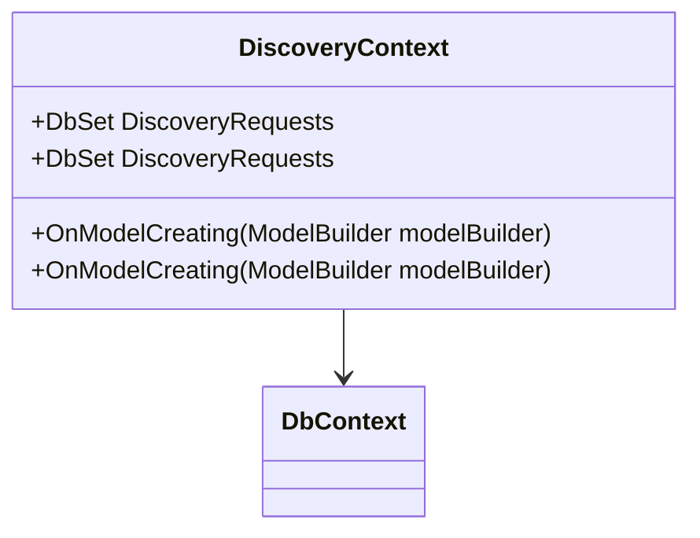

# Introduction to Discovery Database

The Discovery Database is an essential component of the Discovery module, responsible for managing data related to discovery requests. It ensures data persistence and integrity by leveraging the <SwmToken path="src/In.ProjectEKA.HipService/Discovery/Database/DiscoveryContext.cs" pos="6:5:5" line-data="    public class DiscoveryContext : DbContext">`DiscoveryContext`</SwmToken> class, which inherits from <SwmToken path="src/In.ProjectEKA.HipService/Discovery/Database/DiscoveryContext.cs" pos="6:9:9" line-data="    public class DiscoveryContext : DbContext">`DbContext`</SwmToken>.

# <SwmToken path="src/In.ProjectEKA.HipService/Discovery/Database/DiscoveryContext.cs" pos="6:5:5" line-data="    public class DiscoveryContext : DbContext">`DiscoveryContext`</SwmToken> Class

The <SwmToken path="src/In.ProjectEKA.HipService/Discovery/Database/DiscoveryContext.cs" pos="6:5:5" line-data="    public class DiscoveryContext : DbContext">`DiscoveryContext`</SwmToken> class is a part of the database infrastructure in the Discovery module. It inherits from <SwmToken path="src/In.ProjectEKA.HipService/Discovery/Database/DiscoveryContext.cs" pos="6:9:9" line-data="    public class DiscoveryContext : DbContext">`DbContext`</SwmToken> and is used to interact with the database. This class includes a <SwmToken path="src/In.ProjectEKA.HipService/Discovery/Database/DiscoveryContext.cs" pos="12:3:6" line-data="        public DbSet&lt;DiscoveryRequest&gt; DiscoveryRequest { get; set; }">`DbSet<DiscoveryRequest>`</SwmToken> property, which represents the <SwmToken path="src/In.ProjectEKA.HipService/Discovery/Database/DiscoveryContext.cs" pos="12:5:5" line-data="        public DbSet&lt;DiscoveryRequest&gt; DiscoveryRequest { get; set; }">`DiscoveryRequest`</SwmToken> table in the database, allowing for CRUD operations on <SwmToken path="src/In.ProjectEKA.HipService/Discovery/Database/DiscoveryContext.cs" pos="12:5:5" line-data="        public DbSet&lt;DiscoveryRequest&gt; DiscoveryRequest { get; set; }">`DiscoveryRequest`</SwmToken> entities.

<SwmSnippet path="/src/In.ProjectEKA.HipService/Discovery/Database/DiscoveryContext.cs" line="1">

---

The <SwmToken path="src/In.ProjectEKA.HipService/Discovery/Database/DiscoveryContext.cs" pos="6:5:5" line-data="    public class DiscoveryContext : DbContext">`DiscoveryContext`</SwmToken> class is defined in the <SwmToken path="src/In.ProjectEKA.HipService/Discovery/Database/DiscoveryContext.cs" pos="1:2:10" line-data="namespace In.ProjectEKA.HipService.Discovery.Database">`In.ProjectEKA.HipService.Discovery.Database`</SwmToken> namespace.

```c#
namespace In.ProjectEKA.HipService.Discovery.Database
```

---

</SwmSnippet>

# Model Configuration

The <SwmToken path="src/In.ProjectEKA.HipService/Discovery/Database/DiscoveryContext.cs" pos="14:7:7" line-data="        protected override void OnModelCreating(ModelBuilder modelBuilder)">`OnModelCreating`</SwmToken> method in <SwmToken path="src/In.ProjectEKA.HipService/Discovery/Database/DiscoveryContext.cs" pos="6:5:5" line-data="    public class DiscoveryContext : DbContext">`DiscoveryContext`</SwmToken> is used to configure the model using the <SwmToken path="src/In.ProjectEKA.HipService/Discovery/Database/DiscoveryContext.cs" pos="14:9:9" line-data="        protected override void OnModelCreating(ModelBuilder modelBuilder)">`ModelBuilder`</SwmToken> API. It sets default values and unique constraints for the <SwmToken path="src/In.ProjectEKA.HipService/Discovery/Database/DiscoveryContext.cs" pos="12:5:5" line-data="        public DbSet&lt;DiscoveryRequest&gt; DiscoveryRequest { get; set; }">`DiscoveryRequest`</SwmToken> entity, ensuring the database schema aligns with the application's data model.

# Usage in Repositories and Migrations

The <SwmToken path="src/In.ProjectEKA.HipService/Discovery/Database/DiscoveryContext.cs" pos="6:5:5" line-data="    public class DiscoveryContext : DbContext">`DiscoveryContext`</SwmToken> class is utilized in various parts of the application, including repositories and migrations, to manage database operations related to discovery requests. Migrations in the Discovery module use the <SwmToken path="src/In.ProjectEKA.HipService/Discovery/Database/DiscoveryContext.cs" pos="6:5:5" line-data="    public class DiscoveryContext : DbContext">`DiscoveryContext`</SwmToken> to apply schema changes to the database, ensuring that the database structure is in sync with the application's data model.

<SwmSnippet path="/src/In.ProjectEKA.HipService/Discovery/Database/Migrations/20200408103411_UniqueTransactionId.Designer.cs" line="3">

---

The <SwmToken path="src/In.ProjectEKA.HipService/Discovery/Database/DiscoveryContext.cs" pos="6:5:5" line-data="    public class DiscoveryContext : DbContext">`DiscoveryContext`</SwmToken> class is used in migrations to apply schema changes to the database.

```c#
using In.ProjectEKA.HipService.Discovery.Database;
using Microsoft.EntityFrameworkCore;
using Microsoft.EntityFrameworkCore.Infrastructure;
using Microsoft.EntityFrameworkCore.Migrations;
using Microsoft.EntityFrameworkCore.Storage.ValueConversion;
using Npgsql.EntityFrameworkCore.PostgreSQL.Metadata;

namespace In.ProjectEKA.HipService.Discovery.Database.Migrations
```

---

</SwmSnippet>



&nbsp;

*This is an* <SwmToken path="src/In.ProjectEKA.HipService/Discovery/Database/Migrations/20200408103411_UniqueTransactionId.Designer.cs" pos="1:4:6" line-data="// &lt;auto-generated /&gt;">`auto-generated`</SwmToken> *document by Swimm 🌊 and has not yet been verified by a human*

<SwmMeta version="3.0.0" repo-id="Z2l0aHViJTNBJTNBaGlwLXNlcnZpY2UlM0ElM0FTd2ltbS1EZW1v" repo-name="hip-service"><sup>Powered by [Swimm](/)</sup></SwmMeta>
