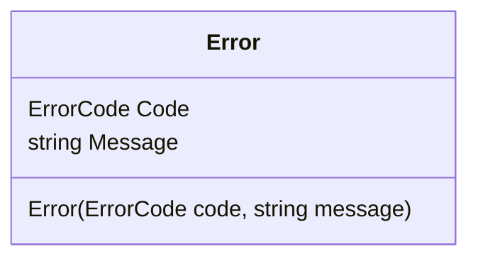

# What is Error Class

The <SwmToken path="src/In.ProjectEKA.HipLibrary/Patient/Model/Error.cs" pos="5:3:3" line-data="        public Error(ErrorCode code, string message)">`Error`</SwmToken> class represents an error that occurs within the system. It encapsulates error details and provides meaningful error information to the user or calling system.

## Properties of Error Class

The <SwmToken path="src/In.ProjectEKA.HipLibrary/Patient/Model/Error.cs" pos="5:3:3" line-data="        public Error(ErrorCode code, string message)">`Error`</SwmToken> class contains two properties: <SwmToken path="src/In.ProjectEKA.HipLibrary/Patient/Model/Error.cs" pos="7:1:1" line-data="            Code = code;">`Code`</SwmToken> and <SwmToken path="src/In.ProjectEKA.HipLibrary/Patient/Model/Error.cs" pos="8:1:1" line-data="            Message = message;">`Message`</SwmToken>.

<SwmSnippet path="/src/In.ProjectEKA.HipLibrary/Patient/Model/Error.cs" line="11">

---

### Code Property

The <SwmToken path="src/In.ProjectEKA.HipLibrary/Patient/Model/Error.cs" pos="11:5:5" line-data="        public ErrorCode Code { get; }">`Code`</SwmToken> property holds an <SwmToken path="src/In.ProjectEKA.HipLibrary/Patient/Model/Error.cs" pos="11:3:3" line-data="        public ErrorCode Code { get; }">`ErrorCode`</SwmToken> that categorizes the type of error. It helps in identifying the nature of the error that occurred.

```c#
        public ErrorCode Code { get; }
```

---

</SwmSnippet>

<SwmSnippet path="/src/In.ProjectEKA.HipLibrary/Patient/Model/Error.cs" line="13">

---

### Message Property

The <SwmToken path="src/In.ProjectEKA.HipLibrary/Patient/Model/Error.cs" pos="13:5:5" line-data="        public string Message { get; }">`Message`</SwmToken> property provides a descriptive message about the error. It gives more context and information about what went wrong.

```c#
        public string Message { get; }
```

---

</SwmSnippet>

<SwmSnippet path="/src/In.ProjectEKA.HipLibrary/Patient/Model/Error.cs" line="5">

---

## Error Constructor

The <SwmToken path="src/In.ProjectEKA.HipLibrary/Patient/Model/Error.cs" pos="5:3:3" line-data="        public Error(ErrorCode code, string message)">`Error`</SwmToken> constructor initializes a new instance of the <SwmToken path="src/In.ProjectEKA.HipLibrary/Patient/Model/Error.cs" pos="5:3:3" line-data="        public Error(ErrorCode code, string message)">`Error`</SwmToken> class with a specific error code and message. It sets the <SwmToken path="src/In.ProjectEKA.HipLibrary/Patient/Model/Error.cs" pos="7:1:1" line-data="            Code = code;">`Code`</SwmToken> and <SwmToken path="src/In.ProjectEKA.HipLibrary/Patient/Model/Error.cs" pos="8:1:1" line-data="            Message = message;">`Message`</SwmToken> properties to provide details about the error.

```c#
        public Error(ErrorCode code, string message)
        {
            Code = code;
            Message = message;
        }
```

---

</SwmSnippet>



&nbsp;

*This is an auto-generated document by Swimm 🌊 and has not yet been verified by a human*

<SwmMeta version="3.0.0" repo-id="Z2l0aHViJTNBJTNBaGlwLXNlcnZpY2UlM0ElM0FTd2ltbS1EZW1v" repo-name="hip-service"><sup>Powered by [Swimm](/)</sup></SwmMeta>
