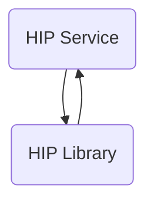

The hip-service repository is a sample implementation of a Health Information Provider (HIP) service. It includes features such as patient account discovery, linking with a Consent Manager, consent artifact acceptance, and data transfer.

## Main Components

### HIP Library

- **Patient**
  - **Model**
    - **Traceable data request**
      - <SwmLink doc-title="Getting started with traceable data request model">[Getting started with traceable data request model](/.swm/getting-started-with-traceable-data-request-model.iftrpbsk.sw.md)</SwmLink>
      - **Classes**
        - <SwmLink doc-title="The traceabledatarequest class">[The traceabledatarequest class](/.swm/the-traceabledatarequest-class.vckib.sw.md)</SwmLink>
    - **Discovery response**
      - <SwmLink doc-title="Overview of discoveryresponse in model">[Overview of discoveryresponse in model](/.swm/overview-of-discoveryresponse-in-model.h0utsuwq.sw.md)</SwmLink>
    - **Care context representation**
      - <SwmLink doc-title="Exploring care context representation model">[Exploring care context representation model](/.swm/exploring-care-context-representation-model.re8qx03t.sw.md)</SwmLink>
      - **Classes**
        - <SwmLink doc-title="The carecontextrepresentation class">[The carecontextrepresentation class](/.swm/the-carecontextrepresentation-class.tkqmh.sw.md)</SwmLink>
    - **Granted context**
      - <SwmLink doc-title="Getting started with the grantedcontext model">[Getting started with the grantedcontext model](/.swm/getting-started-with-the-grantedcontext-model.w7soiga4.sw.md)</SwmLink>
    - **Link enquiry**
      - <SwmLink doc-title="Getting started with link enquiry model">[Getting started with link enquiry model](/.swm/getting-started-with-link-enquiry-model.z5qjuug0.sw.md)</SwmLink>
    - **Key material**
      - <SwmLink doc-title="Exploring the key material class">[Exploring the key material class](/.swm/exploring-the-key-material-class.vo1qqfzv.sw.md)</SwmLink>
    - **Patient enquiry representation**
      - <SwmLink doc-title="Exploring patient enquiry representation model">[Exploring patient enquiry representation model](/.swm/exploring-patient-enquiry-representation-model.nl2kn0e6.sw.md)</SwmLink>
    - **Discovery request**
      - <SwmLink doc-title="Introduction to discovery request model">[Introduction to discovery request model](/.swm/introduction-to-discovery-request-model.1clilzaa.sw.md)</SwmLink>
    - **Entries**
      - <SwmLink doc-title="Introduction to entries model">[Introduction to entries model](/.swm/introduction-to-entries-model.u6hv4ish.sw.md)</SwmLink>
    - **Identifier**
      - <SwmLink doc-title="Getting started with patient identifier">[Getting started with patient identifier](/.swm/getting-started-with-patient-identifier.puudye60.sw.md)</SwmLink>
    - **Link enquiry representation**
      - <SwmLink doc-title="Getting started with link enquiry representation model">[Getting started with link enquiry representation model](/.swm/getting-started-with-link-enquiry-representation-model.6hzsgfe5.sw.md)</SwmLink>
    - **Care context enquiry**
      - <SwmLink doc-title="Basic concepts of carecontextenquiry model">[Basic concepts of carecontextenquiry model](/.swm/basic-concepts-of-carecontextenquiry-model.g6y9s0a7.sw.md)</SwmLink>
    - **Patient link enquiry representation**
      - <SwmLink doc-title="Patient link enquiry representation">[Patient link enquiry representation](/.swm/patient-link-enquiry-representation.ho5ubd7b.sw.md)</SwmLink>
    - **Link confirmation representation**
      - <SwmLink doc-title="Link confirmation representation model">[Link confirmation representation model](/.swm/link-confirmation-representation-model.do3qv3jm.sw.md)</SwmLink>
    - **Patient link enquiry**
      - <SwmLink doc-title="Patient link enquiry model overview">[Patient link enquiry model overview](/.swm/patient-link-enquiry-model-overview.pe6m7l8n.sw.md)</SwmLink>
    - **Error**
      - <SwmLink doc-title="Overview of error class in model">[Overview of error class in model](/.swm/overview-of-error-class-in-model.q7aldky4.sw.md)</SwmLink>
    - **Key structure**
      - <SwmLink doc-title="Overview of key structure">[Overview of key structure](/.swm/overview-of-key-structure.36h2znvd.sw.md)</SwmLink>
    - **Date range**
      - <SwmLink doc-title="Basic concepts of daterange model">[Basic concepts of daterange model](/.swm/basic-concepts-of-daterange-model.h3pj033l.sw.md)</SwmLink>
    - **Care bundle**
      - <SwmLink doc-title="Basic concepts of carebundle model">[Basic concepts of carebundle model](/.swm/basic-concepts-of-carebundle-model.viqxeh1n.sw.md)</SwmLink>
    - **Link reference meta**
      - <SwmLink doc-title="Basic concepts of link reference metadata">[Basic concepts of link reference metadata](/.swm/basic-concepts-of-link-reference-metadata.u883vtd4.sw.md)</SwmLink>
    - **Patient link confirmation representation**
      - <SwmLink doc-title="Patient link confirmation representation model">[Patient link confirmation representation model](/.swm/patient-link-confirmation-representation-model.z3rv8ncs.sw.md)</SwmLink>
    - **Patient**
      - <SwmLink doc-title="Overview of patient model">[Overview of patient model](/.swm/overview-of-patient-model.azjhj9v4.sw.md)</SwmLink>
      - **Classes**
        - <SwmLink doc-title="The patient class">[The patient class](/.swm/the-patient-class.r9sl2.sw.md)</SwmLink>
    - **Resp**
      - <SwmLink doc-title="Introduction to resp class">[Introduction to resp class](/.swm/introduction-to-resp-class.hx86gj9c.sw.md)</SwmLink>
  - **I patient repository**
    - <SwmLink doc-title="Exploring patient repository interface">[Exploring patient repository interface](/.swm/exploring-patient-repository-interface.cn8ba32f.sw.md)</SwmLink>
- **Matcher**
  - **Health id matcher**
    - <SwmLink doc-title="Overview of health id matcher">[Overview of health id matcher](/.swm/overview-of-health-id-matcher.kqoev6xu.sw.md)</SwmLink>
  - **Health number matcher**
    - <SwmLink doc-title="Overview of health number matcher">[Overview of health number matcher](/.swm/overview-of-health-number-matcher.upz106u5.sw.md)</SwmLink>
  - **Phone number matcher**
    - <SwmLink doc-title="Basic concepts of phonenumbermatcher">[Basic concepts of phonenumbermatcher](/.swm/basic-concepts-of-phonenumbermatcher.pv63t1dd.sw.md)</SwmLink>
  - **Empty matcher**
    - <SwmLink doc-title="Emptymatcher in matcher">[Emptymatcher in matcher](/.swm/emptymatcher-in-matcher.y24wqb2v.sw.md)</SwmLink>
  - **Strong matcher factory**
    - <SwmLink doc-title="Overview of strongmatcherfactory">[Overview of strongmatcherfactory](/.swm/overview-of-strongmatcherfactory.icgjswpc.sw.md)</SwmLink>

### HIP Service

- **Gateway**
  - **Flows**
    - <SwmLink doc-title="Handling patient health information requests">[Handling patient health information requests](/.swm/handling-patient-health-information-requests.i9s6691j.sw.md)</SwmLink>
    - <SwmLink doc-title="Saving patient details flow">[Saving patient details flow](/.swm/saving-patient-details-flow.7yngv0jr.sw.md)</SwmLink>
    - <SwmLink doc-title="Handling profile sharing requests">[Handling profile sharing requests](/.swm/handling-profile-sharing-requests.xg91627x.sw.md)</SwmLink>
    - <SwmLink doc-title="Fetching patient authentication modes flow">[Fetching patient authentication modes flow](/.swm/fetching-patient-authentication-modes-flow.51941yij.sw.md)</SwmLink>
    - <SwmLink doc-title="Handling patient authentication mode fetch requests">[Handling patient authentication mode fetch requests](/.swm/handling-patient-authentication-mode-fetch-requests.97p4853a.sw.md)</SwmLink>
    - <SwmLink doc-title="Handling gateway errors during authentication fetch">[Handling gateway errors during authentication fetch](/.swm/handling-gateway-errors-during-authentication-fetch.q9efkw97.sw.md)</SwmLink>
    - <SwmLink doc-title="Handling patient search results">[Handling patient search results](/.swm/handling-patient-search-results.6fac1xcf.sw.md)</SwmLink>
    - <SwmLink doc-title="Handling no single match found">[Handling no single match found](/.swm/handling-no-single-match-found.zpr3mdwb.sw.md)</SwmLink>
    - <SwmLink doc-title="System downtime notification flow">[System downtime notification flow](/.swm/system-downtime-notification-flow.g0lmqsue.sw.md)</SwmLink>
- **Discovery**
  - **Database**
    - **Classes**
      - <SwmLink doc-title="The patientreferencenumber class">[The patientreferencenumber class](/.swm/the-patientreferencenumber-class.zrtc2.sw.md)</SwmLink>
  - **Flows**
    - <SwmLink doc-title="Handling patient demographic records">[Handling patient demographic records](/.swm/handling-patient-demographic-records.5wc357iy.sw.md)</SwmLink>
- **Open mrs**
  - <SwmLink doc-title="Basic concepts of openmrs integration">[Basic concepts of openmrs integration](/.swm/basic-concepts-of-openmrs-integration.zf9u62ri.sw.md)</SwmLink>
  - **Flows**
    - <SwmLink doc-title="Handling patient discovery with null unverified identifier">[Handling patient discovery with null unverified identifier](/.swm/handling-patient-discovery-with-null-unverified-identifier.uf3c9mkn.sw.md)</SwmLink>
    - <SwmLink doc-title="Retrieving patient data with care contexts">[Retrieving patient data with care contexts](/.swm/retrieving-patient-data-with-care-contexts.kq1cmuui.sw.md)</SwmLink>
    - <SwmLink doc-title="Handling multiple patients error">[Handling multiple patients error](/.swm/handling-multiple-patients-error.6eqzcqzs.sw.md)</SwmLink>
    - <SwmLink doc-title="Handling multiple patients found error">[Handling multiple patients found error](/.swm/handling-multiple-patients-found-error.exkakuu6.sw.md)</SwmLink>
    - <SwmLink doc-title="Handling patient discovery requests when no patient is found">[Handling patient discovery requests when no patient is found](/.swm/handling-patient-discovery-requests-when-no-patient-is-found.dd5c5vzp.sw.md)</SwmLink>
- **Common**
  - **Model**
    - <SwmLink doc-title="Introduction to common models">[Introduction to common models](/.swm/introduction-to-common-models.fv9lxsj4.sw.md)</SwmLink>
  - **Classes**
    - <SwmLink doc-title="The constants class">[The constants class](/.swm/the-constants-class.fh877.sw.md)</SwmLink>
- **Link**
  - **Link patient**
    - <SwmLink doc-title="Introduction to link patient process">[Introduction to link patient process](/.swm/introduction-to-link-patient-process.zxx9hoov.sw.md)</SwmLink>
    - **Flows**
      - <SwmLink doc-title="Verifying and linking patient care contexts">[Verifying and linking patient care contexts](/.swm/verifying-and-linking-patient-care-contexts.s3ysqya6.sw.md)</SwmLink>
      - <SwmLink doc-title="Verifying patient link reference response">[Verifying patient link reference response](/.swm/verifying-patient-link-reference-response.h7yzfyso.sw.md)</SwmLink>
      - <SwmLink doc-title="Handling duplicate request ids in patient linking">[Handling duplicate request ids in patient linking](/.swm/handling-duplicate-request-ids-in-patient-linking.sq9w2046.sw.md)</SwmLink>
      - <SwmLink doc-title="Handling care context not found error">[Handling care context not found error](/.swm/handling-care-context-not-found-error.g38lomg0.sw.md)</SwmLink>
      - <SwmLink doc-title="Patient linking and validation flow">[Patient linking and validation flow](/.swm/patient-linking-and-validation-flow.o6k7ppcw.sw.md)</SwmLink>
  - **Model**
    - **Classes**
      - <SwmLink doc-title="The linkenquires class">[The linkenquires class](/.swm/the-linkenquires-class.fzyle.sw.md)</SwmLink>
  - **Database**
    - **Classes**
      - <SwmLink doc-title="The linkpatientcontext class">[The linkpatientcontext class](/.swm/the-linkpatientcontext-class.k1vi2.sw.md)</SwmLink>
  - **Flows**
    - <SwmLink doc-title="Handling patient link requests">[Handling patient link requests](/.swm/handling-patient-link-requests.o4eostog.sw.md)</SwmLink>
    - <SwmLink doc-title="Handling link on add context requests">[Handling link on add context requests](/.swm/handling-link-on-add-context-requests.c7l7in0i.sw.md)</SwmLink>
- **Data flow**
  - <SwmLink doc-title="Exploring data flow">[Exploring data flow](/.swm/exploring-data-flow.yogvbhdz.sw.md)</SwmLink>
  - **Flows**
    - <SwmLink doc-title="Handling data flow messages">[Handling data flow messages](/.swm/handling-data-flow-messages.bqf0h6xv.sw.md)</SwmLink>
    - <SwmLink doc-title="Ensuring correct data flow and notification">[Ensuring correct data flow and notification](/.swm/ensuring-correct-data-flow-and-notification.9jh7j14z.sw.md)</SwmLink>
  - **Classes**
    - <SwmLink doc-title="The dataflow class">[The dataflow class](/.swm/the-dataflow-class.wo3ck.sw.md)</SwmLink>
- **Patient**
  - **Model**
    - <SwmLink doc-title="Overview of the patient model">[Overview of the patient model](/.swm/overview-of-the-patient-model.kdipw8iw.sw.md)</SwmLink>
- **Verification**
  - <SwmLink doc-title="Introduction to verification process">[Introduction to verification process](/.swm/introduction-to-verification-process.skni4qba.sw.md)</SwmLink>
  - **Verification controller**
    - <SwmLink doc-title="Verification controller overview">[Verification controller overview](/.swm/verification-controller-overview.47q3yw6o.sw.md)</SwmLink>
- **Creation**
  - **Model**
    - <SwmLink doc-title="Exploring creation models">[Exploring creation models](/.swm/exploring-creation-models.xz22ws3o.sw.md)</SwmLink>
  - **Creation controller**
    - <SwmLink doc-title="Overview of creation controller">[Overview of creation controller](/.swm/overview-of-creation-controller.vr3pqbye.sw.md)</SwmLink>
- **User auth**
  - **Model**
    - <SwmLink doc-title="Introduction to user authentication models">[Introduction to user authentication models](/.swm/introduction-to-user-authentication-models.li95s035.sw.md)</SwmLink>
  - **User auth controller**
    - <SwmLink doc-title="User authentication controller overview">[User authentication controller overview](/.swm/user-authentication-controller-overview.qyvvejad.sw.md)</SwmLink>
- **Consent**
  - <SwmLink doc-title="Overview of consent management">[Overview of consent management](/.swm/overview-of-consent-management.e8fefpx9.sw.md)</SwmLink>
  - **Database**
    - <SwmLink doc-title="Exploring consent database">[Exploring consent database](/.swm/exploring-consent-database.9hqw0pk6.sw.md)</SwmLink>
  - **Classes**
    - <SwmLink doc-title="The consent class">[The consent class](/.swm/the-consent-class.4kmhj.sw.md)</SwmLink>
- **Flows**
  - <SwmLink doc-title="Notifying hip flow">[Notifying hip flow](/.swm/notifying-hip-flow.ylr5e6r3.sw.md)</SwmLink>
  - <SwmLink doc-title="Notifying gateway about data transfer failure">[Notifying gateway about data transfer failure](/.swm/notifying-gateway-about-data-transfer-failure.dwhnxc58.sw.md)</SwmLink>
  - <SwmLink doc-title="Filtering and returning patient information">[Filtering and returning patient information](/.swm/filtering-and-returning-patient-information.bgn4r7c8.sw.md)</SwmLink>
  - <SwmLink doc-title="Filtering and returning patient data flow">[Filtering and returning patient data flow](/.swm/filtering-and-returning-patient-data-flow.xfgk68tt.sw.md)</SwmLink>
  - <SwmLink doc-title="Filtering and returning patient data flow">[Filtering and returning patient data flow](/.swm/filtering-and-returning-patient-data-flow.j8582efh.sw.md)</SwmLink>
  - <SwmLink doc-title="Filtering and returning patients by phone number">[Filtering and returning patients by phone number](/.swm/filtering-and-returning-patients-by-phone-number.0i8d85w6.sw.md)</SwmLink>
  - <SwmLink doc-title="Filtering patients by fuzzy name">[Filtering patients by fuzzy name](/.swm/filtering-patients-by-fuzzy-name.6umjbxnb.sw.md)</SwmLink>
  - <SwmLink doc-title="Filtering and returning a patient with null name and age">[Filtering and returning a patient with null name and age](/.swm/filtering-and-returning-a-patient-with-null-name-and-age.40lgwz90.sw.md)</SwmLink>
  - <SwmLink doc-title="Filtering and returning patient data">[Filtering and returning patient data](/.swm/filtering-and-returning-patient-data.3el0re0q.sw.md)</SwmLink>
  - <SwmLink doc-title="Filtering and returning a patient regardless of name casing">[Filtering and returning a patient regardless of name casing](/.swm/filtering-and-returning-a-patient-regardless-of-name-casing.rkasmn0a.sw.md)</SwmLink>
- **Classes**
  - <SwmLink doc-title="The log class">[The log class](/.swm/the-log-class.g0h39.sw.md)</SwmLink>

### Build Tools

Build tools automate the compilation, testing, and packaging of the application, ensuring consistency and efficiency in the development workflow.

## Build Tools

- <SwmLink doc-title="Docker configuration for hip service">[Docker configuration for hip service](/.swm/docker-configuration-for-hip-service.5js28xtw.sw.md)</SwmLink>

&nbsp;

*This is an auto-generated document by Swimm 🌊 and has not yet been verified by a human*

<SwmMeta version="3.0.0" repo-id="Z2l0aHViJTNBJTNBaGlwLXNlcnZpY2UlM0ElM0FTd2ltbS1EZW1v" repo-name="hip-service">Powered by [Swimm](/)</SwmMeta>
