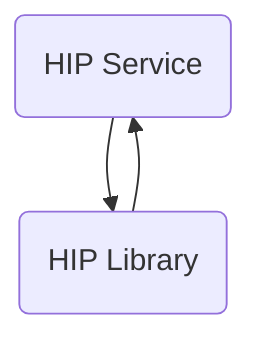

The hip-service repository is a sample implementation of a Health Information Provider (HIP) service. It includes features such as patient account discovery, linking with a Consent Manager, consent artifact acceptance, and data transfer.

## Main Components

### HIP Library

- **Patient**
  - **Model**
    - **Traceable data request**
      - <SwmLink doc-title="Getting Started with Traceable Data Request Model">[Getting Started with Traceable Data Request Model](/.swm/getting-started-with-traceable-data-request-model.iftrpbsk.sw.md)</SwmLink>
      - **Classes**
        - <SwmLink doc-title="The TraceableDataRequest class">[The TraceableDataRequest class](/.swm/the-traceabledatarequest-class.vckib.sw.md)</SwmLink>
    - **Discovery response**
      - <SwmLink doc-title="Overview of DiscoveryResponse in Model">[Overview of DiscoveryResponse in Model](/.swm/overview-of-discoveryresponse-in-model.h0utsuwq.sw.md)</SwmLink>
    - **Care context representation**
      - <SwmLink doc-title="Exploring Care Context Representation Model">[Exploring Care Context Representation Model](/.swm/exploring-care-context-representation-model.re8qx03t.sw.md)</SwmLink>
      - **Classes**
        - <SwmLink doc-title="The CareContextRepresentation class">[The CareContextRepresentation class](/.swm/the-carecontextrepresentation-class.tkqmh.sw.md)</SwmLink>
    - **Granted context**
      - <SwmLink doc-title="Getting Started with the GrantedContext Model">[Getting Started with the GrantedContext Model](/.swm/getting-started-with-the-grantedcontext-model.w7soiga4.sw.md)</SwmLink>
    - **Link enquiry**
      - <SwmLink doc-title="Getting Started with Link Enquiry Model">[Getting Started with Link Enquiry Model](/.swm/getting-started-with-link-enquiry-model.z5qjuug0.sw.md)</SwmLink>
    - **Key material**
      - <SwmLink doc-title="Exploring the Key Material Class">[Exploring the Key Material Class](/.swm/exploring-the-key-material-class.vo1qqfzv.sw.md)</SwmLink>
    - **Patient enquiry representation**
      - <SwmLink doc-title="Exploring Patient Enquiry Representation Model">[Exploring Patient Enquiry Representation Model](/.swm/exploring-patient-enquiry-representation-model.nl2kn0e6.sw.md)</SwmLink>
    - **Discovery request**
      - <SwmLink doc-title="Introduction to Discovery Request Model">[Introduction to Discovery Request Model](/.swm/introduction-to-discovery-request-model.1clilzaa.sw.md)</SwmLink>
    - **Entries**
      - <SwmLink doc-title="Introduction to Entries Model">[Introduction to Entries Model](/.swm/introduction-to-entries-model.u6hv4ish.sw.md)</SwmLink>
    - **Identifier**
      - <SwmLink doc-title="Getting Started with Patient Identifier">[Getting Started with Patient Identifier](/.swm/getting-started-with-patient-identifier.puudye60.sw.md)</SwmLink>
    - **Link enquiry representation**
      - <SwmLink doc-title="Getting Started with Link Enquiry Representation Model">[Getting Started with Link Enquiry Representation Model](/.swm/getting-started-with-link-enquiry-representation-model.6hzsgfe5.sw.md)</SwmLink>
    - **Care context enquiry**
      - <SwmLink doc-title="Basic Concepts of CareContextEnquiry Model">[Basic Concepts of CareContextEnquiry Model](/.swm/basic-concepts-of-carecontextenquiry-model.g6y9s0a7.sw.md)</SwmLink>
    - **Patient link enquiry representation**
      - <SwmLink doc-title="Patient Link Enquiry Representation">[Patient Link Enquiry Representation](/.swm/patient-link-enquiry-representation.ho5ubd7b.sw.md)</SwmLink>
    - **Link confirmation representation**
      - <SwmLink doc-title="Link Confirmation Representation Model">[Link Confirmation Representation Model](/.swm/link-confirmation-representation-model.do3qv3jm.sw.md)</SwmLink>
    - **Patient link enquiry**
      - <SwmLink doc-title="Patient Link Enquiry Model Overview">[Patient Link Enquiry Model Overview](/.swm/patient-link-enquiry-model-overview.pe6m7l8n.sw.md)</SwmLink>
    - **Error**
      - <SwmLink doc-title="Overview of Error Class in Model">[Overview of Error Class in Model](/.swm/overview-of-error-class-in-model.q7aldky4.sw.md)</SwmLink>
    - **Key structure**
      - <SwmLink doc-title="Overview of Key Structure">[Overview of Key Structure](/.swm/overview-of-key-structure.36h2znvd.sw.md)</SwmLink>
    - **Date range**
      - <SwmLink doc-title="Basic Concepts of DateRange Model">[Basic Concepts of DateRange Model](/.swm/basic-concepts-of-daterange-model.h3pj033l.sw.md)</SwmLink>
    - **Care bundle**
      - <SwmLink doc-title="Basic Concepts of CareBundle Model">[Basic Concepts of CareBundle Model](/.swm/basic-concepts-of-carebundle-model.viqxeh1n.sw.md)</SwmLink>
    - **Link reference meta**
      - <SwmLink doc-title="Basic Concepts of Link Reference Metadata">[Basic Concepts of Link Reference Metadata](/.swm/basic-concepts-of-link-reference-metadata.u883vtd4.sw.md)</SwmLink>
    - **Patient link confirmation representation**
      - <SwmLink doc-title="Patient Link Confirmation Representation Model">[Patient Link Confirmation Representation Model](/.swm/patient-link-confirmation-representation-model.z3rv8ncs.sw.md)</SwmLink>
    - **Patient**
      - <SwmLink doc-title="Overview of Patient Model">[Overview of Patient Model](/.swm/overview-of-patient-model.azjhj9v4.sw.md)</SwmLink>
      - **Classes**
        - <SwmLink doc-title="The Patient class">[The Patient class](/.swm/the-patient-class.r9sl2.sw.md)</SwmLink>
    - **Resp**
      - <SwmLink doc-title="Introduction to Resp Class">[Introduction to Resp Class](/.swm/introduction-to-resp-class.hx86gj9c.sw.md)</SwmLink>
  - **I patient repository**
    - <SwmLink doc-title="Exploring Patient Repository Interface">[Exploring Patient Repository Interface](/.swm/exploring-patient-repository-interface.cn8ba32f.sw.md)</SwmLink>
- **Matcher**
  - **Health id matcher**
    - <SwmLink doc-title="Overview of Health ID Matcher">[Overview of Health ID Matcher](/.swm/overview-of-health-id-matcher.kqoev6xu.sw.md)</SwmLink>
  - **Health number matcher**
    - <SwmLink doc-title="Overview of Health Number Matcher">[Overview of Health Number Matcher](/.swm/overview-of-health-number-matcher.upz106u5.sw.md)</SwmLink>
  - **Phone number matcher**
    - <SwmLink doc-title="Basic Concepts of PhoneNumberMatcher">[Basic Concepts of PhoneNumberMatcher](/.swm/basic-concepts-of-phonenumbermatcher.pv63t1dd.sw.md)</SwmLink>
  - **Empty matcher**
    - <SwmLink doc-title="EmptyMatcher in Matcher">[EmptyMatcher in Matcher](/.swm/emptymatcher-in-matcher.y24wqb2v.sw.md)</SwmLink>
  - **Strong matcher factory**
    - <SwmLink doc-title="Overview of StrongMatcherFactory">[Overview of StrongMatcherFactory](/.swm/overview-of-strongmatcherfactory.icgjswpc.sw.md)</SwmLink>

### HIP Service

- **Gateway**
  - **Flows**
    - <SwmLink doc-title="Handling Patient Health Information Requests">[Handling Patient Health Information Requests](/.swm/handling-patient-health-information-requests.i9s6691j.sw.md)</SwmLink>
    - <SwmLink doc-title="Saving Patient Details Flow">[Saving Patient Details Flow](/.swm/saving-patient-details-flow.7yngv0jr.sw.md)</SwmLink>
    - <SwmLink doc-title="Handling Profile Sharing Requests">[Handling Profile Sharing Requests](/.swm/handling-profile-sharing-requests.xg91627x.sw.md)</SwmLink>
    - <SwmLink doc-title="Fetching Patient Authentication Modes Flow">[Fetching Patient Authentication Modes Flow](/.swm/fetching-patient-authentication-modes-flow.51941yij.sw.md)</SwmLink>
    - <SwmLink doc-title="Handling Patient Authentication Mode Fetch Requests">[Handling Patient Authentication Mode Fetch Requests](/.swm/handling-patient-authentication-mode-fetch-requests.97p4853a.sw.md)</SwmLink>
    - <SwmLink doc-title="Handling Gateway Errors During Authentication Fetch">[Handling Gateway Errors During Authentication Fetch](/.swm/handling-gateway-errors-during-authentication-fetch.q9efkw97.sw.md)</SwmLink>
    - <SwmLink doc-title="Handling Patient Search Results">[Handling Patient Search Results](/.swm/handling-patient-search-results.6fac1xcf.sw.md)</SwmLink>
    - <SwmLink doc-title="Handling No Single Match Found">[Handling No Single Match Found](/.swm/handling-no-single-match-found.zpr3mdwb.sw.md)</SwmLink>
    - <SwmLink doc-title="System Downtime Notification Flow">[System Downtime Notification Flow](/.swm/system-downtime-notification-flow.g0lmqsue.sw.md)</SwmLink>
- **Discovery**
  - **Database**
    - **Classes**
      - <SwmLink doc-title="The PatientReferenceNumber class">[The PatientReferenceNumber class](/.swm/the-patientreferencenumber-class.zrtc2.sw.md)</SwmLink>
  - **Flows**
    - <SwmLink doc-title="Handling Patient Demographic Records">[Handling Patient Demographic Records](/.swm/handling-patient-demographic-records.5wc357iy.sw.md)</SwmLink>
- **Open mrs**
  - <SwmLink doc-title="Basic Concepts of OpenMRS Integration">[Basic Concepts of OpenMRS Integration](/.swm/basic-concepts-of-openmrs-integration.zf9u62ri.sw.md)</SwmLink>
  - **Flows**
    - <SwmLink doc-title="Handling Patient Discovery with Null Unverified Identifier">[Handling Patient Discovery with Null Unverified Identifier](/.swm/handling-patient-discovery-with-null-unverified-identifier.uf3c9mkn.sw.md)</SwmLink>
    - <SwmLink doc-title="Retrieving Patient Data with Care Contexts">[Retrieving Patient Data with Care Contexts](/.swm/retrieving-patient-data-with-care-contexts.kq1cmuui.sw.md)</SwmLink>
    - <SwmLink doc-title="Handling Multiple Patients Error">[Handling Multiple Patients Error](/.swm/handling-multiple-patients-error.6eqzcqzs.sw.md)</SwmLink>
    - <SwmLink doc-title="Handling Multiple Patients Found Error">[Handling Multiple Patients Found Error](/.swm/handling-multiple-patients-found-error.exkakuu6.sw.md)</SwmLink>
    - <SwmLink doc-title="Handling Patient Discovery Requests When No Patient is Found">[Handling Patient Discovery Requests When No Patient is Found](/.swm/handling-patient-discovery-requests-when-no-patient-is-found.dd5c5vzp.sw.md)</SwmLink>
- **Common**
  - **Model**
    - <SwmLink doc-title="Introduction to Common Models">[Introduction to Common Models](/.swm/introduction-to-common-models.fv9lxsj4.sw.md)</SwmLink>
  - **Classes**
    - <SwmLink doc-title="The Constants class">[The Constants class](/.swm/the-constants-class.fh877.sw.md)</SwmLink>
- **Link**
  - **Link patient**
    - <SwmLink doc-title="Introduction to Link Patient Process">[Introduction to Link Patient Process](/.swm/introduction-to-link-patient-process.zxx9hoov.sw.md)</SwmLink>
    - **Flows**
      - <SwmLink doc-title="Verifying and Linking Patient Care Contexts">[Verifying and Linking Patient Care Contexts](/.swm/verifying-and-linking-patient-care-contexts.s3ysqya6.sw.md)</SwmLink>
      - <SwmLink doc-title="Verifying Patient Link Reference Response">[Verifying Patient Link Reference Response](/.swm/verifying-patient-link-reference-response.h7yzfyso.sw.md)</SwmLink>
      - <SwmLink doc-title="Handling Duplicate Request IDs in Patient Linking">[Handling Duplicate Request IDs in Patient Linking](/.swm/handling-duplicate-request-ids-in-patient-linking.sq9w2046.sw.md)</SwmLink>
      - <SwmLink doc-title="Handling Care Context Not Found Error">[Handling Care Context Not Found Error](/.swm/handling-care-context-not-found-error.g38lomg0.sw.md)</SwmLink>
      - <SwmLink doc-title="Patient Linking and Validation Flow">[Patient Linking and Validation Flow](/.swm/patient-linking-and-validation-flow.o6k7ppcw.sw.md)</SwmLink>
  - **Model**
    - **Classes**
      - <SwmLink doc-title="The LinkEnquires class">[The LinkEnquires class](/.swm/the-linkenquires-class.fzyle.sw.md)</SwmLink>
  - **Database**
    - **Classes**
      - <SwmLink doc-title="The LinkPatientContext class">[The LinkPatientContext class](/.swm/the-linkpatientcontext-class.k1vi2.sw.md)</SwmLink>
  - **Flows**
    - <SwmLink doc-title="Handling Patient Link Requests">[Handling Patient Link Requests](/.swm/handling-patient-link-requests.o4eostog.sw.md)</SwmLink>
    - <SwmLink doc-title="Handling Link On-Add-Context Requests">[Handling Link On-Add-Context Requests](/.swm/handling-link-on-add-context-requests.c7l7in0i.sw.md)</SwmLink>
- **Data flow**
  - <SwmLink doc-title="Exploring Data Flow">[Exploring Data Flow](/.swm/exploring-data-flow.yogvbhdz.sw.md)</SwmLink>
  - **Flows**
    - <SwmLink doc-title="Handling Data Flow Messages">[Handling Data Flow Messages](/.swm/handling-data-flow-messages.bqf0h6xv.sw.md)</SwmLink>
    - <SwmLink doc-title="Ensuring Correct Data Flow and Notification">[Ensuring Correct Data Flow and Notification](/.swm/ensuring-correct-data-flow-and-notification.9jh7j14z.sw.md)</SwmLink>
  - **Classes**
    - <SwmLink doc-title="The DataFlow class">[The DataFlow class](/.swm/the-dataflow-class.wo3ck.sw.md)</SwmLink>
- **Patient**
  - **Model**
    - <SwmLink doc-title="Overview of the Patient Model">[Overview of the Patient Model](/.swm/overview-of-the-patient-model.kdipw8iw.sw.md)</SwmLink>
- **Verification**
  - <SwmLink doc-title="Introduction to Verification Process">[Introduction to Verification Process](/.swm/introduction-to-verification-process.skni4qba.sw.md)</SwmLink>
  - **Verification controller**
    - <SwmLink doc-title="Verification Controller Overview">[Verification Controller Overview](/.swm/verification-controller-overview.47q3yw6o.sw.md)</SwmLink>
- **Creation**
  - **Model**
    - <SwmLink doc-title="Exploring Creation Models">[Exploring Creation Models](/.swm/exploring-creation-models.xz22ws3o.sw.md)</SwmLink>
  - **Creation controller**
    - <SwmLink doc-title="Overview of Creation Controller">[Overview of Creation Controller](/.swm/overview-of-creation-controller.vr3pqbye.sw.md)</SwmLink>
- **User auth**
  - **Model**
    - <SwmLink doc-title="Introduction to User Authentication Models">[Introduction to User Authentication Models](/.swm/introduction-to-user-authentication-models.li95s035.sw.md)</SwmLink>
  - **User auth controller**
    - <SwmLink doc-title="User Authentication Controller Overview">[User Authentication Controller Overview](/.swm/user-authentication-controller-overview.qyvvejad.sw.md)</SwmLink>
- **Consent**
  - <SwmLink doc-title="Overview of Consent Management">[Overview of Consent Management](/.swm/overview-of-consent-management.e8fefpx9.sw.md)</SwmLink>
  - **Database**
    - <SwmLink doc-title="Exploring Consent Database">[Exploring Consent Database](/.swm/exploring-consent-database.9hqw0pk6.sw.md)</SwmLink>
  - **Classes**
    - <SwmLink doc-title="The Consent class">[The Consent class](/.swm/the-consent-class.4kmhj.sw.md)</SwmLink>
- **Flows**
  - <SwmLink doc-title="Notifying HIP Flow">[Notifying HIP Flow](/.swm/notifying-hip-flow.ylr5e6r3.sw.md)</SwmLink>
  - <SwmLink doc-title="Notifying Gateway About Data Transfer Failure">[Notifying Gateway About Data Transfer Failure](/.swm/notifying-gateway-about-data-transfer-failure.dwhnxc58.sw.md)</SwmLink>
  - <SwmLink doc-title="Filtering and Returning Patient Information">[Filtering and Returning Patient Information](/.swm/filtering-and-returning-patient-information.bgn4r7c8.sw.md)</SwmLink>
  - <SwmLink doc-title="Filtering and Returning Patient Data Flow">[Filtering and Returning Patient Data Flow](/.swm/filtering-and-returning-patient-data-flow.xfgk68tt.sw.md)</SwmLink>
  - <SwmLink doc-title="Filtering and Returning Patient Data Flow">[Filtering and Returning Patient Data Flow](/.swm/filtering-and-returning-patient-data-flow.j8582efh.sw.md)</SwmLink>
  - <SwmLink doc-title="Filtering and Returning Patients by Phone Number">[Filtering and Returning Patients by Phone Number](/.swm/filtering-and-returning-patients-by-phone-number.0i8d85w6.sw.md)</SwmLink>
  - <SwmLink doc-title="Filtering Patients by Fuzzy Name">[Filtering Patients by Fuzzy Name](/.swm/filtering-patients-by-fuzzy-name.6umjbxnb.sw.md)</SwmLink>
  - <SwmLink doc-title="Filtering and Returning a Patient with Null Name and Age">[Filtering and Returning a Patient with Null Name and Age](/.swm/filtering-and-returning-a-patient-with-null-name-and-age.40lgwz90.sw.md)</SwmLink>
  - <SwmLink doc-title="Filtering and Returning Patient Data">[Filtering and Returning Patient Data](/.swm/filtering-and-returning-patient-data.3el0re0q.sw.md)</SwmLink>
  - <SwmLink doc-title="Filtering and Returning a Patient Regardless of Name Casing">[Filtering and Returning a Patient Regardless of Name Casing](/.swm/filtering-and-returning-a-patient-regardless-of-name-casing.rkasmn0a.sw.md)</SwmLink>
- **Classes**
  - <SwmLink doc-title="The Log class">[The Log class](/.swm/the-log-class.g0h39.sw.md)</SwmLink>

### Build Tools

Build tools automate the compilation, testing, and packaging of the application, ensuring consistency and efficiency in the development workflow.

## Build Tools

- <SwmLink doc-title="Docker Configuration ">[Docker Configuration ](/.swm/docker-configuration.5js28xtw.sw.md)</SwmLink>

&nbsp;

*This is an auto-generated document by Swimm 🌊 and has not yet been verified by a human*

<SwmMeta version="3.0.0" repo-id="Z2l0aHViJTNBJTNBaGlwLXNlcnZpY2UlM0ElM0FTd2ltbS1EZW1v" repo-name="hip-service">Powered by [Swimm](https://app.swimm.io/)</SwmMeta>
