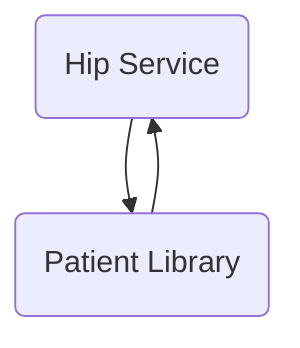

The `hip-service` repository is designed to facilitate the exchange of healthcare information. It includes functionalities for collecting patient data, linking care contexts, and managing patient profiles.

## Main Components

### Patient Library

- **Patient**
  - **I patient repository**
    - <SwmLink doc-title="Introduction to patient repository interface">[Introduction to patient repository interface](/.swm/introduction-to-patient-repository-interface.96m1287n.sw.md)</SwmLink>
  - **Model**
    - **Traceable data request**
      - <SwmLink doc-title="Introduction to traceable data request model">[Introduction to traceable data request model](/.swm/introduction-to-traceable-data-request-model.1ggvcoqi.sw.md)</SwmLink>
      - **Classes**
        - <SwmLink doc-title="The traceabledatarequest class">[The traceabledatarequest class](/.swm/the-traceabledatarequest-class.ba16d.sw.md)</SwmLink>
    - **Patient enquiry representation**
      - <SwmLink doc-title="Patient enquiry representation">[Patient enquiry representation](/.swm/patient-enquiry-representation.n4ap88kg.sw.md)</SwmLink>
    - **Patient enquiry**
      - <SwmLink doc-title="Patient enquiry model">[Patient enquiry model](/.swm/patient-enquiry-model.s1reu5ex.sw.md)</SwmLink>
    - **Patient**
      - <SwmLink doc-title="Overview of patient model">[Overview of patient model](/.swm/overview-of-patient-model.0vic0c2d.sw.md)</SwmLink>
      - **Classes**
        - <SwmLink doc-title="The patient class">[The patient class](/.swm/the-patient-class.o4b79.sw.md)</SwmLink>
    - **Resp**
      - <SwmLink doc-title="Overview of the resp model">[Overview of the resp model](/.swm/overview-of-the-resp-model.cjz64eu0.sw.md)</SwmLink>
- **Matcher**
  - **Health number matcher**
    - <SwmLink doc-title="Health number matcher overview">[Health number matcher overview](/.swm/health-number-matcher-overview.6c65mfi0.sw.md)</SwmLink>
  - **Medical record matcher**
    - <SwmLink doc-title="Introduction to medical record matcher">[Introduction to medical record matcher](/.swm/introduction-to-medical-record-matcher.arnquw6g.sw.md)</SwmLink>
  - **Phone number matcher**
    - <SwmLink doc-title="Exploring phonenumbermatcher in matcher">[Exploring phonenumbermatcher in matcher](/.swm/exploring-phonenumbermatcher-in-matcher.zcrli715.sw.md)</SwmLink>
  - **Empty matcher**
    - <SwmLink doc-title="Exploring emptymatcher in matcher">[Exploring emptymatcher in matcher](/.swm/exploring-emptymatcher-in-matcher.ff3a9m3x.sw.md)</SwmLink>
  - **Strong matcher factory**
    - <SwmLink doc-title="Getting started with strong matcher factory">[Getting started with strong matcher factory](/.swm/getting-started-with-strong-matcher-factory.rhx4b7v1.sw.md)</SwmLink>
  - **Health id matcher**
    - <SwmLink doc-title="Basic concepts of health id matcher">[Basic concepts of health id matcher](/.swm/basic-concepts-of-health-id-matcher.dms45jes.sw.md)</SwmLink>

### Hip Service

- **Sms notification**
  - <SwmLink doc-title="Overview of sms notification in hip service">[Overview of sms notification in hip service](/.swm/overview-of-sms-notification-in-hip-service.92ug4bhc.sw.md)</SwmLink>
- **Open mrs**
  - **Flows**
    - <SwmLink doc-title="Notifyhip process">[Notifyhip process](/.swm/notifyhip-process.b3bxt11f.sw.md)</SwmLink>
- **Discovery**
  - **Patient discovery**
    - <SwmLink doc-title="Patient discovery process">[Patient discovery process](/.swm/patient-discovery-process.45lwwst8.sw.md)</SwmLink>
  - **Database**
    - **Classes**
      - <SwmLink doc-title="The patientreferencenumber class">[The patientreferencenumber class](/.swm/the-patientreferencenumber-class.290fq.sw.md)</SwmLink>
  - **Flows**
    - <SwmLink doc-title="Patient discovery process">[Patient discovery process](/.swm/patient-discovery-process.f882pqfm.sw.md)</SwmLink>
- **Data flow**
  - <SwmLink doc-title="Data flow in hip service">[Data flow in hip service](/.swm/data-flow-in-hip-service.y8vhfkqv.sw.md)</SwmLink>
  - **Database**
    - <SwmLink doc-title="Basic concepts of database in data flow">[Basic concepts of database in data flow](/.swm/basic-concepts-of-database-in-data-flow.ormouiyh.sw.md)</SwmLink>
  - **Flows**
    - <SwmLink doc-title="Handling data flow messages">[Handling data flow messages](/.swm/handling-data-flow-messages.wxa22445.sw.md)</SwmLink>
  - **Classes**
    - <SwmLink doc-title="The dataflow class">[The dataflow class](/.swm/the-dataflow-class.jlg0o.sw.md)</SwmLink>
- **Consent**
  - <SwmLink doc-title="Introduction to consent mechanism">[Introduction to consent mechanism](/.swm/introduction-to-consent-mechanism.370xek1y.sw.md)</SwmLink>
  - **Database**
    - <SwmLink doc-title="Database management in consent module">[Database management in consent module](/.swm/database-management-in-consent-module.ft03aruy.sw.md)</SwmLink>
  - **Classes**
    - <SwmLink doc-title="The consent class">[The consent class](/.swm/the-consent-class.gqwhe.sw.md)</SwmLink>
- **Link**
  - **Link patient repository**
    - <SwmLink doc-title="Overview of link patient repository">[Overview of link patient repository](/.swm/overview-of-link-patient-repository.k4oa3fe6.sw.md)</SwmLink>
  - **Database**
    - <SwmLink doc-title="Database management in link module">[Database management in link module](/.swm/database-management-in-link-module.yb2xy6r6.sw.md)</SwmLink>
    - **Classes**
      - <SwmLink doc-title="The linkpatientcontext class">[The linkpatientcontext class](/.swm/the-linkpatientcontext-class.z493u.sw.md)</SwmLink>
  - **Model**
    - <SwmLink doc-title="Understanding link models">[Understanding link models](/.swm/understanding-link-models.961neev3.sw.md)</SwmLink>
    - **Classes**
      - <SwmLink doc-title="The linkenquires class">[The linkenquires class](/.swm/the-linkenquires-class.6it1e.sw.md)</SwmLink>
  - **Flows**
    - <SwmLink doc-title="Linking patient care contexts">[Linking patient care contexts](/.swm/linking-patient-care-contexts.amdcg9iw.sw.md)</SwmLink>
    - <SwmLink doc-title="Patient linking process">[Patient linking process](/.swm/patient-linking-process.n98da95e.sw.md)</SwmLink>
    - <SwmLink doc-title="Handling link on add context requests">[Handling link on add context requests](/.swm/handling-link-on-add-context-requests.mibwpclp.sw.md)</SwmLink>
- **User auth**
  - **User auth service**
    - <SwmLink doc-title="Basic concepts of user authentication service">[Basic concepts of user authentication service](/.swm/basic-concepts-of-user-authentication-service.lmcalqa7.sw.md)</SwmLink>
  - **Model**
    - <SwmLink doc-title="Introduction to user authentication models">[Introduction to user authentication models](/.swm/introduction-to-user-authentication-models.1ka7zm40.sw.md)</SwmLink>
  - **User auth controller**
    - <SwmLink doc-title="User authentication controller overview">[User authentication controller overview](/.swm/user-authentication-controller-overview.fow39a3t.sw.md)</SwmLink>
- **Creation**
  - **Creation controller**
    - <SwmLink doc-title="Getting started with creation controller">[Getting started with creation controller](/.swm/getting-started-with-creation-controller.eq2diuy1.sw.md)</SwmLink>
  - **Model**
    - <SwmLink doc-title="Creation models overview">[Creation models overview](/.swm/creation-models-overview.6ey8wdhh.sw.md)</SwmLink>
- **Classes**
  - <SwmLink doc-title="The log class">[The log class](/.swm/the-log-class.t4nok.sw.md)</SwmLink>

### Build Tools

Build tools are used to compile, test, and deploy the application, ensuring consistency and automation in the development process.

## Build Tools

- <SwmLink doc-title="Building the project with docker">[Building the project with docker](/.swm/building-the-project-with-docker.3dkdh143.sw.md)</SwmLink>

&nbsp;

*This is an auto-generated document by Swimm 🌊 and has not yet been verified by a human*

<SwmMeta version="3.0.0" repo-id="Z2l0aHViJTNBJTNBaGlwLXNlcnZpY2UlM0ElM0FTd2ltbS1EZW1v" repo-name="hip-service">Powered by [Swimm](/)</SwmMeta>
