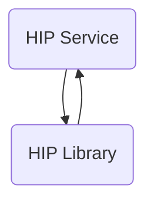

The hip-service repository is a sample implementation of a Health Information Provider (HIP) service. It includes features such as patient account discovery, linking with a Consent Manager, consent artifact acceptance, and data transfer.

## Main Components

### HIP Library

- **Patient**
  - **I patient repository**
    - <SwmLink doc-title="Basic concepts of patient repository interface">[Basic concepts of patient repository interface](.swm/basic-concepts-of-patient-repository-interface.v5f09hm5.sw.md)</SwmLink>
  - **Model**
    - **Traceable data request**
      - <SwmLink doc-title="Basic concepts of traceable data request model">[Basic concepts of traceable data request model](.swm/basic-concepts-of-traceable-data-request-model.ja3d1hqd.sw.md)</SwmLink>
    - **Discovery response**
      - <SwmLink doc-title="Introduction to discovery response model">[Introduction to discovery response model](.swm/introduction-to-discovery-response-model.1yl79t0d.sw.md)</SwmLink>
    - **Error representation**
      - <SwmLink doc-title="Getting started with error representation in model">[Getting started with error representation in model](.swm/getting-started-with-error-representation-in-model.24yr1rob.sw.md)</SwmLink>
    - **Care context representation**
      - <SwmLink doc-title="Overview of care context representation model">[Overview of care context representation model](.swm/overview-of-care-context-representation-model.yuwm4hxt.sw.md)</SwmLink>
    - **Granted context**
      - <SwmLink doc-title="Exploring granted context model">[Exploring granted context model](.swm/exploring-granted-context-model.9fpmbuaq.sw.md)</SwmLink>
    - **Link enquiry**
      - <SwmLink doc-title="Getting started with link enquiry model">[Getting started with link enquiry model](.swm/getting-started-with-link-enquiry-model.6e9rui7u.sw.md)</SwmLink>
    - **Key material**
      - <SwmLink doc-title="Basic concepts of key material">[Basic concepts of key material](.swm/basic-concepts-of-key-material.g6kot17n.sw.md)</SwmLink>
    - **Patient enquiry representation**
      - <SwmLink doc-title="Getting started with patient enquiry representation model">[Getting started with patient enquiry representation model](.swm/getting-started-with-patient-enquiry-representation-model.5glgh6f0.sw.md)</SwmLink>
    - **Discovery request**
      - <SwmLink doc-title="Basic concepts of discovery request model">[Basic concepts of discovery request model](.swm/basic-concepts-of-discovery-request-model.imfgky5h.sw.md)</SwmLink>
    - **Entries**
      - <SwmLink doc-title="Getting started with entries model">[Getting started with entries model](.swm/getting-started-with-entries-model.qgftgr1t.sw.md)</SwmLink>
    - **Identifier**
      - <SwmLink doc-title="Patient identifier">[Patient identifier](.swm/patient-identifier.zxx6cgse.sw.md)</SwmLink>
    - **Link enquiry representation**
      - <SwmLink doc-title="Exploring link enquiry representation model">[Exploring link enquiry representation model](.swm/exploring-link-enquiry-representation-model.l9sxyp27.sw.md)</SwmLink>
    - **Care context enquiry**
      - <SwmLink doc-title="Overview of carecontextenquiry model">[Overview of carecontextenquiry model](.swm/overview-of-carecontextenquiry-model.1a3fefzw.sw.md)</SwmLink>
    - **Patient link enquiry representation**
      - <SwmLink doc-title="Patient link enquiry representation">[Patient link enquiry representation](.swm/patient-link-enquiry-representation.yngpsj3l.sw.md)</SwmLink>
    - **Patient enquiry**
      - <SwmLink doc-title="Basic concepts of patient enquiry model">[Basic concepts of patient enquiry model](.swm/basic-concepts-of-patient-enquiry-model.ta2fv189.sw.md)</SwmLink>
    - **Patient link enquiry**
      - <SwmLink doc-title="Overview of patient link enquiry model">[Overview of patient link enquiry model](.swm/overview-of-patient-link-enquiry-model.smtocaz1.sw.md)</SwmLink>
    - **Error**
      - <SwmLink doc-title="Overview of the error class">[Overview of the error class](.swm/overview-of-the-error-class.k415of6o.sw.md)</SwmLink>
    - **Key structure**
      - <SwmLink doc-title="Basic concepts of key structure in model">[Basic concepts of key structure in model](.swm/basic-concepts-of-key-structure-in-model.5mxaobqw.sw.md)</SwmLink>
    - **Link confirmation request**
      - <SwmLink doc-title="Getting started with link confirmation request model">[Getting started with link confirmation request model](.swm/getting-started-with-link-confirmation-request-model.fbf888gp.sw.md)</SwmLink>
    - **Date range**
      - <SwmLink doc-title="Daterange model overview">[Daterange model overview](.swm/daterange-model-overview.mbxl2hfz.sw.md)</SwmLink>
    - **Data request**
      - <SwmLink doc-title="Getting started with data request model">[Getting started with data request model](.swm/getting-started-with-data-request-model.w3xuzv7r.sw.md)</SwmLink>
    - **Care bundle**
      - <SwmLink doc-title="Overview of the carebundle model">[Overview of the carebundle model](.swm/overview-of-the-carebundle-model.tjlys6af.sw.md)</SwmLink>
    - **Link reference meta**
      - <SwmLink doc-title="Overview of link reference metadata">[Overview of link reference metadata](.swm/overview-of-link-reference-metadata.lsg42xl3.sw.md)</SwmLink>
    - **Patient link confirmation representation**
      - <SwmLink doc-title="Getting started with patient link confirmation representation model">[Getting started with patient link confirmation representation model](.swm/getting-started-with-patient-link-confirmation-representation-model.32jxwofs.sw.md)</SwmLink>
    - **Patient**
      - <SwmLink doc-title="Getting started with patient model">[Getting started with patient model](.swm/getting-started-with-patient-model.1mn9o5zl.sw.md)</SwmLink>
    - **Resp**
      - <SwmLink doc-title="Understanding resp class">[Understanding resp class](.swm/understanding-resp-class.j5l0k23w.sw.md)</SwmLink>
- **Matcher**
  - **Health number matcher**
    - <SwmLink doc-title="Getting started with health number matcher">[Getting started with health number matcher](.swm/getting-started-with-health-number-matcher.5q4ecxrx.sw.md)</SwmLink>
  - **Medical record matcher**
    - <SwmLink doc-title="Overview of medical record matcher">[Overview of medical record matcher](.swm/overview-of-medical-record-matcher.boew5rq8.sw.md)</SwmLink>
    - **Classes**
      - <SwmLink doc-title="The medicalrecordmatcher class">[The medicalrecordmatcher class](.swm/the-medicalrecordmatcher-class.f5mi2.sw.md)</SwmLink>
  - **Phone number matcher**
    - <SwmLink doc-title="Overview of phonenumbermatcher">[Overview of phonenumbermatcher](.swm/overview-of-phonenumbermatcher.yoxje6nq.sw.md)</SwmLink>
  - **Empty matcher**
    - <SwmLink doc-title="Overview of emptymatcher">[Overview of emptymatcher](.swm/overview-of-emptymatcher.pnc38i8t.sw.md)</SwmLink>
  - **Strong matcher factory**
    - <SwmLink doc-title="Overview of strongmatcherfactory">[Overview of strongmatcherfactory](.swm/overview-of-strongmatcherfactory.w942k5w7.sw.md)</SwmLink>
  - **Health id matcher**
    - <SwmLink doc-title="Basic concepts of health id matcher">[Basic concepts of health id matcher](.swm/basic-concepts-of-health-id-matcher.naz83pwf.sw.md)</SwmLink>

### HIP Service

- **Gateway**
  - <SwmLink doc-title="Exploring gateway configuration and client">[Exploring gateway configuration and client](.swm/exploring-gateway-configuration-and-client.lys46voe.sw.md)</SwmLink>
- **Verification**
  - <SwmLink doc-title="Getting started with verification process">[Getting started with verification process](.swm/getting-started-with-verification-process.hhorx2n8.sw.md)</SwmLink>
  - **Verification controller**
    - <SwmLink doc-title="Overview of verification controller">[Overview of verification controller](.swm/overview-of-verification-controller.pi2ksq8r.sw.md)</SwmLink>
- **User auth**
  - **User auth service**
    - <SwmLink doc-title="Understanding user authentication service">[Understanding user authentication service](.swm/understanding-user-authentication-service.mi01mzba.sw.md)</SwmLink>
  - **Model**
    - <SwmLink doc-title="Exploring user authentication models">[Exploring user authentication models](.swm/exploring-user-authentication-models.bsp5f576.sw.md)</SwmLink>
  - **User auth controller**
    - <SwmLink doc-title="Getting started with user authentication controller">[Getting started with user authentication controller](.swm/getting-started-with-user-authentication-controller.brcsjz35.sw.md)</SwmLink>
- **Patient**
  - <SwmLink doc-title="Introduction to patient in hip service">[Introduction to patient in hip service](.swm/introduction-to-patient-in-hip-service.fqjw5c1d.sw.md)</SwmLink>
  - **Model**
    - <SwmLink doc-title="Exploring patient model">[Exploring patient model](.swm/exploring-patient-model.5n63b36e.sw.md)</SwmLink>
- **Startup**
  - <SwmLink doc-title="Getting started with application startup configuration">[Getting started with application startup configuration](.swm/getting-started-with-application-startup-configuration.lwc15m3w.sw.md)</SwmLink>
- **Sms notification**
  - <SwmLink doc-title="Getting started with sms notification in hip service">[Getting started with sms notification in hip service](.swm/getting-started-with-sms-notification-in-hip-service.eclvx5t8.sw.md)</SwmLink>
- **Discovery**
  - **Patient discovery**
    - <SwmLink doc-title="Overview of patient discovery">[Overview of patient discovery](.swm/overview-of-patient-discovery.25el3zlm.sw.md)</SwmLink>
  - **Database**
    - <SwmLink doc-title="Overview of the discovery database">[Overview of the discovery database](.swm/overview-of-the-discovery-database.xjb3xglu.sw.md)</SwmLink>
  - **Flows**
    - <SwmLink doc-title="Handling patient discovery requests">[Handling patient discovery requests](.swm/handling-patient-discovery-requests.64dkl2sv.sw.md)</SwmLink>
  - **Classes**
    - <SwmLink doc-title="The nameranker class">[The nameranker class](.swm/the-nameranker-class.zf7cg.sw.md)</SwmLink>
- **Creation**
  - **Creation controller**
    - <SwmLink doc-title="Exploring creation controller">[Exploring creation controller](.swm/exploring-creation-controller.623rqif6.sw.md)</SwmLink>
  - **Link phr controller**
    - <SwmLink doc-title="Understanding link phr controller">[Understanding link phr controller](.swm/understanding-link-phr-controller.t38odqxy.sw.md)</SwmLink>
  - **Model**
    - <SwmLink doc-title="Exploring creation models">[Exploring creation models](.swm/exploring-creation-models.ang9a1ne.sw.md)</SwmLink>
- **Common**
  - <SwmLink doc-title="Overview of common utilities and configurations">[Overview of common utilities and configurations](.swm/overview-of-common-utilities-and-configurations.8dummpss.sw.md)</SwmLink>
  - **Model**
    - <SwmLink doc-title="Overview of common models">[Overview of common models](.swm/overview-of-common-models.jl7u8dr8.sw.md)</SwmLink>
- **Link**
  - **Link patient repository**
    - <SwmLink doc-title="Basic concepts of linkpatientrepository">[Basic concepts of linkpatientrepository](.swm/basic-concepts-of-linkpatientrepository.cne17ghs.sw.md)</SwmLink>
  - **Database**
    - <SwmLink doc-title="Exploring database management in link">[Exploring database management in link](.swm/exploring-database-management-in-link.ktq7mb1u.sw.md)</SwmLink>
  - **Link patient**
    - <SwmLink doc-title="Introduction to link patient process">[Introduction to link patient process](.swm/introduction-to-link-patient-process.1p2gkv7z.sw.md)</SwmLink>
  - **Model**
    - <SwmLink doc-title="Exploring link models">[Exploring link models](.swm/exploring-link-models.n5lxpnfh.sw.md)</SwmLink>
  - **Flows**
    - <SwmLink doc-title="Linking patient care contexts">[Linking patient care contexts](.swm/linking-patient-care-contexts.co6uxua8.sw.md)</SwmLink>
    - <SwmLink doc-title="Linking patient data flow">[Linking patient data flow](.swm/linking-patient-data-flow.yfnnviib.sw.md)</SwmLink>
    - <SwmLink doc-title="Handling care context linking confirmation">[Handling care context linking confirmation](.swm/handling-care-context-linking-confirmation.pu4tfyav.sw.md)</SwmLink>
- **Open mrs**
  - <SwmLink doc-title="Overview of openmrs integration">[Overview of openmrs integration](.swm/overview-of-openmrs-integration.liqhztc7.sw.md)</SwmLink>
  - **Flows**
    - <SwmLink doc-title="Handling patient status notifications">[Handling patient status notifications](.swm/handling-patient-status-notifications.em23krol.sw.md)</SwmLink>
- **Data flow**
  - <SwmLink doc-title="Overview of data flow in hip service">[Overview of data flow in hip service](.swm/overview-of-data-flow-in-hip-service.dahttkme.sw.md)</SwmLink>
  - **Database**
    - <SwmLink doc-title="Overview of database in data flow">[Overview of database in data flow](.swm/overview-of-database-in-data-flow.oazvkqnw.sw.md)</SwmLink>
  - **Flows**
    - <SwmLink doc-title="Handling data requests and secure data transfer">[Handling data requests and secure data transfer](.swm/handling-data-requests-and-secure-data-transfer.4xtikgx8.sw.md)</SwmLink>
- **Consent**
  - <SwmLink doc-title="Overview of consent management">[Overview of consent management](.swm/overview-of-consent-management.rbttt9ev.sw.md)</SwmLink>
  - **Database**
    - <SwmLink doc-title="Getting started with consent database">[Getting started with consent database](.swm/getting-started-with-consent-database.n473e3q0.sw.md)</SwmLink>

&nbsp;

*This is an auto-generated document by Swimm 🌊 and has not yet been verified by a human*

<SwmMeta version="3.0.0" repo-id="Z2l0aHViJTNBJTNBaGlwLXNlcnZpY2UlM0ElM0FTd2ltbS1EZW1v" repo-name="hip-service">Powered by [Swimm](/)</SwmMeta>
