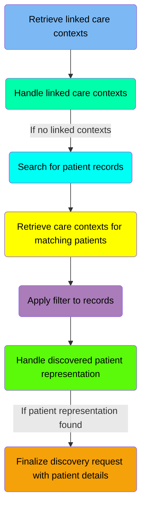
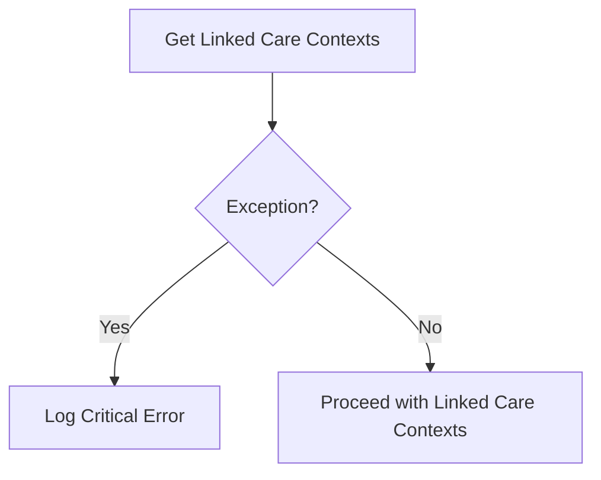
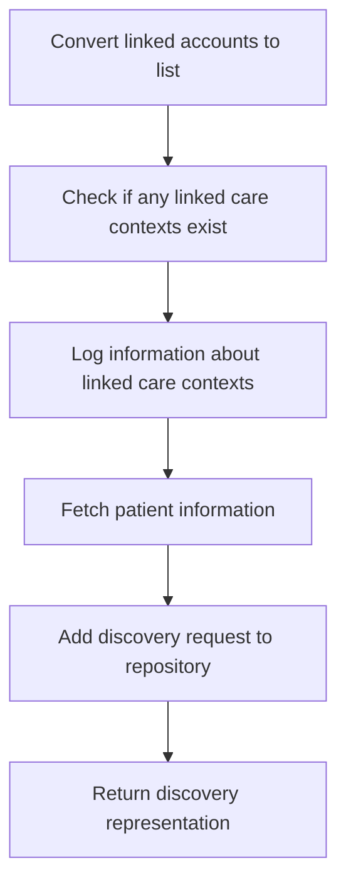
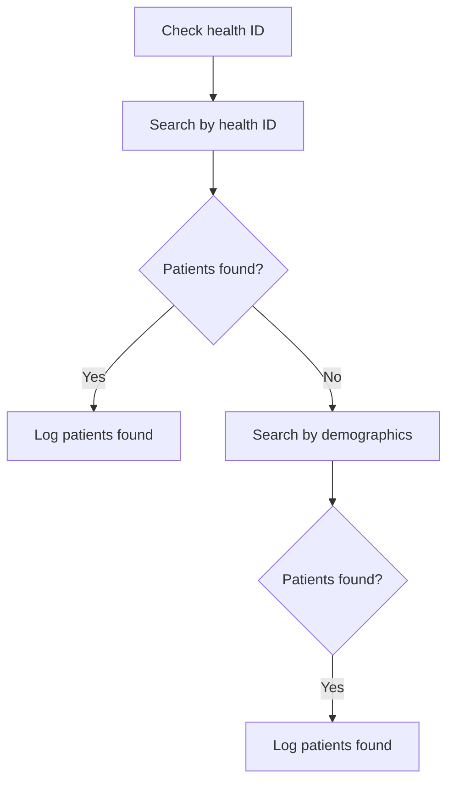
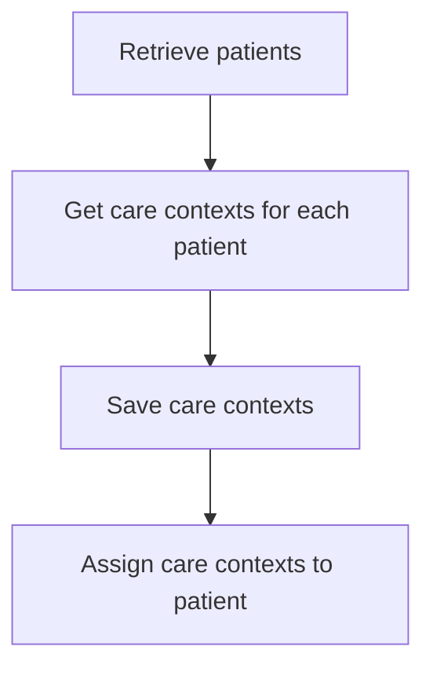
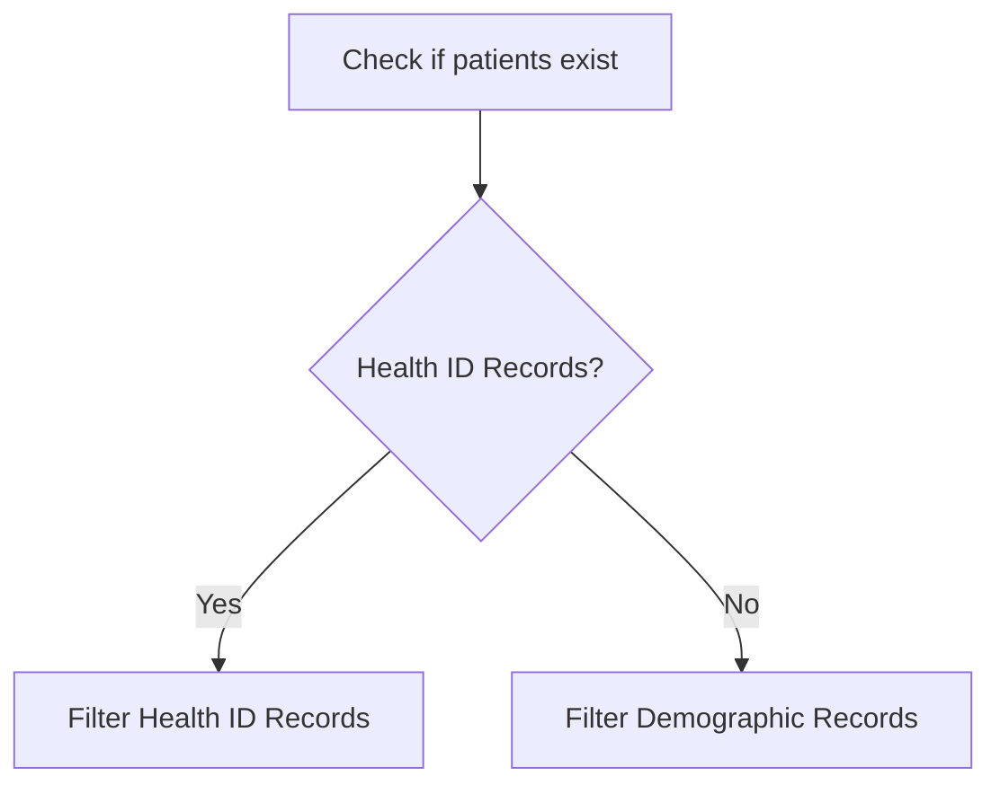
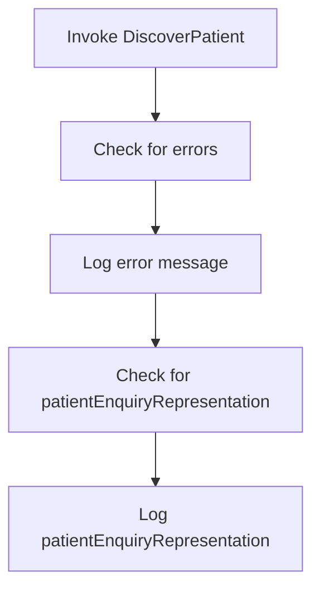
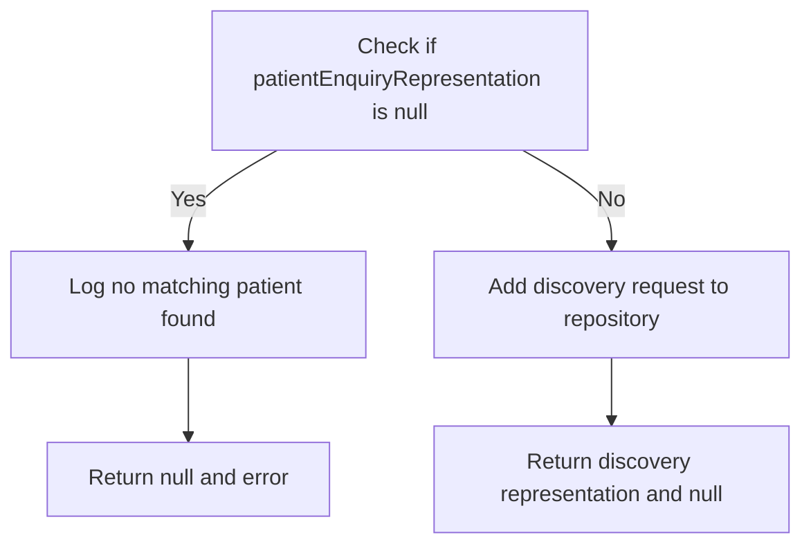
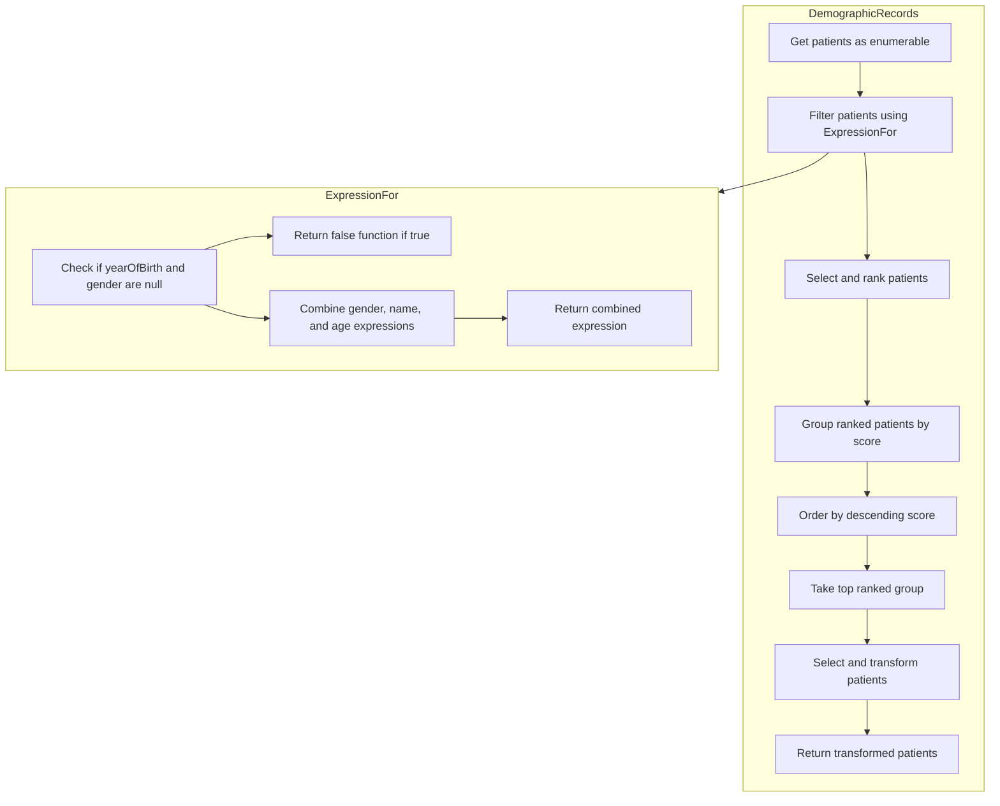

This document explains the <SwmToken path="src/In.ProjectEKA.HipService/Discovery/PatientDiscovery.cs" pos="51:17:17" line-data="        public virtual async Task&lt;ValueTuple&lt;DiscoveryRepresentation, ErrorRepresentation&gt;&gt; PatientFor(">`PatientFor`</SwmToken> function, which is responsible for discovering patient information by retrieving linked care contexts, handling exceptions, searching for patient records, and finalizing the discovery request with patient details.

The <SwmToken path="src/In.ProjectEKA.HipService/Discovery/PatientDiscovery.cs" pos="51:17:17" line-data="        public virtual async Task&lt;ValueTuple&lt;DiscoveryRepresentation, ErrorRepresentation&gt;&gt; PatientFor(">`PatientFor`</SwmToken> function starts by retrieving linked care contexts for a patient. If an exception occurs, it logs the error and returns an error message. If no linked contexts are found, it searches for patient records using either a health ID or demographic information. Once the patient records are found, it retrieves care contexts for the matching patients and applies filters to these records. Finally, it handles the discovered patient representation and finalizes the discovery request with the patient details.

Here is a high level diagram of the flow, showing only the most important functions:

```mermaid
graph TD;
      subgraph srcInProjectEKAHipServiceDiscovery[src/In.ProjectEKA.HipService/Discovery]
c9492533f6794861666ddba685ef8e10a8a9cd6b2d7c14ca8b7c601d963533fb(PatientFor) --> e37bd2319e70a3cc4983c64c5b1ae6c5f8548d69222487ceffab4be1c069d09a(DemographicRecords)
end

subgraph srcInProjectEKAHipServiceDiscovery[src/In.ProjectEKA.HipService/Discovery]
e37bd2319e70a3cc4983c64c5b1ae6c5f8548d69222487ceffab4be1c069d09a(DemographicRecords) --> e4e40037e20b250fbf5bc0601a222a04b6036f186e2660080f842e277eb01536(ExpressionFor)
end


      classDef mainFlowStyle color:#000000,fill:#7CB9F4
classDef rootsStyle color:#000000,fill:#00FFF4
classDef Style1 color:#000000,fill:#00FFAA
classDef Style2 color:#000000,fill:#FFFF00
classDef Style3 color:#000000,fill:#AA7CB9

%% Swimm:
%% graph TD;
%%       subgraph srcInProjectEKAHipServiceDiscovery[<SwmPath>[src/In.ProjectEKA.HipService/Discovery/](src/In.ProjectEKA.HipService/Discovery/)</SwmPath>]
%% c9492533f6794861666ddba685ef8e10a8a9cd6b2d7c14ca8b7c601d963533fb(<SwmToken path="src/In.ProjectEKA.HipService/Discovery/PatientDiscovery.cs" pos="51:17:17" line-data="        public virtual async Task&lt;ValueTuple&lt;DiscoveryRepresentation, ErrorRepresentation&gt;&gt; PatientFor(">`PatientFor`</SwmToken>) --> e37bd2319e70a3cc4983c64c5b1ae6c5f8548d69222487ceffab4be1c069d09a(<SwmToken path="src/In.ProjectEKA.HipService/Discovery/PatientDiscovery.cs" pos="168:5:5" line-data="                                                 : Filter.DemographicRecords(patients, request);   ">`DemographicRecords`</SwmToken>)
%% end
%% 
%% subgraph srcInProjectEKAHipServiceDiscovery[<SwmPath>[src/In.ProjectEKA.HipService/Discovery/](src/In.ProjectEKA.HipService/Discovery/)</SwmPath>]
%% e37bd2319e70a3cc4983c64c5b1ae6c5f8548d69222487ceffab4be1c069d09a(<SwmToken path="src/In.ProjectEKA.HipService/Discovery/PatientDiscovery.cs" pos="168:5:5" line-data="                                                 : Filter.DemographicRecords(patients, request);   ">`DemographicRecords`</SwmToken>) --> e4e40037e20b250fbf5bc0601a222a04b6036f186e2660080f842e277eb01536(<SwmToken path="src/In.ProjectEKA.HipService/Discovery/Filter.cs" pos="62:4:4" line-data="                .Where(ExpressionFor(request.Patient.Name, request.Patient.YearOfBirth, request.Patient.Gender))">`ExpressionFor`</SwmToken>)
%% end
%% 
%% 
%%       classDef mainFlowStyle color:#000000,fill:#7CB9F4
%% classDef rootsStyle color:#000000,fill:#00FFF4
%% classDef Style1 color:#000000,fill:#00FFAA
%% classDef Style2 color:#000000,fill:#FFFF00
%% classDef Style3 color:#000000,fill:#AA7CB9
```



# Flow drill down

## Diving into the <SwmToken path="src/In.ProjectEKA.HipService/Discovery/PatientDiscovery.cs" pos="51:17:17" line-data="        public virtual async Task&lt;ValueTuple&lt;DiscoveryRepresentation, ErrorRepresentation&gt;&gt; PatientFor(">`PatientFor`</SwmToken> function



## <SwmToken path="src/In.ProjectEKA.HipService/Discovery/PatientDiscovery.cs" pos="51:17:17" line-data="        public virtual async Task&lt;ValueTuple&lt;DiscoveryRepresentation, ErrorRepresentation&gt;&gt; PatientFor(">`PatientFor`</SwmToken> function - Retrieve linked care contexts

Here is a diagram of this part:



<SwmSnippet path="/src/In.ProjectEKA.HipService/Discovery/PatientDiscovery.cs" line="63">

---

### Retrieving linked care contexts

The function retrieves linked care contexts for a patient by calling <SwmToken path="src/In.ProjectEKA.HipService/Discovery/PatientDiscovery.cs" pos="63:14:16" line-data="            var (linkedAccounts, exception) = await linkPatientRepository.GetLinkedCareContexts(request.Patient.Id);">`linkPatientRepository.GetLinkedCareContexts`</SwmToken> with the patient's ID. This step is crucial as it fetches the necessary care contexts associated with the patient.

```c#
            var (linkedAccounts, exception) = await linkPatientRepository.GetLinkedCareContexts(request.Patient.Id);
```

---

</SwmSnippet>

<SwmSnippet path="/src/In.ProjectEKA.HipService/Discovery/PatientDiscovery.cs" line="65">

---

### Handling exceptions

If an exception occurs during the retrieval of linked care contexts, it is logged as a critical error using <SwmToken path="src/In.ProjectEKA.HipService/Discovery/PatientDiscovery.cs" pos="67:1:3" line-data="                logger.Log(LogLevel.Critical, LogEvents.Discovery, exception, &quot;Failed to get care contexts&quot;);">`logger.Log`</SwmToken>. This ensures that any issues are recorded for further investigation. The function then returns an error representation indicating the failure to get linked care contexts.

```c#
            if (exception != null)
            {
                logger.Log(LogLevel.Critical, LogEvents.Discovery, exception, "Failed to get care contexts");
                return (null,
                    new ErrorRepresentation(new Error(ErrorCode.FailedToGetLinkedCareContexts,
                        "Failed to get Linked Care Contexts")));
            }
```

---

</SwmSnippet>

## <SwmToken path="src/In.ProjectEKA.HipService/Discovery/PatientDiscovery.cs" pos="51:17:17" line-data="        public virtual async Task&lt;ValueTuple&lt;DiscoveryRepresentation, ErrorRepresentation&gt;&gt; PatientFor(">`PatientFor`</SwmToken> function - Handle linked care contexts

Here is a diagram of this part:



<SwmSnippet path="/src/In.ProjectEKA.HipService/Discovery/PatientDiscovery.cs" line="73">

---

### Handling linked care contexts

The function first converts the <SwmToken path="src/In.ProjectEKA.HipService/Discovery/PatientDiscovery.cs" pos="73:7:7" line-data="            var linkedCareContexts = linkedAccounts.ToList();">`linkedAccounts`</SwmToken> to a list using <SwmToken path="src/In.ProjectEKA.HipService/Discovery/PatientDiscovery.cs" pos="73:7:11" line-data="            var linkedCareContexts = linkedAccounts.ToList();">`linkedAccounts.ToList()`</SwmToken>. This list contains the care contexts linked to the patient.

```c#
            var linkedCareContexts = linkedAccounts.ToList();
```

---

</SwmSnippet>

<SwmSnippet path="/src/In.ProjectEKA.HipService/Discovery/PatientDiscovery.cs" line="74">

---

Next, it checks if there are any linked care contexts using the <SwmToken path="src/In.ProjectEKA.HipService/Discovery/PatientDiscovery.cs" pos="74:4:4" line-data="            if (HasAny(linkedCareContexts))">`HasAny`</SwmToken> function. If there are linked care contexts, it logs this information with the transaction ID.

```c#
            if (HasAny(linkedCareContexts))
            {
                logger.Log(LogLevel.Information,
                    LogEvents.Discovery,
                    $"User has already linked care contexts: {request.TransactionId}");
```

---

</SwmSnippet>

<SwmSnippet path="/src/In.ProjectEKA.HipService/Discovery/PatientDiscovery.cs" line="79">

---

### Mapping patient information

The function then fetches the patient information using the <SwmToken path="src/In.ProjectEKA.HipService/Discovery/PatientDiscovery.cs" pos="80:5:5" line-data="                    await patientRepository.PatientWithAsync(linkedCareContexts.First().PatientReferenceNumber);">`PatientWithAsync`</SwmToken> method, which retrieves the patient details based on the first linked care context's patient reference number.

```c#
                var patient =
                    await patientRepository.PatientWithAsync(linkedCareContexts.First().PatientReferenceNumber);
```

---

</SwmSnippet>

<SwmSnippet path="/src/In.ProjectEKA.HipService/Discovery/PatientDiscovery.cs" line="84">

---

After fetching the patient information, it adds a new discovery request to the repository with the transaction ID, patient ID, and patient identifier.

```c#
                        await discoveryRequestRepository.Add(new Model.DiscoveryRequest(request.TransactionId,
                            request.Patient.Id,
                            patient.Identifier));
```

---

</SwmSnippet>

<SwmSnippet path="/src/In.ProjectEKA.HipService/Discovery/PatientDiscovery.cs" line="87">

---

Finally, it returns a <SwmToken path="src/In.ProjectEKA.HipService/Discovery/PatientDiscovery.cs" pos="87:6:6" line-data="                        return (new DiscoveryRepresentation(patient.ToPatientEnquiryRepresentation(">`DiscoveryRepresentation`</SwmToken> containing the patient information and the unlinked care contexts, or an error representation if no patient is found.

```c#
                        return (new DiscoveryRepresentation(patient.ToPatientEnquiryRepresentation(
                                GetUnlinkedCareContexts(linkedCareContexts, patient))),
                            (ErrorRepresentation) null);
                    })
                    .ValueOr(Task.FromResult(GetError(ErrorCode.NoPatientFound, ErrorMessage.NoPatientFound)));
```

---

</SwmSnippet>

## <SwmToken path="src/In.ProjectEKA.HipService/Discovery/PatientDiscovery.cs" pos="51:17:17" line-data="        public virtual async Task&lt;ValueTuple&lt;DiscoveryRepresentation, ErrorRepresentation&gt;&gt; PatientFor(">`PatientFor`</SwmToken> function - Search for patient records

Here is a diagram of this part:



<SwmSnippet path="/src/In.ProjectEKA.HipService/Discovery/PatientDiscovery.cs" line="100">

---

### Handling patient search based on health ID

The function first attempts to search for patients using the health ID provided in the request. It retrieves the health ID from the request and logs whether a health ID was found or not. If a health ID is found, it executes a search for patients with this verified ID.

```c#
                var phoneNumber = request.Patient?.VerifiedIdentifiers?
                    .FirstOrDefault(identifier => identifier.Type.Equals(IdentifierType.MOBILE))
                    ?.Value.ToString();
                var healthId = request.Patient?.Id ?? null;
                
                if (healthId != null) {
                    Log.Information("User name -> " + request.Patient?.Name + " healthId found -> " + healthId);
                } else {
                    Log.Information("No healthId found for this user " + request.Patient?.Name);
                }

                if (healthId != null) {
                    Log.Information("Executing records with healthId block for healthId " + healthId);
                    patients = await patientRepository.PatientsWithVerifiedId(healthId);
                    if (patients.Any()) {
                        healthIdRecords = true;
                        Log.Information("Patients found with healthId :-> Name->" + patients.First());
                        Log.Information("Phone Number" + patients.First().PhoneNumber);
                    }
```

---

</SwmSnippet>

<SwmSnippet path="/src/In.ProjectEKA.HipService/Discovery/PatientDiscovery.cs" line="121">

---

### Handling patient search based on demographics

If no patients are found using the health ID, the function proceeds to search for patients based on demographic information such as name, gender, year of birth, and phone number. It logs the demographic details being used for the search and then executes the search. If patients are found using these demographics, it logs the details of the patients found.

```c#
                if (!patients.Any())
                {
                    Log.Information("Executing records with demographics as below ~~> ");
                    Log.Information(request.Patient?.Name + " " + request.Patient?.Gender.ToOpenMrsGender() + " " + request.Patient?.YearOfBirth?.ToString() + " " + phoneNumber);
                    patients = await patientRepository.PatientsWithDemographics(request.Patient?.Name,
                        request.Patient?.Gender.ToOpenMrsGender(),
                        request.Patient?.YearOfBirth?.ToString(),
                        phoneNumber);
                    if (patients.Any())
                    {
                        healthIdRecords = false;
                        Log.Information("Patients found with demographics :-> Name->" + patients.First().Name);
                        Log.Information("Phone Number" + patients.First().PhoneNumber);
                    }
```

---

</SwmSnippet>

## <SwmToken path="src/In.ProjectEKA.HipService/Discovery/PatientDiscovery.cs" pos="51:17:17" line-data="        public virtual async Task&lt;ValueTuple&lt;DiscoveryRepresentation, ErrorRepresentation&gt;&gt; PatientFor(">`PatientFor`</SwmToken> function - Retrieve care contexts for matching patients

Here is a diagram of this part:



<SwmSnippet path="/src/In.ProjectEKA.HipService/Discovery/PatientDiscovery.cs" line="145">

---

### Retrieving and saving care contexts for each patient

The function iterates over the list of patients retrieved earlier in the process. For each patient, it retrieves their care contexts using the <SwmToken path="src/In.ProjectEKA.HipService/Discovery/PatientDiscovery.cs" pos="147:9:11" line-data="                    var careContexts = await careContextRepository.GetCareContexts(patient.Uuid);">`careContextRepository.GetCareContexts`</SwmToken> method. This ensures that all care contexts associated with the patient are fetched and available for further processing.

```c#
                foreach (var patient in patients)
                {
                    var careContexts = await careContextRepository.GetCareContexts(patient.Uuid);
```

---

</SwmSnippet>

## <SwmToken path="src/In.ProjectEKA.HipService/Discovery/PatientDiscovery.cs" pos="51:17:17" line-data="        public virtual async Task&lt;ValueTuple&lt;DiscoveryRepresentation, ErrorRepresentation&gt;&gt; PatientFor(">`PatientFor`</SwmToken> function - Apply filter to records

Here is a diagram of this part:



<SwmSnippet path="/src/In.ProjectEKA.HipService/Discovery/PatientDiscovery.cs" line="166">

---

### Filtering patient records based on health ID or demographics

The function checks if there are any patient records available by evaluating <SwmToken path="src/In.ProjectEKA.HipService/Discovery/PatientDiscovery.cs" pos="166:4:8" line-data="            if (patients.Any()){">`patients.Any()`</SwmToken>. If patient records exist, it proceeds to filter these records based on whether they are health ID records or demographic records.

```c#
            if (patients.Any()){
                patientEnquiry = healthIdRecords ? Filter.HealthIdRecords(patients, request)
                                                 : Filter.DemographicRecords(patients, request);   
            }
```

---

</SwmSnippet>

## <SwmToken path="src/In.ProjectEKA.HipService/Discovery/PatientDiscovery.cs" pos="51:17:17" line-data="        public virtual async Task&lt;ValueTuple&lt;DiscoveryRepresentation, ErrorRepresentation&gt;&gt; PatientFor(">`PatientFor`</SwmToken> function - Handle discovered patient representation

Here is a diagram of this part:



<SwmSnippet path="/src/In.ProjectEKA.HipService/Discovery/PatientDiscovery.cs" line="171">

---

### Handling the discovered patient representation

The function <SwmToken path="src/In.ProjectEKA.HipService/Discovery/PatientDiscovery.cs" pos="51:17:17" line-data="        public virtual async Task&lt;ValueTuple&lt;DiscoveryRepresentation, ErrorRepresentation&gt;&gt; PatientFor(">`PatientFor`</SwmToken> handles the discovered patient representation by invoking the <SwmToken path="src/In.ProjectEKA.HipService/Discovery/PatientDiscovery.cs" pos="171:14:14" line-data="            var (patientEnquiryRepresentation, error) = DiscoveryUseCase.DiscoverPatient(patientEnquiry);">`DiscoverPatient`</SwmToken> method from the <SwmToken path="src/In.ProjectEKA.HipService/Discovery/PatientDiscovery.cs" pos="171:12:12" line-data="            var (patientEnquiryRepresentation, error) = DiscoveryUseCase.DiscoverPatient(patientEnquiry);">`DiscoveryUseCase`</SwmToken> class. This method processes the <SwmToken path="src/In.ProjectEKA.HipService/Discovery/PatientDiscovery.cs" pos="171:16:16" line-data="            var (patientEnquiryRepresentation, error) = DiscoveryUseCase.DiscoverPatient(patientEnquiry);">`patientEnquiry`</SwmToken> list to find a matching patient representation.

```c#
            var (patientEnquiryRepresentation, error) = DiscoveryUseCase.DiscoverPatient(patientEnquiry);
```

---

</SwmSnippet>

## <SwmToken path="src/In.ProjectEKA.HipService/Discovery/PatientDiscovery.cs" pos="51:17:17" line-data="        public virtual async Task&lt;ValueTuple&lt;DiscoveryRepresentation, ErrorRepresentation&gt;&gt; PatientFor(">`PatientFor`</SwmToken> function - Finalize discovery request with patient details

Here is a diagram of this part:



<SwmSnippet path="/src/In.ProjectEKA.HipService/Discovery/PatientDiscovery.cs" line="178">

---

### Handling patient enquiry representation

The function first checks if <SwmToken path="src/In.ProjectEKA.HipService/Discovery/PatientDiscovery.cs" pos="178:4:4" line-data="            if (patientEnquiryRepresentation == null) {">`patientEnquiryRepresentation`</SwmToken> (which holds the matched patient details) is null. If it is null, it logs that no matching unique patient was found for the transaction and returns null along with the error.

```c#
            if (patientEnquiryRepresentation == null) {
                Log.Information($"No matching unique patient found for transaction {request.TransactionId}.", error);
                return (null, error);
            }
```

---

</SwmSnippet>

<SwmSnippet path="/src/In.ProjectEKA.HipService/Discovery/PatientDiscovery.cs" line="183">

---

### Adding discovery request

If <SwmToken path="src/In.ProjectEKA.HipService/Discovery/PatientDiscovery.cs" pos="184:8:8" line-data="                request.Patient.Id, patientEnquiryRepresentation.ReferenceNumber));">`patientEnquiryRepresentation`</SwmToken> is not null, the function proceeds to add a new discovery request to the <SwmToken path="src/In.ProjectEKA.HipService/Discovery/PatientDiscovery.cs" pos="183:3:3" line-data="            await discoveryRequestRepository.Add(new Model.DiscoveryRequest(request.TransactionId,">`discoveryRequestRepository`</SwmToken>. This includes the transaction ID, patient ID, and the reference number from <SwmToken path="src/In.ProjectEKA.HipService/Discovery/PatientDiscovery.cs" pos="184:8:8" line-data="                request.Patient.Id, patientEnquiryRepresentation.ReferenceNumber));">`patientEnquiryRepresentation`</SwmToken>. Finally, it returns a new <SwmToken path="src/In.ProjectEKA.HipService/Discovery/PatientDiscovery.cs" pos="185:6:6" line-data="            return (new DiscoveryRepresentation(patientEnquiryRepresentation), null);">`DiscoveryRepresentation`</SwmToken> object containing the <SwmToken path="src/In.ProjectEKA.HipService/Discovery/PatientDiscovery.cs" pos="184:8:8" line-data="                request.Patient.Id, patientEnquiryRepresentation.ReferenceNumber));">`patientEnquiryRepresentation`</SwmToken> and null for the error.

```c#
            await discoveryRequestRepository.Add(new Model.DiscoveryRequest(request.TransactionId,
                request.Patient.Id, patientEnquiryRepresentation.ReferenceNumber));
            return (new DiscoveryRepresentation(patientEnquiryRepresentation), null);
```

---

</SwmSnippet>

## Breaking down <SwmToken path="src/In.ProjectEKA.HipService/Discovery/PatientDiscovery.cs" pos="168:5:5" line-data="                                                 : Filter.DemographicRecords(patients, request);   ">`DemographicRecords`</SwmToken> & <SwmToken path="src/In.ProjectEKA.HipService/Discovery/Filter.cs" pos="62:4:4" line-data="                .Where(ExpressionFor(request.Patient.Name, request.Patient.YearOfBirth, request.Patient.Gender))">`ExpressionFor`</SwmToken>



<SwmSnippet path="/src/In.ProjectEKA.HipService/Discovery/Filter.cs" line="60">

---

## Filtering Patients

First, the <SwmToken path="src/In.ProjectEKA.HipService/Discovery/PatientDiscovery.cs" pos="168:5:5" line-data="                                                 : Filter.DemographicRecords(patients, request);   ">`DemographicRecords`</SwmToken> function filters the list of patients based on the demographic data provided in the request. This is done using the <SwmToken path="src/In.ProjectEKA.HipService/Discovery/Filter.cs" pos="62:4:4" line-data="                .Where(ExpressionFor(request.Patient.Name, request.Patient.YearOfBirth, request.Patient.Gender))">`ExpressionFor`</SwmToken> function, which creates a combined expression to filter patients by their gender, name, and year of birth.

```c#
            var temp = patients
                .AsEnumerable()
                .Where(ExpressionFor(request.Patient.Name, request.Patient.YearOfBirth, request.Patient.Gender))
```

---

</SwmSnippet>

<SwmSnippet path="/src/In.ProjectEKA.HipService/Discovery/Filter.cs" line="63">

---

## Ranking Patients

Next, the filtered patients are ranked based on their relevance to the request. The <SwmToken path="src/In.ProjectEKA.HipService/Discovery/Filter.cs" pos="63:8:8" line-data="                .Select(patientInfo =&gt; RankPatient(patientInfo, request))">`RankPatient`</SwmToken> function is used to assign a score to each patient, and the patients are then grouped by their scores and ordered in descending order.

```c#
                .Select(patientInfo => RankPatient(patientInfo, request))
                .GroupBy(rankedPatient => rankedPatient.Rank.Score)
                .OrderByDescending(rankedPatient => rankedPatient.Key)
```

---

</SwmSnippet>

<SwmSnippet path="/src/In.ProjectEKA.HipService/Discovery/Filter.cs" line="66">

---

## Selecting Top Ranked Patients

Then, the top-ranked group of patients is selected. This ensures that only the most relevant patient records are considered for further processing.

```c#
                .Take(1)
```

---

</SwmSnippet>

<SwmSnippet path="/src/In.ProjectEKA.HipService/Discovery/Filter.cs" line="67">

---

## Creating Patient Enquiry Representations

Finally, for each patient in the top-ranked group, a <SwmToken path="src/In.ProjectEKA.HipService/Discovery/Filter.cs" pos="85:5:5" line-data="                    return new PatientEnquiryRepresentation(">`PatientEnquiryRepresentation`</SwmToken> is created. This includes the patient's identifier, name, care contexts, and metadata fields. This representation is then returned as the result of the function.

```c#
                .SelectMany(group => group.Select(rankedPatient =>
                {
                    var careContexts = rankedPatient.Patient.CareContexts ?? new List<CareContextRepresentation>();

                    var careContextRepresentations = careContexts
                        .Select(program =>
                            new CareContextRepresentation(
                                program.ReferenceNumber,
                                program.Display))
                        .ToList();

                    Log.Information("rankedPatient.Patient.Identifier ~~~~~~~~~~~~~~~~~~~~> " + rankedPatient.Patient.Identifier);
                    Log.Information("rankedPatient.Patient.Name ~~~~~~~~~~~~~~~~~~~~> " + rankedPatient.Patient.Name);
                    Log.Information("careContextRepresentations ~~~~~~~~~~~~~~~~~~~~> " + careContextRepresentations);
                    Log.Information("careContextRepresentations.Count ~~~~~~~~~~~~~~~~~~~~> " + careContextRepresentations.Count);
                    Log.Information("rankedPatient.Meta.Select(meta => meta.Field)) ~~~~~~~~~~~~~~~~~~~~> " + rankedPatient.Meta.Select(meta => meta.Field));
                    // Log.Information("rankedPatient.Meta ~~~~~~~~~~~~~~~~~~~~> " + rankedPatient.Meta.GetEnumerator());

                    return new PatientEnquiryRepresentation(
                        rankedPatient.Patient.Identifier,
                        $"{rankedPatient.Patient.Name}",
```

---

</SwmSnippet>

&nbsp;

*This is an auto-generated document by Swimm 🌊 and has not yet been verified by a human*

<SwmMeta version="3.0.0" repo-id="Z2l0aHViJTNBJTNBaGlwLXNlcnZpY2UlM0ElM0FTd2ltbS1EZW1v" repo-name="hip-service"><sup>Powered by [Swimm](/)</sup></SwmMeta>
