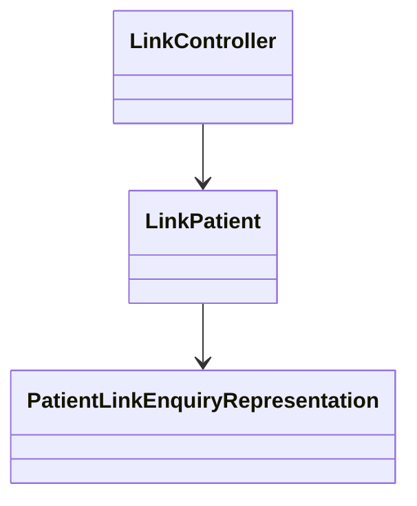

# Patient Link Enquiry Representation

The <SwmToken path="src/In.ProjectEKA.HipLibrary/Patient/Model/PatientLinkEnquiryRepresentation.cs" pos="5:3:3" line-data="        public PatientLinkEnquiryRepresentation()">`PatientLinkEnquiryRepresentation`</SwmToken> class encapsulates the details of a patient's link enquiry. It contains a property <SwmToken path="src/In.ProjectEKA.HipLibrary/Patient/Model/PatientLinkEnquiryRepresentation.cs" pos="11:1:1" line-data="            Link = link;">`Link`</SwmToken> which holds an instance of <SwmToken path="src/In.ProjectEKA.HipLibrary/Patient/Model/PatientLinkEnquiryRepresentation.cs" pos="9:5:5" line-data="        public PatientLinkEnquiryRepresentation(LinkEnquiryRepresentation link)">`LinkEnquiryRepresentation`</SwmToken>. This class is used in various parts of the application, such as in the <SwmToken path="src/In.ProjectEKA.HipService/Link/LinkPatient.cs" pos="22:5:5" line-data="    public class LinkPatient">`LinkPatient`</SwmToken> and <SwmToken path="src/In.ProjectEKA.HipService/Link/LinkController.cs" pos="24:5:5" line-data="    public class LinkController : ControllerBase">`LinkController`</SwmToken> classes.

## Constructors

The <SwmToken path="src/In.ProjectEKA.HipLibrary/Patient/Model/PatientLinkEnquiryRepresentation.cs" pos="5:3:3" line-data="        public PatientLinkEnquiryRepresentation()">`PatientLinkEnquiryRepresentation`</SwmToken> class has two constructors. The parameterless constructor initializes a new instance of the class without setting any properties.

<SwmSnippet path="/src/In.ProjectEKA.HipLibrary/Patient/Model/PatientLinkEnquiryRepresentation.cs" line="5">

---

The parameterless constructor initializes a new instance of the <SwmToken path="src/In.ProjectEKA.HipLibrary/Patient/Model/PatientLinkEnquiryRepresentation.cs" pos="5:3:3" line-data="        public PatientLinkEnquiryRepresentation()">`PatientLinkEnquiryRepresentation`</SwmToken> class without setting any properties.

```c#
        public PatientLinkEnquiryRepresentation()
        {
        }
```

---

</SwmSnippet>

The constructor with a <SwmToken path="src/In.ProjectEKA.HipLibrary/Patient/Model/PatientLinkEnquiryRepresentation.cs" pos="9:5:5" line-data="        public PatientLinkEnquiryRepresentation(LinkEnquiryRepresentation link)">`LinkEnquiryRepresentation`</SwmToken> parameter initializes a new instance of the class and sets the <SwmToken path="src/In.ProjectEKA.HipLibrary/Patient/Model/PatientLinkEnquiryRepresentation.cs" pos="11:1:1" line-data="            Link = link;">`Link`</SwmToken> property with the provided <SwmToken path="src/In.ProjectEKA.HipLibrary/Patient/Model/PatientLinkEnquiryRepresentation.cs" pos="9:5:5" line-data="        public PatientLinkEnquiryRepresentation(LinkEnquiryRepresentation link)">`LinkEnquiryRepresentation`</SwmToken> object.

<SwmSnippet path="/src/In.ProjectEKA.HipLibrary/Patient/Model/PatientLinkEnquiryRepresentation.cs" line="9">

---

The constructor with a <SwmToken path="src/In.ProjectEKA.HipLibrary/Patient/Model/PatientLinkEnquiryRepresentation.cs" pos="9:5:5" line-data="        public PatientLinkEnquiryRepresentation(LinkEnquiryRepresentation link)">`LinkEnquiryRepresentation`</SwmToken> parameter initializes a new instance of the <SwmToken path="src/In.ProjectEKA.HipLibrary/Patient/Model/PatientLinkEnquiryRepresentation.cs" pos="9:3:3" line-data="        public PatientLinkEnquiryRepresentation(LinkEnquiryRepresentation link)">`PatientLinkEnquiryRepresentation`</SwmToken> class and sets the <SwmToken path="src/In.ProjectEKA.HipLibrary/Patient/Model/PatientLinkEnquiryRepresentation.cs" pos="11:1:1" line-data="            Link = link;">`Link`</SwmToken> property with the provided <SwmToken path="src/In.ProjectEKA.HipLibrary/Patient/Model/PatientLinkEnquiryRepresentation.cs" pos="9:5:5" line-data="        public PatientLinkEnquiryRepresentation(LinkEnquiryRepresentation link)">`LinkEnquiryRepresentation`</SwmToken> object.

```c#
        public PatientLinkEnquiryRepresentation(LinkEnquiryRepresentation link)
        {
            Link = link;
        }
```

---

</SwmSnippet>

## Link Property

The <SwmToken path="src/In.ProjectEKA.HipLibrary/Patient/Model/PatientLinkEnquiryRepresentation.cs" pos="11:1:1" line-data="            Link = link;">`Link`</SwmToken> property holds an instance of the <SwmToken path="src/In.ProjectEKA.HipLibrary/Patient/Model/PatientLinkEnquiryRepresentation.cs" pos="9:5:5" line-data="        public PatientLinkEnquiryRepresentation(LinkEnquiryRepresentation link)">`LinkEnquiryRepresentation`</SwmToken> class, encapsulating the details of a patient's link enquiry.

<SwmSnippet path="/src/In.ProjectEKA.HipLibrary/Patient/Model/PatientLinkEnquiryRepresentation.cs" line="14">

---

The <SwmToken path="src/In.ProjectEKA.HipLibrary/Patient/Model/PatientLinkEnquiryRepresentation.cs" pos="14:5:5" line-data="        public LinkEnquiryRepresentation Link { get; }">`Link`</SwmToken> property holds an instance of the <SwmToken path="src/In.ProjectEKA.HipLibrary/Patient/Model/PatientLinkEnquiryRepresentation.cs" pos="14:3:3" line-data="        public LinkEnquiryRepresentation Link { get; }">`LinkEnquiryRepresentation`</SwmToken> class, encapsulating the details of a patient's link enquiry.

```c#
        public LinkEnquiryRepresentation Link { get; }
    }
```

---

</SwmSnippet>

## Usage in <SwmToken path="src/In.ProjectEKA.HipService/Link/LinkPatient.cs" pos="22:5:5" line-data="    public class LinkPatient">`LinkPatient`</SwmToken>

An example of using <SwmToken path="src/In.ProjectEKA.HipLibrary/Patient/Model/PatientLinkEnquiryRepresentation.cs" pos="5:3:3" line-data="        public PatientLinkEnquiryRepresentation()">`PatientLinkEnquiryRepresentation`</SwmToken> is in the <SwmToken path="src/In.ProjectEKA.HipService/Link/LinkPatient.cs" pos="22:5:5" line-data="    public class LinkPatient">`LinkPatient`</SwmToken> class where it is used to create a <SwmToken path="src/In.ProjectEKA.HipLibrary/Patient/Model/PatientLinkEnquiryRepresentation.cs" pos="5:3:3" line-data="        public PatientLinkEnquiryRepresentation()">`PatientLinkEnquiryRepresentation`</SwmToken> object with the necessary link enquiry details.

<SwmSnippet path="/src/In.ProjectEKA.HipService/Link/LinkPatient.cs" line="104">

---

In the <SwmToken path="src/In.ProjectEKA.HipService/Link/LinkPatient.cs" pos="22:5:5" line-data="    public class LinkPatient">`LinkPatient`</SwmToken> class, <SwmToken path="src/In.ProjectEKA.HipService/Link/LinkPatient.cs" pos="105:9:9" line-data="            var patientLinkReferenceResponse = new PatientLinkEnquiryRepresentation(">`PatientLinkEnquiryRepresentation`</SwmToken> is used to create an object with the necessary link enquiry details.

```c#
            var meta = new LinkReferenceMeta(nameof(CommunicationMode.MOBILE), patient.PhoneNumber, expiry);
            var patientLinkReferenceResponse = new PatientLinkEnquiryRepresentation(
                new LinkEnquiryRepresentation(linkRefNumber, "MEDIATED", meta));
```

---

</SwmSnippet>

## Usage in <SwmToken path="src/In.ProjectEKA.HipService/Link/LinkController.cs" pos="24:5:5" line-data="    public class LinkController : ControllerBase">`LinkController`</SwmToken>

Another example of using <SwmToken path="src/In.ProjectEKA.HipLibrary/Patient/Model/PatientLinkEnquiryRepresentation.cs" pos="5:3:3" line-data="        public PatientLinkEnquiryRepresentation()">`PatientLinkEnquiryRepresentation`</SwmToken> is in the <SwmToken path="src/In.ProjectEKA.HipService/Link/LinkController.cs" pos="24:5:5" line-data="    public class LinkController : ControllerBase">`LinkController`</SwmToken> class where it is used to create a <SwmToken path="src/In.ProjectEKA.HipLibrary/Patient/Model/PatientLinkEnquiryRepresentation.cs" pos="5:3:3" line-data="        public PatientLinkEnquiryRepresentation()">`PatientLinkEnquiryRepresentation`</SwmToken> object.

<SwmSnippet path="/src/In.ProjectEKA.HipService/Link/LinkController.cs" line="98">

---

In the <SwmToken path="src/In.ProjectEKA.HipService/Link/LinkController.cs" pos="24:5:5" line-data="    public class LinkController : ControllerBase">`LinkController`</SwmToken> class, <SwmToken path="src/In.ProjectEKA.HipService/Link/LinkController.cs" pos="99:9:9" line-data="                var patientLinkEnquiryRepresentation = new PatientLinkEnquiryRepresentation();">`PatientLinkEnquiryRepresentation`</SwmToken> is used to create an object.

```c#
                    new PatientLinkEnquiry(request.TransactionId, request.RequestId, patient);
                var patientLinkEnquiryRepresentation = new PatientLinkEnquiryRepresentation();
```

---

</SwmSnippet>

## Patient Link Enquiry Endpoints

The <SwmToken path="src/In.ProjectEKA.HipService/Link/LinkPatient.cs" pos="22:5:5" line-data="    public class LinkPatient">`LinkPatient`</SwmToken> and <SwmToken path="src/In.ProjectEKA.HipService/Link/LinkController.cs" pos="24:5:5" line-data="    public class LinkController : ControllerBase">`LinkController`</SwmToken> classes handle the logic and endpoints for patient linking operations. They use the <SwmToken path="src/In.ProjectEKA.HipLibrary/Patient/Model/PatientLinkEnquiryRepresentation.cs" pos="5:3:3" line-data="        public PatientLinkEnquiryRepresentation()">`PatientLinkEnquiryRepresentation`</SwmToken> to encapsulate the details of the patient's link enquiry.

<SwmSnippet path="/src/In.ProjectEKA.HipService/Link/LinkPatient.cs" line="1">

---

The <SwmToken path="src/In.ProjectEKA.HipService/Link/LinkPatient.cs" pos="22:5:5" line-data="    public class LinkPatient">`LinkPatient`</SwmToken> class handles the logic for linking a patient and uses the <SwmToken path="src/In.ProjectEKA.HipLibrary/Patient/Model/PatientLinkEnquiryRepresentation.cs" pos="5:3:3" line-data="        public PatientLinkEnquiryRepresentation()">`PatientLinkEnquiryRepresentation`</SwmToken> to encapsulate the details of the patient's link enquiry.

```c#
using In.ProjectEKA.HipService.OpenMrs;
using In.ProjectEKA.HipService.UserAuth;
using In.ProjectEKA.HipService.UserAuth.Model;
using Newtonsoft.Json;
using Newtonsoft.Json.Serialization;

namespace In.ProjectEKA.HipService.Link
{
    using System;
    using System.Linq;
```

---

</SwmSnippet>

<SwmSnippet path="/src/In.ProjectEKA.HipService/Link/LinkController.cs" line="1">

---

The <SwmToken path="src/In.ProjectEKA.HipService/Link/LinkController.cs" pos="24:5:5" line-data="    public class LinkController : ControllerBase">`LinkController`</SwmToken> class defines the endpoints for patient linking operations and uses the <SwmToken path="src/In.ProjectEKA.HipService/Link/LinkPatient.cs" pos="22:5:5" line-data="    public class LinkPatient">`LinkPatient`</SwmToken> class to process the link enquiries.

```c#
using In.ProjectEKA.HipService.Patient.Model;

namespace In.ProjectEKA.HipService.Link
{
    using System;
    using System.Threading.Tasks;
    using Discovery;
    using Gateway;
    using Gateway.Model;
    using Hangfire;
```

---

</SwmSnippet>



&nbsp;

*This is an auto-generated document by Swimm 🌊 and has not yet been verified by a human*

<SwmMeta version="3.0.0" repo-id="Z2l0aHViJTNBJTNBaGlwLXNlcnZpY2UlM0ElM0FTd2ltbS1EZW1v" repo-name="hip-service"><sup>Powered by [Swimm](/)</sup></SwmMeta>
