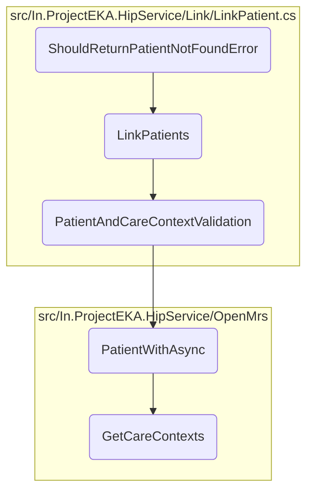

In this document, we will explain the process of handling patient linking and validation. The process involves several steps to ensure that the patient and their care contexts are correctly validated and linked.

The flow starts with the <SwmToken path="src/In.ProjectEKA.HipService/Link/LinkPatient.cs" pos="52:17:17" line-data="        public virtual async Task&lt;ValueTuple&lt;PatientLinkEnquiryRepresentation, ErrorRepresentation&gt;&gt; LinkPatients(">`LinkPatients`</SwmToken> method, which initiates the patient linking process. It then calls the <SwmToken path="src/In.ProjectEKA.HipService/Link/LinkPatient.cs" pos="110:21:21" line-data="        private async Task&lt;ValueTuple&lt;HipLibrary.Patient.Model.Patient, ErrorRepresentation&gt;&gt; PatientAndCareContextValidation(">`PatientAndCareContextValidation`</SwmToken> method to validate the patient and their care contexts. This method retrieves patient information based on the patient reference number and checks if the provided care contexts match the ones stored for the patient. If there is any care context mismatch or if the patient is not found, appropriate error representations are returned. If the patient is found and the care contexts match, the process continues to retrieve the care contexts using the `GetCareContexts` method.

# Flow drill down



<SwmSnippet path="/src/In.ProjectEKA.HipService/Link/LinkPatient.cs" line="110">

---

## Validating Patient and Care Context

First, the <SwmToken path="src/In.ProjectEKA.HipService/Link/LinkPatient.cs" pos="110:21:21" line-data="        private async Task&lt;ValueTuple&lt;HipLibrary.Patient.Model.Patient, ErrorRepresentation&gt;&gt; PatientAndCareContextValidation(">`PatientAndCareContextValidation`</SwmToken> method validates the patient and their care contexts. It retrieves patient information based on the patient reference number and checks if the provided care contexts match the ones stored for the patient. If there is any care context mismatch or if the patient is not found, appropriate error representations are returned.

```c#
        private async Task<ValueTuple<HipLibrary.Patient.Model.Patient, ErrorRepresentation>> PatientAndCareContextValidation(
            PatientLinkEnquiry request)
        {
            var patient = await patientRepository.PatientWithAsync(request.Patient.ReferenceNumber);
            return patient.Map(patient =>
                    {
                        var programs = request.Patient.CareContexts
                            .Where(careContext =>
                                patient.CareContexts.Any(c => c.ReferenceNumber == careContext.ReferenceNumber))
                            .Select(context => new CareContextRepresentation(context.ReferenceNumber,
                                patient.CareContexts.First(info => info.ReferenceNumber == context.ReferenceNumber)
                                    .Display)).ToList();
                        if (programs.Count != request.Patient.CareContexts.Count())
                            return (null, new ErrorRepresentation(new Error(ErrorCode.CareContextNotFound,
                                ErrorMessage.CareContextNotFound)));

                        return (patient, (ErrorRepresentation) null);
                    })
                .ValueOr((null,
                    new ErrorRepresentation(new Error(ErrorCode.NoPatientFound, ErrorMessage.NoPatientFound))));
        }
```

---

</SwmSnippet>

&nbsp;

*This is an auto-generated document by Swimm 🌊 and has not yet been verified by a human*

<SwmMeta version="3.0.0" repo-id="Z2l0aHViJTNBJTNBaGlwLXNlcnZpY2UlM0ElM0FTd2ltbS1EZW1v" repo-name="hip-service"><sup>Powered by [Swimm](/)</sup></SwmMeta>
