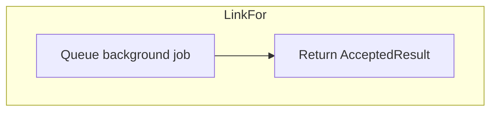

```mermaid
graph TD
  subgraph LinkPatient
    LinkPatient:A["Extract Patient Id"] --> LinkPatient:B["Extract suffix from Id"]
    LinkPatient:B --> LinkPatient:C["Create LinkEnquiry object"]
    LinkPatient:C --> LinkPatient:D["Check if request exists in repository"]
    LinkPatient:D --> LinkPatient:E["Request does not exist - Create error representation"]
    LinkPatient:D --> LinkPatient:F["Create PatientLinkEnquiry object"]
    LinkPatient:E --> LinkPatient:G["Assign error representation"]
    LinkPatient:F --> LinkPatient:H["Call linkPatient.LinkPatients"]
    LinkPatient:G --> LinkPatient:I["Assign link response"]
    LinkPatient:H --> LinkPatient:I["Get link response"]
    LinkPatient:I --> LinkPatient:J["Log if there was an error"]
    LinkPatient:J --> LinkPatient:K["Create GatewayLinkResponse object"]
    LinkPatient:K --> LinkPatient:L["Send data to gateway"]
  end

%% Swimm:
%% graph TD
%%   subgraph <SwmToken path="src/In.ProjectEKA.HipService/Link/LinkController.cs" pos="47:10:10" line-data="            backgroundJob.Enqueue(() =&gt; LinkPatient(request, correlationId));">`LinkPatient`</SwmToken>
%%     <SwmToken path="src/In.ProjectEKA.HipService/Link/LinkController.cs" pos="47:10:10" line-data="            backgroundJob.Enqueue(() =&gt; LinkPatient(request, correlationId));">`LinkPatient`</SwmToken>:A["Extract Patient Id"] --> <SwmToken path="src/In.ProjectEKA.HipService/Link/LinkController.cs" pos="47:10:10" line-data="            backgroundJob.Enqueue(() =&gt; LinkPatient(request, correlationId));">`LinkPatient`</SwmToken>:B["Extract suffix from Id"]
%%     <SwmToken path="src/In.ProjectEKA.HipService/Link/LinkController.cs" pos="47:10:10" line-data="            backgroundJob.Enqueue(() =&gt; LinkPatient(request, correlationId));">`LinkPatient`</SwmToken>:B --> <SwmToken path="src/In.ProjectEKA.HipService/Link/LinkController.cs" pos="47:10:10" line-data="            backgroundJob.Enqueue(() =&gt; LinkPatient(request, correlationId));">`LinkPatient`</SwmToken>:C["Create <SwmToken path="src/In.ProjectEKA.HipService/Link/LinkController.cs" pos="78:9:9" line-data="            var patient = new LinkEnquiry(">`LinkEnquiry`</SwmToken> object"]
%%     <SwmToken path="src/In.ProjectEKA.HipService/Link/LinkController.cs" pos="47:10:10" line-data="            backgroundJob.Enqueue(() =&gt; LinkPatient(request, correlationId));">`LinkPatient`</SwmToken>:C --> <SwmToken path="src/In.ProjectEKA.HipService/Link/LinkController.cs" pos="47:10:10" line-data="            backgroundJob.Enqueue(() =&gt; LinkPatient(request, correlationId));">`LinkPatient`</SwmToken>:D["Check if request exists in repository"]
%%     <SwmToken path="src/In.ProjectEKA.HipService/Link/LinkController.cs" pos="47:10:10" line-data="            backgroundJob.Enqueue(() =&gt; LinkPatient(request, correlationId));">`LinkPatient`</SwmToken>:D --> <SwmToken path="src/In.ProjectEKA.HipService/Link/LinkController.cs" pos="47:10:10" line-data="            backgroundJob.Enqueue(() =&gt; LinkPatient(request, correlationId));">`LinkPatient`</SwmToken>:E["Request does not exist - Create error representation"]
%%     <SwmToken path="src/In.ProjectEKA.HipService/Link/LinkController.cs" pos="47:10:10" line-data="            backgroundJob.Enqueue(() =&gt; LinkPatient(request, correlationId));">`LinkPatient`</SwmToken>:D --> <SwmToken path="src/In.ProjectEKA.HipService/Link/LinkController.cs" pos="47:10:10" line-data="            backgroundJob.Enqueue(() =&gt; LinkPatient(request, correlationId));">`LinkPatient`</SwmToken>:F["Create <SwmToken path="src/In.ProjectEKA.HipService/Link/LinkController.cs" pos="98:3:3" line-data="                    new PatientLinkEnquiry(request.TransactionId, request.RequestId, patient);">`PatientLinkEnquiry`</SwmToken> object"]
%%     <SwmToken path="src/In.ProjectEKA.HipService/Link/LinkController.cs" pos="47:10:10" line-data="            backgroundJob.Enqueue(() =&gt; LinkPatient(request, correlationId));">`LinkPatient`</SwmToken>:E --> <SwmToken path="src/In.ProjectEKA.HipService/Link/LinkController.cs" pos="47:10:10" line-data="            backgroundJob.Enqueue(() =&gt; LinkPatient(request, correlationId));">`LinkPatient`</SwmToken>:G["Assign error representation"]
%%     <SwmToken path="src/In.ProjectEKA.HipService/Link/LinkController.cs" pos="47:10:10" line-data="            backgroundJob.Enqueue(() =&gt; LinkPatient(request, correlationId));">`LinkPatient`</SwmToken>:F --> <SwmToken path="src/In.ProjectEKA.HipService/Link/LinkController.cs" pos="47:10:10" line-data="            backgroundJob.Enqueue(() =&gt; LinkPatient(request, correlationId));">`LinkPatient`</SwmToken>:H["Call <SwmToken path="src/In.ProjectEKA.HipService/Link/LinkController.cs" pos="103:5:7" line-data="                    : await linkPatient.LinkPatients(patientReferenceRequest);">`linkPatient.LinkPatients`</SwmToken>"]
%%     <SwmToken path="src/In.ProjectEKA.HipService/Link/LinkController.cs" pos="47:10:10" line-data="            backgroundJob.Enqueue(() =&gt; LinkPatient(request, correlationId));">`LinkPatient`</SwmToken>:G --> <SwmToken path="src/In.ProjectEKA.HipService/Link/LinkController.cs" pos="47:10:10" line-data="            backgroundJob.Enqueue(() =&gt; LinkPatient(request, correlationId));">`LinkPatient`</SwmToken>:I["Assign link response"]
%%     <SwmToken path="src/In.ProjectEKA.HipService/Link/LinkController.cs" pos="47:10:10" line-data="            backgroundJob.Enqueue(() =&gt; LinkPatient(request, correlationId));">`LinkPatient`</SwmToken>:H --> <SwmToken path="src/In.ProjectEKA.HipService/Link/LinkController.cs" pos="47:10:10" line-data="            backgroundJob.Enqueue(() =&gt; LinkPatient(request, correlationId));">`LinkPatient`</SwmToken>:I["Get link response"]
%%     <SwmToken path="src/In.ProjectEKA.HipService/Link/LinkController.cs" pos="47:10:10" line-data="            backgroundJob.Enqueue(() =&gt; LinkPatient(request, correlationId));">`LinkPatient`</SwmToken>:I --> <SwmToken path="src/In.ProjectEKA.HipService/Link/LinkController.cs" pos="47:10:10" line-data="            backgroundJob.Enqueue(() =&gt; LinkPatient(request, correlationId));">`LinkPatient`</SwmToken>:J["Log if there was an error"]
%%     <SwmToken path="src/In.ProjectEKA.HipService/Link/LinkController.cs" pos="47:10:10" line-data="            backgroundJob.Enqueue(() =&gt; LinkPatient(request, correlationId));">`LinkPatient`</SwmToken>:J --> <SwmToken path="src/In.ProjectEKA.HipService/Link/LinkController.cs" pos="47:10:10" line-data="            backgroundJob.Enqueue(() =&gt; LinkPatient(request, correlationId));">`LinkPatient`</SwmToken>:K["Create <SwmToken path="src/In.ProjectEKA.HipService/Link/LinkController.cs" pos="111:9:9" line-data="                var response = new GatewayLinkResponse(">`GatewayLinkResponse`</SwmToken> object"]
%%     <SwmToken path="src/In.ProjectEKA.HipService/Link/LinkController.cs" pos="47:10:10" line-data="            backgroundJob.Enqueue(() =&gt; LinkPatient(request, correlationId));">`LinkPatient`</SwmToken>:K --> <SwmToken path="src/In.ProjectEKA.HipService/Link/LinkController.cs" pos="47:10:10" line-data="            backgroundJob.Enqueue(() =&gt; LinkPatient(request, correlationId));">`LinkPatient`</SwmToken>:L["Send data to gateway"]
%%   end
```

```mermaid
graph TD
  subgraph LinkPatients
    LinkPatients:A["Validate patient and care context"] --> LinkPatients:B["Check for errors"]
    LinkPatients:B --> |Has error| LinkPatients:C["Log and return error"]
    LinkPatients:B --> |No error| LinkPatients:D["Generate link reference number"]
    LinkPatients:D --> LinkPatients:E["Begin transaction scope"]
    LinkPatients:E --> LinkPatients:F["Save initiated link request"]
    LinkPatients:F --> |Fail to save| LinkPatients:G["Return duplicate request ID error"]
    LinkPatients:F --> |Success| LinkPatients:H["Save patient link request"]
    LinkPatients:H --> |Exception| LinkPatients:I["Return database storage error"]
    LinkPatients:H --> |Success| LinkPatients:J["Create OTP session"]
    LinkPatients:J --> LinkPatients:K["Send OTP token"]
    LinkPatients:K --> |OTP generation failed| LinkPatients:L["Return OTP generation error"]
    LinkPatients:K --> |OTP generation succeeded| LinkPatients:M["Delete discovery request"]
    LinkPatients:M --> LinkPatients:N["Complete transaction scope"]
    LinkPatients:N --> LinkPatients:O["Prepare link reference meta"]
    LinkPatients:O --> LinkPatients:P["Create and return patient link enquiry representation"]
  end

%% Swimm:
%% graph TD
%%   subgraph <SwmToken path="src/In.ProjectEKA.HipService/Link/LinkController.cs" pos="103:7:7" line-data="                    : await linkPatient.LinkPatients(patientReferenceRequest);">`LinkPatients`</SwmToken>
%%     <SwmToken path="src/In.ProjectEKA.HipService/Link/LinkController.cs" pos="103:7:7" line-data="                    : await linkPatient.LinkPatients(patientReferenceRequest);">`LinkPatients`</SwmToken>:A["Validate patient and care context"] --> <SwmToken path="src/In.ProjectEKA.HipService/Link/LinkController.cs" pos="103:7:7" line-data="                    : await linkPatient.LinkPatients(patientReferenceRequest);">`LinkPatients`</SwmToken>:B["Check for errors"]
%%     <SwmToken path="src/In.ProjectEKA.HipService/Link/LinkController.cs" pos="103:7:7" line-data="                    : await linkPatient.LinkPatients(patientReferenceRequest);">`LinkPatients`</SwmToken>:B --> |Has error| <SwmToken path="src/In.ProjectEKA.HipService/Link/LinkController.cs" pos="103:7:7" line-data="                    : await linkPatient.LinkPatients(patientReferenceRequest);">`LinkPatients`</SwmToken>:C["Log and return error"]
%%     <SwmToken path="src/In.ProjectEKA.HipService/Link/LinkController.cs" pos="103:7:7" line-data="                    : await linkPatient.LinkPatients(patientReferenceRequest);">`LinkPatients`</SwmToken>:B --> |No error| <SwmToken path="src/In.ProjectEKA.HipService/Link/LinkController.cs" pos="103:7:7" line-data="                    : await linkPatient.LinkPatients(patientReferenceRequest);">`LinkPatients`</SwmToken>:D["Generate link reference number"]
%%     <SwmToken path="src/In.ProjectEKA.HipService/Link/LinkController.cs" pos="103:7:7" line-data="                    : await linkPatient.LinkPatients(patientReferenceRequest);">`LinkPatients`</SwmToken>:D --> <SwmToken path="src/In.ProjectEKA.HipService/Link/LinkController.cs" pos="103:7:7" line-data="                    : await linkPatient.LinkPatients(patientReferenceRequest);">`LinkPatients`</SwmToken>:E["Begin transaction scope"]
%%     <SwmToken path="src/In.ProjectEKA.HipService/Link/LinkController.cs" pos="103:7:7" line-data="                    : await linkPatient.LinkPatients(patientReferenceRequest);">`LinkPatients`</SwmToken>:E --> <SwmToken path="src/In.ProjectEKA.HipService/Link/LinkController.cs" pos="103:7:7" line-data="                    : await linkPatient.LinkPatients(patientReferenceRequest);">`LinkPatients`</SwmToken>:F["Save initiated link request"]
%%     <SwmToken path="src/In.ProjectEKA.HipService/Link/LinkController.cs" pos="103:7:7" line-data="                    : await linkPatient.LinkPatients(patientReferenceRequest);">`LinkPatients`</SwmToken>:F --> |Fail to save| <SwmToken path="src/In.ProjectEKA.HipService/Link/LinkController.cs" pos="103:7:7" line-data="                    : await linkPatient.LinkPatients(patientReferenceRequest);">`LinkPatients`</SwmToken>:G["Return duplicate request ID error"]
%%     <SwmToken path="src/In.ProjectEKA.HipService/Link/LinkController.cs" pos="103:7:7" line-data="                    : await linkPatient.LinkPatients(patientReferenceRequest);">`LinkPatients`</SwmToken>:F --> |Success| <SwmToken path="src/In.ProjectEKA.HipService/Link/LinkController.cs" pos="103:7:7" line-data="                    : await linkPatient.LinkPatients(patientReferenceRequest);">`LinkPatients`</SwmToken>:H["Save patient link request"]
%%     <SwmToken path="src/In.ProjectEKA.HipService/Link/LinkController.cs" pos="103:7:7" line-data="                    : await linkPatient.LinkPatients(patientReferenceRequest);">`LinkPatients`</SwmToken>:H --> |Exception| <SwmToken path="src/In.ProjectEKA.HipService/Link/LinkController.cs" pos="103:7:7" line-data="                    : await linkPatient.LinkPatients(patientReferenceRequest);">`LinkPatients`</SwmToken>:I["Return database storage error"]
%%     <SwmToken path="src/In.ProjectEKA.HipService/Link/LinkController.cs" pos="103:7:7" line-data="                    : await linkPatient.LinkPatients(patientReferenceRequest);">`LinkPatients`</SwmToken>:H --> |Success| <SwmToken path="src/In.ProjectEKA.HipService/Link/LinkController.cs" pos="103:7:7" line-data="                    : await linkPatient.LinkPatients(patientReferenceRequest);">`LinkPatients`</SwmToken>:J["Create OTP session"]
%%     <SwmToken path="src/In.ProjectEKA.HipService/Link/LinkController.cs" pos="103:7:7" line-data="                    : await linkPatient.LinkPatients(patientReferenceRequest);">`LinkPatients`</SwmToken>:J --> <SwmToken path="src/In.ProjectEKA.HipService/Link/LinkController.cs" pos="103:7:7" line-data="                    : await linkPatient.LinkPatients(patientReferenceRequest);">`LinkPatients`</SwmToken>:K["Send OTP token"]
%%     <SwmToken path="src/In.ProjectEKA.HipService/Link/LinkController.cs" pos="103:7:7" line-data="                    : await linkPatient.LinkPatients(patientReferenceRequest);">`LinkPatients`</SwmToken>:K --> |OTP generation failed| <SwmToken path="src/In.ProjectEKA.HipService/Link/LinkController.cs" pos="103:7:7" line-data="                    : await linkPatient.LinkPatients(patientReferenceRequest);">`LinkPatients`</SwmToken>:L["Return OTP generation error"]
%%     <SwmToken path="src/In.ProjectEKA.HipService/Link/LinkController.cs" pos="103:7:7" line-data="                    : await linkPatient.LinkPatients(patientReferenceRequest);">`LinkPatients`</SwmToken>:K --> |OTP generation succeeded| <SwmToken path="src/In.ProjectEKA.HipService/Link/LinkController.cs" pos="103:7:7" line-data="                    : await linkPatient.LinkPatients(patientReferenceRequest);">`LinkPatients`</SwmToken>:M["Delete discovery request"]
%%     <SwmToken path="src/In.ProjectEKA.HipService/Link/LinkController.cs" pos="103:7:7" line-data="                    : await linkPatient.LinkPatients(patientReferenceRequest);">`LinkPatients`</SwmToken>:M --> <SwmToken path="src/In.ProjectEKA.HipService/Link/LinkController.cs" pos="103:7:7" line-data="                    : await linkPatient.LinkPatients(patientReferenceRequest);">`LinkPatients`</SwmToken>:N["Complete transaction scope"]
%%     <SwmToken path="src/In.ProjectEKA.HipService/Link/LinkController.cs" pos="103:7:7" line-data="                    : await linkPatient.LinkPatients(patientReferenceRequest);">`LinkPatients`</SwmToken>:N --> <SwmToken path="src/In.ProjectEKA.HipService/Link/LinkController.cs" pos="103:7:7" line-data="                    : await linkPatient.LinkPatients(patientReferenceRequest);">`LinkPatients`</SwmToken>:O["Prepare link reference meta"]
%%     <SwmToken path="src/In.ProjectEKA.HipService/Link/LinkController.cs" pos="103:7:7" line-data="                    : await linkPatient.LinkPatients(patientReferenceRequest);">`LinkPatients`</SwmToken>:O --> <SwmToken path="src/In.ProjectEKA.HipService/Link/LinkController.cs" pos="103:7:7" line-data="                    : await linkPatient.LinkPatients(patientReferenceRequest);">`LinkPatients`</SwmToken>:P["Create and return patient link enquiry representation"]
%%   end
```

```mermaid
graph TD
  subgraph PatientAndCareContextValidation
    PatientAndCareContextValidation:A["Fetch patient using PatientWithAsync"] --> PatientAndCareContextValidation:B["Validate care contexts in request"]
    PatientAndCareContextValidation:B --> PatientAndCareContextValidation:C["If care contexts not found, return care context not found error"]
    PatientAndCareContextValidation:C --> PatientAndCareContextValidation:D["If patient not found, return no patient found error"]
    PatientAndCareContextValidation:D --> PatientAndCareContextValidation:E["Return patient information"]
  end

%% Swimm:
%% graph TD
%%   subgraph <SwmToken path="src/In.ProjectEKA.HipService/Link/LinkPatient.cs" pos="55:14:14" line-data="            var (patient, error) = await PatientAndCareContextValidation(request);">`PatientAndCareContextValidation`</SwmToken>
%%     <SwmToken path="src/In.ProjectEKA.HipService/Link/LinkPatient.cs" pos="55:14:14" line-data="            var (patient, error) = await PatientAndCareContextValidation(request);">`PatientAndCareContextValidation`</SwmToken>:A["Fetch patient using <SwmToken path="src/In.ProjectEKA.HipService/Link/LinkPatient.cs" pos="113:11:11" line-data="            var patient = await patientRepository.PatientWithAsync(request.Patient.ReferenceNumber);">`PatientWithAsync`</SwmToken>"] --> <SwmToken path="src/In.ProjectEKA.HipService/Link/LinkPatient.cs" pos="55:14:14" line-data="            var (patient, error) = await PatientAndCareContextValidation(request);">`PatientAndCareContextValidation`</SwmToken>:B["Validate care contexts in request"]
%%     <SwmToken path="src/In.ProjectEKA.HipService/Link/LinkPatient.cs" pos="55:14:14" line-data="            var (patient, error) = await PatientAndCareContextValidation(request);">`PatientAndCareContextValidation`</SwmToken>:B --> <SwmToken path="src/In.ProjectEKA.HipService/Link/LinkPatient.cs" pos="55:14:14" line-data="            var (patient, error) = await PatientAndCareContextValidation(request);">`PatientAndCareContextValidation`</SwmToken>:C["If care contexts not found, return care context not found error"]
%%     <SwmToken path="src/In.ProjectEKA.HipService/Link/LinkPatient.cs" pos="55:14:14" line-data="            var (patient, error) = await PatientAndCareContextValidation(request);">`PatientAndCareContextValidation`</SwmToken>:C --> <SwmToken path="src/In.ProjectEKA.HipService/Link/LinkPatient.cs" pos="55:14:14" line-data="            var (patient, error) = await PatientAndCareContextValidation(request);">`PatientAndCareContextValidation`</SwmToken>:D["If patient not found, return no patient found error"]
%%     <SwmToken path="src/In.ProjectEKA.HipService/Link/LinkPatient.cs" pos="55:14:14" line-data="            var (patient, error) = await PatientAndCareContextValidation(request);">`PatientAndCareContextValidation`</SwmToken>:D --> <SwmToken path="src/In.ProjectEKA.HipService/Link/LinkPatient.cs" pos="55:14:14" line-data="            var (patient, error) = await PatientAndCareContextValidation(request);">`PatientAndCareContextValidation`</SwmToken>:E["Return patient information"]
%%   end
```

```mermaid
graph TD
  subgraph PatientWithAsync
    PatientWithAsync:A["Load patient with identifier"] --> PatientWithAsync:B["Extract patient's first name"]
    PatientWithAsync:B --> PatientWithAsync:C["Convert to HIP patient"]
    PatientWithAsync:C --> PatientWithAsync:D["Get care contexts"]
    PatientWithAsync:D --> PatientWithAsync:E["Get phone number"]
  end
  subgraph GetCareContexts
    GetCareContexts:A["Set care context path"] --> GetCareContexts:B["Check if patient UUID is provided"]
    GetCareContexts:B -->|"Yes"| GetCareContexts:C["Add patient UUID to query"]
    GetCareContexts:B -->|"No"| GetCareContexts:D["Keep default path"]
    GetCareContexts:C --> GetCareContexts:D
    GetCareContexts:D --> GetCareContexts:E["Send HTTP GET request"]
    GetCareContexts:E --> GetCareContexts:F["Parse JSON response"]
    GetCareContexts:F --> GetCareContexts:G["Extract care contexts and add to list"]
  end
  PatientWithAsync:D --> GetCareContexts

%% Swimm:
%% graph TD
%%   subgraph <SwmToken path="src/In.ProjectEKA.HipService/Link/LinkPatient.cs" pos="113:11:11" line-data="            var patient = await patientRepository.PatientWithAsync(request.Patient.ReferenceNumber);">`PatientWithAsync`</SwmToken>
%%     <SwmToken path="src/In.ProjectEKA.HipService/Link/LinkPatient.cs" pos="113:11:11" line-data="            var patient = await patientRepository.PatientWithAsync(request.Patient.ReferenceNumber);">`PatientWithAsync`</SwmToken>:A["Load patient with identifier"] --> <SwmToken path="src/In.ProjectEKA.HipService/Link/LinkPatient.cs" pos="113:11:11" line-data="            var patient = await patientRepository.PatientWithAsync(request.Patient.ReferenceNumber);">`PatientWithAsync`</SwmToken>:B["Extract patient's first name"]
%%     <SwmToken path="src/In.ProjectEKA.HipService/Link/LinkPatient.cs" pos="113:11:11" line-data="            var patient = await patientRepository.PatientWithAsync(request.Patient.ReferenceNumber);">`PatientWithAsync`</SwmToken>:B --> <SwmToken path="src/In.ProjectEKA.HipService/Link/LinkPatient.cs" pos="113:11:11" line-data="            var patient = await patientRepository.PatientWithAsync(request.Patient.ReferenceNumber);">`PatientWithAsync`</SwmToken>:C["Convert to HIP patient"]
%%     <SwmToken path="src/In.ProjectEKA.HipService/Link/LinkPatient.cs" pos="113:11:11" line-data="            var patient = await patientRepository.PatientWithAsync(request.Patient.ReferenceNumber);">`PatientWithAsync`</SwmToken>:C --> <SwmToken path="src/In.ProjectEKA.HipService/Link/LinkPatient.cs" pos="113:11:11" line-data="            var patient = await patientRepository.PatientWithAsync(request.Patient.ReferenceNumber);">`PatientWithAsync`</SwmToken>:D["Get care contexts"]
%%     <SwmToken path="src/In.ProjectEKA.HipService/Link/LinkPatient.cs" pos="113:11:11" line-data="            var patient = await patientRepository.PatientWithAsync(request.Patient.ReferenceNumber);">`PatientWithAsync`</SwmToken>:D --> <SwmToken path="src/In.ProjectEKA.HipService/Link/LinkPatient.cs" pos="113:11:11" line-data="            var patient = await patientRepository.PatientWithAsync(request.Patient.ReferenceNumber);">`PatientWithAsync`</SwmToken>:E["Get phone number"]
%%   end
%%   subgraph <SwmToken path="src/In.ProjectEKA.HipService/OpenMrs/OpenMrsPatientRepository.cs" pos="35:11:11" line-data="            hipPatient.CareContexts = await _careContextRepository.GetCareContexts(referenceNumber);">`GetCareContexts`</SwmToken>
%%     <SwmToken path="src/In.ProjectEKA.HipService/OpenMrs/OpenMrsPatientRepository.cs" pos="35:11:11" line-data="            hipPatient.CareContexts = await _careContextRepository.GetCareContexts(referenceNumber);">`GetCareContexts`</SwmToken>:A["Set care context path"] --> <SwmToken path="src/In.ProjectEKA.HipService/OpenMrs/OpenMrsPatientRepository.cs" pos="35:11:11" line-data="            hipPatient.CareContexts = await _careContextRepository.GetCareContexts(referenceNumber);">`GetCareContexts`</SwmToken>:B["Check if patient UUID is provided"]
%%     <SwmToken path="src/In.ProjectEKA.HipService/OpenMrs/OpenMrsPatientRepository.cs" pos="35:11:11" line-data="            hipPatient.CareContexts = await _careContextRepository.GetCareContexts(referenceNumber);">`GetCareContexts`</SwmToken>:B -->|"Yes"| <SwmToken path="src/In.ProjectEKA.HipService/OpenMrs/OpenMrsPatientRepository.cs" pos="35:11:11" line-data="            hipPatient.CareContexts = await _careContextRepository.GetCareContexts(referenceNumber);">`GetCareContexts`</SwmToken>:C["Add patient UUID to query"]
%%     <SwmToken path="src/In.ProjectEKA.HipService/OpenMrs/OpenMrsPatientRepository.cs" pos="35:11:11" line-data="            hipPatient.CareContexts = await _careContextRepository.GetCareContexts(referenceNumber);">`GetCareContexts`</SwmToken>:B -->|"No"| <SwmToken path="src/In.ProjectEKA.HipService/OpenMrs/OpenMrsPatientRepository.cs" pos="35:11:11" line-data="            hipPatient.CareContexts = await _careContextRepository.GetCareContexts(referenceNumber);">`GetCareContexts`</SwmToken>:D["Keep default path"]
%%     <SwmToken path="src/In.ProjectEKA.HipService/OpenMrs/OpenMrsPatientRepository.cs" pos="35:11:11" line-data="            hipPatient.CareContexts = await _careContextRepository.GetCareContexts(referenceNumber);">`GetCareContexts`</SwmToken>:C --> <SwmToken path="src/In.ProjectEKA.HipService/OpenMrs/OpenMrsPatientRepository.cs" pos="35:11:11" line-data="            hipPatient.CareContexts = await _careContextRepository.GetCareContexts(referenceNumber);">`GetCareContexts`</SwmToken>:D
%%     <SwmToken path="src/In.ProjectEKA.HipService/OpenMrs/OpenMrsPatientRepository.cs" pos="35:11:11" line-data="            hipPatient.CareContexts = await _careContextRepository.GetCareContexts(referenceNumber);">`GetCareContexts`</SwmToken>:D --> <SwmToken path="src/In.ProjectEKA.HipService/OpenMrs/OpenMrsPatientRepository.cs" pos="35:11:11" line-data="            hipPatient.CareContexts = await _careContextRepository.GetCareContexts(referenceNumber);">`GetCareContexts`</SwmToken>:E["Send HTTP GET request"]
%%     <SwmToken path="src/In.ProjectEKA.HipService/OpenMrs/OpenMrsPatientRepository.cs" pos="35:11:11" line-data="            hipPatient.CareContexts = await _careContextRepository.GetCareContexts(referenceNumber);">`GetCareContexts`</SwmToken>:E --> <SwmToken path="src/In.ProjectEKA.HipService/OpenMrs/OpenMrsPatientRepository.cs" pos="35:11:11" line-data="            hipPatient.CareContexts = await _careContextRepository.GetCareContexts(referenceNumber);">`GetCareContexts`</SwmToken>:F["Parse JSON response"]
%%     <SwmToken path="src/In.ProjectEKA.HipService/OpenMrs/OpenMrsPatientRepository.cs" pos="35:11:11" line-data="            hipPatient.CareContexts = await _careContextRepository.GetCareContexts(referenceNumber);">`GetCareContexts`</SwmToken>:F --> <SwmToken path="src/In.ProjectEKA.HipService/OpenMrs/OpenMrsPatientRepository.cs" pos="35:11:11" line-data="            hipPatient.CareContexts = await _careContextRepository.GetCareContexts(referenceNumber);">`GetCareContexts`</SwmToken>:G["Extract care contexts and add to list"]
%%   end
%%   <SwmToken path="src/In.ProjectEKA.HipService/Link/LinkPatient.cs" pos="113:11:11" line-data="            var patient = await patientRepository.PatientWithAsync(request.Patient.ReferenceNumber);">`PatientWithAsync`</SwmToken>:D --> <SwmToken path="src/In.ProjectEKA.HipService/OpenMrs/OpenMrsPatientRepository.cs" pos="35:11:11" line-data="            hipPatient.CareContexts = await _careContextRepository.GetCareContexts(referenceNumber);">`GetCareContexts`</SwmToken>
```

In this document, we will explain the process of linking a patient. The process involves initiating the linking process, validating the patient and care context, generating a link reference number, saving the link request, sending an OTP for verification, and finally, deleting the discovery request and completing the transaction.

The flow starts by initiating the patient linking process and validating the patient and care context. Then, a unique link reference number is generated, and the link request is saved. An OTP is sent to the patient's mobile number for verification. If the OTP generation is successful, the discovery request is deleted, and the transaction is completed.

Here is a high level diagram of the flow, showing only the most important functions:

```mermaid
graph TD;
      subgraph srcInProjectEKAHipServiceLink[src/In.ProjectEKA.HipService/Link]
782adcf8f38e4c3d404c0d98abddfe78f41b4f678cd86bd55a82797c1ea64cea(LinkFor) --> ad83b8027e9d5303cf49466439d953b3aa0b65c0045768efb18dcc23540d83e3(LinkPatient)
end

subgraph srcInProjectEKAHipServiceLink[src/In.ProjectEKA.HipService/Link]
ad83b8027e9d5303cf49466439d953b3aa0b65c0045768efb18dcc23540d83e3(LinkPatient) --> 6849245398465158b3bb7d239519e4ad884bdc0b550271120553ecc8f6139d55(LinkPatients)
end

subgraph srcInProjectEKAHipServiceLink[src/In.ProjectEKA.HipService/Link]
6849245398465158b3bb7d239519e4ad884bdc0b550271120553ecc8f6139d55(LinkPatients) --> b395028df58004c5b0618f353245d7cbbf24f41d38a776657b2662153d5a8772(PatientAndCareContextValidation)
end

subgraph srcInProjectEKAHipServiceOpenMrs[src/In.ProjectEKA.HipService/OpenMrs]
b395028df58004c5b0618f353245d7cbbf24f41d38a776657b2662153d5a8772(PatientAndCareContextValidation) --> dd70669797c818b313d9a11e817dc9ed83b93f37739339c86521cb905bd3dcae(PatientWithAsync)
end

subgraph srcInProjectEKAHipServiceOpenMrs[src/In.ProjectEKA.HipService/OpenMrs]
dd70669797c818b313d9a11e817dc9ed83b93f37739339c86521cb905bd3dcae(PatientWithAsync) --> bc8341f884da0777a1cb7088037bd750965dfa48508b07c3fef1dafb683bb701(GetCareContexts)
end


      classDef mainFlowStyle color:#000000,fill:#7CB9F4
classDef rootsStyle color:#000000,fill:#00FFF4
classDef Style1 color:#000000,fill:#00FFAA
classDef Style2 color:#000000,fill:#FFFF00
classDef Style3 color:#000000,fill:#AA7CB9

%% Swimm:
%% graph TD;
%%       subgraph srcInProjectEKAHipServiceLink[<SwmPath>[src/In.ProjectEKA.HipService/Link/](src/In.ProjectEKA.HipService/Link/)</SwmPath>]
%% 782adcf8f38e4c3d404c0d98abddfe78f41b4f678cd86bd55a82797c1ea64cea(<SwmToken path="src/In.ProjectEKA.HipService/Link/LinkController.cs" pos="43:5:5" line-data="        public AcceptedResult LinkFor(">`LinkFor`</SwmToken>) --> ad83b8027e9d5303cf49466439d953b3aa0b65c0045768efb18dcc23540d83e3(<SwmToken path="src/In.ProjectEKA.HipService/Link/LinkController.cs" pos="47:10:10" line-data="            backgroundJob.Enqueue(() =&gt; LinkPatient(request, correlationId));">`LinkPatient`</SwmToken>)
%% end
%% 
%% subgraph srcInProjectEKAHipServiceLink[<SwmPath>[src/In.ProjectEKA.HipService/Link/](src/In.ProjectEKA.HipService/Link/)</SwmPath>]
%% ad83b8027e9d5303cf49466439d953b3aa0b65c0045768efb18dcc23540d83e3(<SwmToken path="src/In.ProjectEKA.HipService/Link/LinkController.cs" pos="47:10:10" line-data="            backgroundJob.Enqueue(() =&gt; LinkPatient(request, correlationId));">`LinkPatient`</SwmToken>) --> 6849245398465158b3bb7d239519e4ad884bdc0b550271120553ecc8f6139d55(<SwmToken path="src/In.ProjectEKA.HipService/Link/LinkController.cs" pos="103:7:7" line-data="                    : await linkPatient.LinkPatients(patientReferenceRequest);">`LinkPatients`</SwmToken>)
%% end
%% 
%% subgraph srcInProjectEKAHipServiceLink[<SwmPath>[src/In.ProjectEKA.HipService/Link/](src/In.ProjectEKA.HipService/Link/)</SwmPath>]
%% 6849245398465158b3bb7d239519e4ad884bdc0b550271120553ecc8f6139d55(<SwmToken path="src/In.ProjectEKA.HipService/Link/LinkController.cs" pos="103:7:7" line-data="                    : await linkPatient.LinkPatients(patientReferenceRequest);">`LinkPatients`</SwmToken>) --> b395028df58004c5b0618f353245d7cbbf24f41d38a776657b2662153d5a8772(<SwmToken path="src/In.ProjectEKA.HipService/Link/LinkPatient.cs" pos="55:14:14" line-data="            var (patient, error) = await PatientAndCareContextValidation(request);">`PatientAndCareContextValidation`</SwmToken>)
%% end
%% 
%% subgraph srcInProjectEKAHipServiceOpenMrs[<SwmPath>[src/In.ProjectEKA.HipService/OpenMrs/](src/In.ProjectEKA.HipService/OpenMrs/)</SwmPath>]
%% b395028df58004c5b0618f353245d7cbbf24f41d38a776657b2662153d5a8772(<SwmToken path="src/In.ProjectEKA.HipService/Link/LinkPatient.cs" pos="55:14:14" line-data="            var (patient, error) = await PatientAndCareContextValidation(request);">`PatientAndCareContextValidation`</SwmToken>) --> dd70669797c818b313d9a11e817dc9ed83b93f37739339c86521cb905bd3dcae(<SwmToken path="src/In.ProjectEKA.HipService/Link/LinkPatient.cs" pos="113:11:11" line-data="            var patient = await patientRepository.PatientWithAsync(request.Patient.ReferenceNumber);">`PatientWithAsync`</SwmToken>)
%% end
%% 
%% subgraph srcInProjectEKAHipServiceOpenMrs[<SwmPath>[src/In.ProjectEKA.HipService/OpenMrs/](src/In.ProjectEKA.HipService/OpenMrs/)</SwmPath>]
%% dd70669797c818b313d9a11e817dc9ed83b93f37739339c86521cb905bd3dcae(<SwmToken path="src/In.ProjectEKA.HipService/Link/LinkPatient.cs" pos="113:11:11" line-data="            var patient = await patientRepository.PatientWithAsync(request.Patient.ReferenceNumber);">`PatientWithAsync`</SwmToken>) --> bc8341f884da0777a1cb7088037bd750965dfa48508b07c3fef1dafb683bb701(<SwmToken path="src/In.ProjectEKA.HipService/OpenMrs/OpenMrsPatientRepository.cs" pos="35:11:11" line-data="            hipPatient.CareContexts = await _careContextRepository.GetCareContexts(referenceNumber);">`GetCareContexts`</SwmToken>)
%% end
%% 
%% 
%%       classDef mainFlowStyle color:#000000,fill:#7CB9F4
%% classDef rootsStyle color:#000000,fill:#00FFF4
%% classDef Style1 color:#000000,fill:#00FFAA
%% classDef Style2 color:#000000,fill:#FFFF00
%% classDef Style3 color:#000000,fill:#AA7CB9
```



# Flow drill down

## Zooming into <SwmToken path="src/In.ProjectEKA.HipService/Link/LinkController.cs" pos="43:5:5" line-data="        public AcceptedResult LinkFor(">`LinkFor`</SwmToken>



<SwmSnippet path="/src/In.ProjectEKA.HipService/Link/LinkController.cs" line="47">

---

## Enqueuing the <SwmToken path="src/In.ProjectEKA.HipService/Link/LinkController.cs" pos="47:10:10" line-data="            backgroundJob.Enqueue(() =&gt; LinkPatient(request, correlationId));">`LinkPatient`</SwmToken> job

First, the <SwmToken path="src/In.ProjectEKA.HipService/Link/LinkController.cs" pos="43:5:5" line-data="        public AcceptedResult LinkFor(">`LinkFor`</SwmToken> method is responsible for initiating the patient linking process. It starts by enqueuing a background job to handle the linking process asynchronously. This ensures that the linking process does not block the main thread and can handle multiple requests efficiently.

```c#
            backgroundJob.Enqueue(() => LinkPatient(request, correlationId));
            return Accepted();
```

---

</SwmSnippet>

<SwmSnippet path="/src/In.ProjectEKA.HipService/Link/LinkController.cs" line="48">

---

Next, the method returns an HTTP 202 Accepted response to indicate that the request has been received and the linking process has been initiated. This response informs the client that the request is being processed and they can expect a response once the linking process is complete.

```c#
            return Accepted();
        }
```

---

</SwmSnippet>

## Going into <SwmToken path="src/In.ProjectEKA.HipService/Link/LinkController.cs" pos="47:10:10" line-data="            backgroundJob.Enqueue(() =&gt; LinkPatient(request, correlationId));">`LinkPatient`</SwmToken>



<SwmSnippet path="/src/In.ProjectEKA.HipService/Link/LinkController.cs" line="76">

---

## Validating the request

First, the method extracts the patient ID and suffix from the request. It then creates a <SwmToken path="src/In.ProjectEKA.HipService/Link/LinkController.cs" pos="78:9:9" line-data="            var patient = new LinkEnquiry(">`LinkEnquiry`</SwmToken> object using the patient details provided in the request. This object is essential for further processing and validation.

```c#
            var cmUserId = request.Patient.Id;
            var cmSuffix = cmUserId.Substring(cmUserId.LastIndexOf("@", StringComparison.Ordinal) + 1);
            var patient = new LinkEnquiry(
                cmSuffix,
                cmUserId,
                request.Patient.ReferenceNumber,
                request.Patient.CareContexts);
```

---

</SwmSnippet>

<SwmSnippet path="/src/In.ProjectEKA.HipService/Link/LinkController.cs" line="85">

---

Next, the method checks if a discovery request already exists for the given transaction ID, patient ID, and reference number. If no such request exists, an error representation is created indicating that the discovery request was not found.

```c#
                var doesRequestExists = await discoveryRequestRepository.RequestExistsFor(
                    request.TransactionId,
                    request.Patient?.Id,
                    request.Patient?.ReferenceNumber);

                ErrorRepresentation errorRepresentation = null;
                if (!doesRequestExists)
                {
                    errorRepresentation = new ErrorRepresentation(
                        new Error(ErrorCode.DiscoveryRequestNotFound, ErrorMessage.DiscoveryRequestNotFound));
                }
```

---

</SwmSnippet>

<SwmSnippet path="/src/In.ProjectEKA.HipService/Link/LinkController.cs" line="97">

---

## Sending the response

Moving to the next step, a <SwmToken path="src/In.ProjectEKA.HipService/Link/LinkController.cs" pos="98:3:3" line-data="                    new PatientLinkEnquiry(request.TransactionId, request.RequestId, patient);">`PatientLinkEnquiry`</SwmToken> object is created using the transaction ID, request ID, and the previously created <SwmToken path="src/In.ProjectEKA.HipService/Link/LinkController.cs" pos="78:9:9" line-data="            var patient = new LinkEnquiry(">`LinkEnquiry`</SwmToken> object. This is followed by the creation of a <SwmToken path="src/In.ProjectEKA.HipService/Link/LinkController.cs" pos="99:9:9" line-data="                var patientLinkEnquiryRepresentation = new PatientLinkEnquiryRepresentation();">`PatientLinkEnquiryRepresentation`</SwmToken> object.

```c#
                var patientReferenceRequest =
                    new PatientLinkEnquiry(request.TransactionId, request.RequestId, patient);
                var patientLinkEnquiryRepresentation = new PatientLinkEnquiryRepresentation();
```

---

</SwmSnippet>

<SwmSnippet path="/src/In.ProjectEKA.HipService/Link/LinkController.cs" line="101">

---

Then, the method attempts to link the patient by calling the <SwmToken path="src/In.ProjectEKA.HipService/Link/LinkController.cs" pos="103:7:7" line-data="                    : await linkPatient.LinkPatients(patientReferenceRequest);">`LinkPatients`</SwmToken> method. If the linking is successful, a <SwmToken path="src/In.ProjectEKA.HipService/Link/LinkController.cs" pos="104:9:9" line-data="                var linkedPatientRepresentation = new LinkEnquiryRepresentation();">`LinkEnquiryRepresentation`</SwmToken> object is created with the link details. If there is an error, it is logged.

```c#
                var (linkReferenceResponse, error) = errorRepresentation != null
                    ? (patientLinkEnquiryRepresentation, errorRepresentation)
                    : await linkPatient.LinkPatients(patientReferenceRequest);
                var linkedPatientRepresentation = new LinkEnquiryRepresentation();
                if (linkReferenceResponse != null)
                {
                    linkedPatientRepresentation = linkReferenceResponse.Link;
                }
                if (error != null)
                    Log.Error(error.Error.Code.ToString());
```

---

</SwmSnippet>

<SwmSnippet path="/src/In.ProjectEKA.HipService/Link/LinkController.cs" line="111">

---

Finally, a <SwmToken path="src/In.ProjectEKA.HipService/Link/LinkController.cs" pos="111:9:9" line-data="                var response = new GatewayLinkResponse(">`GatewayLinkResponse`</SwmToken> object is created and sent to the gateway client. This response includes the linked patient representation, any errors, and other relevant details. The method ensures that the response is sent to the correct gateway path with the appropriate correlation ID.

```c#
                var response = new GatewayLinkResponse(
                    linkedPatientRepresentation,
                    error?.Error,
                    new Resp(request.RequestId),
                    request.TransactionId,
                    DateTime.Now.ToUniversalTime().ToString(DateTimeFormat),
                    Guid.NewGuid());

                await gatewayClient.SendDataToGateway(PATH_ON_LINK_INIT, response, cmSuffix, correlationId);
```

---

</SwmSnippet>

## Zooming into <SwmToken path="src/In.ProjectEKA.HipService/Link/LinkController.cs" pos="103:7:7" line-data="                    : await linkPatient.LinkPatients(patientReferenceRequest);">`LinkPatients`</SwmToken>



<SwmSnippet path="/src/In.ProjectEKA.HipService/Link/LinkPatient.cs" line="55">

---

## Validating Patient and Care Context

First, the <SwmToken path="src/In.ProjectEKA.HipService/Link/LinkController.cs" pos="103:7:7" line-data="                    : await linkPatient.LinkPatients(patientReferenceRequest);">`LinkPatients`</SwmToken> method validates the request for patient linking by checking patient existence and verifying care contexts. If the patient or care contexts are not found, an error is logged and returned.

```c#
            var (patient, error) = await PatientAndCareContextValidation(request);
            if (error != null)
            {
                Log.Error(error.Error.Message);
                return (null, error);
            }
```

---

</SwmSnippet>

<SwmSnippet path="/src/In.ProjectEKA.HipService/Link/LinkPatient.cs" line="62">

---

## Generating Link Reference Number

Next, a unique link reference number is generated using the <SwmToken path="src/In.ProjectEKA.HipService/Link/LinkPatient.cs" pos="62:7:7" line-data="            var linkRefNumber = referenceNumberGenerator.NewGuid();">`referenceNumberGenerator`</SwmToken>. This number is used to track the linking request.

```c#
            var linkRefNumber = referenceNumberGenerator.NewGuid();
```

---

</SwmSnippet>

<SwmSnippet path="/src/In.ProjectEKA.HipService/Link/LinkPatient.cs" line="65">

---

## Saving Link Request

Moving to the next step, the method saves the initiated link request. If the request ID is a duplicate, an error is returned indicating a duplicate request ID.

```c#
                if (!await SaveInitiatedLinkRequest(request.RequestId, request.TransactionId, linkRefNumber)
                    .ConfigureAwait(false))
                    return (null,
                        new ErrorRepresentation(new Error(ErrorCode.DuplicateRequestId, ErrorMessage.DuplicateRequestId))
                        );
```

---

</SwmSnippet>

<SwmSnippet path="/src/In.ProjectEKA.HipService/Link/LinkPatient.cs" line="86">

---

## Sending OTP

Then, an OTP (One-Time Password) is generated and sent to the patient's mobile number for verification. If OTP generation fails, an error is returned.

```c#
                var session = new Session(
                    linkRefNumber,
                    new Communication(CommunicationMode.MOBILE, patient.PhoneNumber),
                    new OtpGenerationDetail(otpService.Value.SenderSystemName,
                        OtpAction.LINK_PATIENT_CARECONTEXT.ToString()));
                var otpGeneration = await patientVerification.SendTokenFor(session);
                if (otpGeneration != null)
                    return (null,
                        new ErrorRepresentation(new Error(ErrorCode.OtpGenerationFailed, otpGeneration.Message)));
```

---

</SwmSnippet>

<SwmSnippet path="/src/In.ProjectEKA.HipService/Link/LinkPatient.cs" line="96">

---

## Deleting Discovery Request

Finally, the discovery request associated with the transaction ID is deleted to clean up any temporary data. The transaction scope is then completed, and a response with the link reference number and metadata is returned.

```c#
                await discoveryRequestRepository.Delete(request.TransactionId, request.Patient.ConsentManagerUserId)
                    .ConfigureAwait(false);

                scope.Complete();
            }

            var time = new TimeSpan(0, 0, otpService.Value.OffsetInMinutes, 0);
            var expiry = DateTime.Now.Add(time).ToUniversalTime().ToString(Constants.DateTimeFormat);
            var meta = new LinkReferenceMeta(nameof(CommunicationMode.MOBILE), patient.PhoneNumber, expiry);
            var patientLinkReferenceResponse = new PatientLinkEnquiryRepresentation(
                new LinkEnquiryRepresentation(linkRefNumber, "MEDIATED", meta));
            return (patientLinkReferenceResponse, null);
```

---

</SwmSnippet>

## Inside <SwmToken path="src/In.ProjectEKA.HipService/Link/LinkPatient.cs" pos="55:14:14" line-data="            var (patient, error) = await PatientAndCareContextValidation(request);">`PatientAndCareContextValidation`</SwmToken>



<SwmSnippet path="/src/In.ProjectEKA.HipService/Link/LinkPatient.cs" line="113">

---

## Validating Patient and Care Context Information

First, the <SwmToken path="src/In.ProjectEKA.HipService/Link/LinkPatient.cs" pos="55:14:14" line-data="            var (patient, error) = await PatientAndCareContextValidation(request);">`PatientAndCareContextValidation`</SwmToken> method retrieves patient information based on the provided patient reference number. This step ensures that the patient exists in the repository.

```c#
            var patient = await patientRepository.PatientWithAsync(request.Patient.ReferenceNumber);
```

---

</SwmSnippet>

<SwmSnippet path="/src/In.ProjectEKA.HipService/Link/LinkPatient.cs" line="116">

---

Next, the method maps the retrieved patient information to check if the care contexts in the request match those in the patient's record. This involves filtering and selecting the relevant care contexts.

```c#
                        var programs = request.Patient.CareContexts
                            .Where(careContext =>
                                patient.CareContexts.Any(c => c.ReferenceNumber == careContext.ReferenceNumber))
                            .Select(context => new CareContextRepresentation(context.ReferenceNumber,
                                patient.CareContexts.First(info => info.ReferenceNumber == context.ReferenceNumber)
                                    .Display)).ToList();
```

---

</SwmSnippet>

<SwmSnippet path="/src/In.ProjectEKA.HipService/Link/LinkPatient.cs" line="122">

---

Then, the method verifies if the number of matched care contexts is equal to the number of care contexts in the request. If they do not match, it returns an error indicating that some care contexts were not found.

```c#
                        if (programs.Count != request.Patient.CareContexts.Count())
                            return (null, new ErrorRepresentation(new Error(ErrorCode.CareContextNotFound,
                                ErrorMessage.CareContextNotFound)));
```

---

</SwmSnippet>

<SwmSnippet path="/src/In.ProjectEKA.HipService/Link/LinkPatient.cs" line="126">

---

Finally, if all care contexts are validated successfully, the method returns the patient information along with a null error representation, indicating successful validation.

```c#
                        return (patient, (ErrorRepresentation) null);
                    })
```

---

</SwmSnippet>

## Looking at <SwmToken path="src/In.ProjectEKA.HipService/Link/LinkPatient.cs" pos="113:11:11" line-data="            var patient = await patientRepository.PatientWithAsync(request.Patient.ReferenceNumber);">`PatientWithAsync`</SwmToken> & <SwmToken path="src/In.ProjectEKA.HipService/OpenMrs/OpenMrsPatientRepository.cs" pos="35:11:11" line-data="            hipPatient.CareContexts = await _careContextRepository.GetCareContexts(referenceNumber);">`GetCareContexts`</SwmToken>



<SwmSnippet path="/src/In.ProjectEKA.HipService/OpenMrs/OpenMrsPatientRepository.cs" line="29">

---

## Fetching Patient Details

First, the <SwmToken path="src/In.ProjectEKA.HipService/OpenMrs/OpenMrsPatientRepository.cs" pos="29:12:12" line-data="        public async Task&lt;Option&lt;Patient&gt;&gt; PatientWithAsync(string patientIdentifier)">`PatientWithAsync`</SwmToken> function is responsible for fetching the patient's details using their identifier. It loads the patient data asynchronously and extracts the first name from the patient's FHIR data.

```c#
        public async Task<Option<Patient>> PatientWithAsync(string patientIdentifier)
        {
            var fhirPatient = await _patientDal.LoadPatientAsyncWithIdentifier(patientIdentifier);
            var firstName = fhirPatient.Name[0].GivenElement.FirstOrDefault().ToString();
```

---

</SwmSnippet>

<SwmSnippet path="/src/In.ProjectEKA.HipService/OpenMrs/OpenMrsPatientRepository.cs" line="33">

---

## Converting to HIP Patient

Next, the function converts the FHIR patient data to a HIP patient format, which includes assigning a unique reference number to the patient.

```c#
            var hipPatient = fhirPatient.ToHipPatient(firstName);
            var referenceNumber = hipPatient.Uuid;
```

---

</SwmSnippet>

<SwmSnippet path="/src/In.ProjectEKA.HipService/OpenMrs/OpenMrsPatientRepository.cs" line="35">

---

## Fetching Care Contexts

Then, the function fetches the care contexts associated with the patient by calling the <SwmToken path="src/In.ProjectEKA.HipService/OpenMrs/OpenMrsPatientRepository.cs" pos="35:11:11" line-data="            hipPatient.CareContexts = await _careContextRepository.GetCareContexts(referenceNumber);">`GetCareContexts`</SwmToken> function. This function sends an HTTP GET request to retrieve the care contexts using the patient's UUID.

```c#
            hipPatient.CareContexts = await _careContextRepository.GetCareContexts(referenceNumber);
```

---

</SwmSnippet>

<SwmSnippet path="/src/In.ProjectEKA.HipService/OpenMrs/OpenMrsPatientRepository.cs" line="36">

---

## Fetching Phone Number

Additionally, the function fetches the patient's phone number using the reference number, ensuring that all relevant patient contact information is retrieved.

```c#
            hipPatient.PhoneNumber = await _phoneNumberRepository.GetPhoneNumber(referenceNumber);
```

---

</SwmSnippet>

<SwmSnippet path="/src/In.ProjectEKA.HipService/OpenMrs/OpenMrsPatientRepository.cs" line="38">

---

## Returning Patient Data

Finally, the function returns the HIP patient data encapsulated in an <SwmToken path="src/In.ProjectEKA.HipService/OpenMrs/OpenMrsPatientRepository.cs" pos="38:3:3" line-data="            return Option.Some(hipPatient);">`Option`</SwmToken> object, ensuring that the patient details and care contexts are available for further processing.

```c#
            return Option.Some(hipPatient);
        }
```

---

</SwmSnippet>

<SwmSnippet path="/src/In.ProjectEKA.HipService/OpenMrs/OpenMrsCareContextRepository.cs" line="19">

---

## Sending HTTP GET Request

Moving to the <SwmToken path="src/In.ProjectEKA.HipService/OpenMrs/OpenMrsCareContextRepository.cs" pos="19:12:12" line-data="        public async Task&lt;IEnumerable&lt;CareContextRepresentation&gt;&gt; GetCareContexts(string patientUuid)">`GetCareContexts`</SwmToken> function, it constructs the HTTP GET request path using the patient's UUID and sends the request to fetch the care contexts.

```c#
        public async Task<IEnumerable<CareContextRepresentation>> GetCareContexts(string patientUuid)
        {
            var path = DiscoveryPathConstants.CareContextPath;
            var query = HttpUtility.ParseQueryString(string.Empty);
            if (!string.IsNullOrEmpty(patientUuid))
            {
                query["patientUuid"] = patientUuid;
            }

            if (query.ToString() != "")
            {
                path = $"{path}?{query}";
            }

            var response = await openMrsClient.GetAsync(path);
```

---

</SwmSnippet>

<SwmSnippet path="/src/In.ProjectEKA.HipService/OpenMrs/OpenMrsCareContextRepository.cs" line="34">

---

## Parsing Response Data

Then, the function parses the response data into a JSON document and iterates over the care contexts, extracting relevant details such as care context type, name, and reference number.

```c#
            var content = await response.Content.ReadAsStringAsync();
            var jsonDoc = JsonDocument.Parse(content);
            var root = jsonDoc.RootElement;
            var careContexts = new List<CareContextRepresentation>();

            for (var i = 0; i < root.GetArrayLength(); i++)
            {
                var careContextType = root[i].GetProperty("careContextType").ToString();
                var careContextName = root[i].GetProperty("careContextName").GetString();
                var careContextReferenceNumber = root[i].GetProperty("careContextReference").ToString();
                if (careContextType.Equals("PROGRAM"))
```

---

</SwmSnippet>

<SwmSnippet path="/src/In.ProjectEKA.HipService/OpenMrs/OpenMrsCareContextRepository.cs" line="50">

---

## Structuring Care Contexts

Finally, the care contexts are structured into a list of <SwmToken path="src/In.ProjectEKA.HipService/OpenMrs/OpenMrsCareContextRepository.cs" pos="50:7:7" line-data="                careContexts.Add(new CareContextRepresentation(careContextReferenceNumber,careContextName,">`CareContextRepresentation`</SwmToken> objects and returned, ensuring that the care contexts are properly formatted and ready for use.

```c#
                careContexts.Add(new CareContextRepresentation(careContextReferenceNumber,careContextName,
                    careContextType));
            }

            return careContexts;
```

---

</SwmSnippet>

&nbsp;

*This is an auto-generated document by Swimm 🌊 and has not yet been verified by a human*

<SwmMeta version="3.0.0" repo-id="Z2l0aHViJTNBJTNBaGlwLXNlcnZpY2UlM0ElM0FTd2ltbS1EZW1v" repo-name="hip-service"><sup>Powered by [Swimm](/)</sup></SwmMeta>
