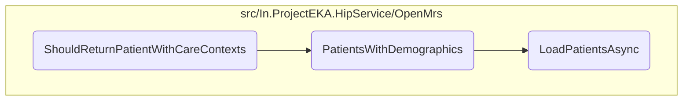

In this document, we will explain the process of retrieving patient data with care contexts. The process involves setting up test data, filtering patients by demographics, and loading patients asynchronously.

The flow begins by setting up the necessary test data and mocking the required repositories. Next, it retrieves patients with demographics matching the specified criteria such as name, gender, year of birth, and phone number. This involves loading patients asynchronously from an external API and filtering them to exclude those who already have an ABHA identifier. Finally, it matches the phone number and adds the filtered patients to the result list.

# Flow drill down



<SwmSnippet path="/test/In.ProjectEKA.HipServiceTest/Discovery/PatientDiscoveryTest.cs" line="355">

---

## Retrieving Patient Data

First, the <SwmToken path="test/In.ProjectEKA.HipServiceTest/Discovery/PatientDiscoveryTest.cs" pos="356:7:7" line-data="        private async void ShouldReturnPatientWithCareContexts()">`ShouldReturnPatientWithCareContexts`</SwmToken> method sets up the necessary test data and mocks the required repositories. It creates a discovery request and sets up the patient repository to return patients with demographics matching the request.

```c#
        [Fact]
        private async void ShouldReturnPatientWithCareContexts()
        {
            var careContextRepresentations = new[]
            {
                new CareContextRepresentation(Faker().Random.String(), Faker().Random.String()),
                new CareContextRepresentation(Faker().Random.String(), Faker().Random.String())
            };
            var expectedPatient = BuildExpectedPatientByExpectedMatchTypes(careContextRepresentations.ToList(),
                Match.Mobile,
                Match.Name,
                Match.Gender);
            var discoveryRequest = discoveryRequestBuilder.WithUnverifiedIdentifiers(null).Build();
            SetupLinkRepositoryWithLinkedPatient();
            SetupMatchingRepositoryForDiscoveryRequest(discoveryRequest);
            patientRepository.Setup(repository => repository.PatientsWithVerifiedId(null))
                .Returns((Task<IQueryable<HipLibrary.Patient.Model.Patient>>) null);
            patientRepository.Setup(repository => repository.PatientsWithDemographics(discoveryRequest.Patient.Name,
                    discoveryRequest.Patient.Gender.ToOpenMrsGender(),
                    discoveryRequest.Patient.YearOfBirth.ToString(), phoneNumber))
                .Returns(Task.FromResult(new List<HipLibrary.Patient.Model.Patient>
```

---

</SwmSnippet>

<SwmSnippet path="/src/In.ProjectEKA.HipService/OpenMrs/OpenMrsPatientRepository.cs" line="51">

---

## Filtering Patients by Demographics

Next, the <SwmToken path="src/In.ProjectEKA.HipService/OpenMrs/OpenMrsPatientRepository.cs" pos="51:12:12" line-data="        public async Task&lt;IQueryable&lt;Patient&gt;&gt; PatientsWithDemographics(string name,">`PatientsWithDemographics`</SwmToken> method retrieves patients with demographics matching the specified criteria (name, gender, year of birth, and phone number). It first loads patients using an asynchronous call to <SwmToken path="src/In.ProjectEKA.HipService/OpenMrs/OpenMrsPatientRepository.cs" pos="55:11:11" line-data="            var fhirPatients = await _patientDal.LoadPatientsAsync(name, gender, yearOfBirth);">`LoadPatientsAsync`</SwmToken>, then filters the patients to exclude those who already have an ABHA identifier. Finally, it matches the phone number and adds the filtered patients to the result list.

```c#
        public async Task<IQueryable<Patient>> PatientsWithDemographics(string name,
            AdministrativeGender? gender, string yearOfBirth, string phoneNumber)
        {
            var result = new List<Patient>();
            var fhirPatients = await _patientDal.LoadPatientsAsync(name, gender, yearOfBirth);
            foreach (var patient in fhirPatients)
            {
                if (!CheckIfPatientAlreadyHasAbhaIdentifier(patient.Identifier))
                {
                    var hipPatient = patient.ToHipPatient(name);
                    var referenceNumber = hipPatient.Uuid;
                    var bahmniPhoneNumber = _phoneNumberRepository.GetPhoneNumber(referenceNumber).Result;
                    if (bahmniPhoneNumber != null && phoneNumber[^PHONE_NUMBER_LENGTH..].Equals(bahmniPhoneNumber[^PHONE_NUMBER_LENGTH..]))
                    {
                        result.Add(hipPatient);
                    }
                }
            }
            return result.ToList().AsQueryable();
        }
```

---

</SwmSnippet>

<SwmSnippet path="/src/In.ProjectEKA.HipService/OpenMrs/FhirDiscoveryDataSource.cs" line="42">

---

## Loading Patients Asynchronously

Then, the <SwmToken path="src/In.ProjectEKA.HipService/OpenMrs/FhirDiscoveryDataSource.cs" pos="42:12:12" line-data="        public async Task&lt;List&lt;Patient&gt;&gt; LoadPatientsAsync(string name, AdministrativeGender? gender, string yearOfBirth)">`LoadPatientsAsync`</SwmToken> method asynchronously loads a list of patients by performing a GET request to an external OpenMRS API endpoint based on provided name, gender, and year of birth filters. It parses the JSON response and extracts Patient resources from the FHIR bundle.

```c#
        public async Task<List<Patient>> LoadPatientsAsync(string name, AdministrativeGender? gender, string yearOfBirth)
        {
            var path = DiscoveryPathConstants.OnPatientPath;
            var query = HttpUtility.ParseQueryString(string.Empty);
            if (!string.IsNullOrEmpty(name)) {
                query["name"]=name;
            }
            if (gender != null) {
                query["gender"]=gender.ToString().ToLower();
            }
            if (!string.IsNullOrEmpty(yearOfBirth)) {
                query["birthdate"]=yearOfBirth;
            }
            if (query.ToString() != ""){
                path = $"{path}?{query}";
            }

            var patients = new List<Patient>();
            var response = await openMrsClient.GetAsync(path);
            var content = await response.Content.ReadAsStringAsync();
            var bundle = new FhirJsonParser().Parse<Bundle>(content);
```

---

</SwmSnippet>

&nbsp;

*This is an auto-generated document by Swimm 🌊 and has not yet been verified by a human*

<SwmMeta version="3.0.0" repo-id="Z2l0aHViJTNBJTNBaGlwLXNlcnZpY2UlM0ElM0FTd2ltbS1EZW1v" repo-name="hip-service"><sup>Powered by [Swimm](/)</sup></SwmMeta>
