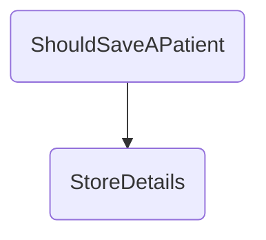

In this document, we will explain the process of determining whether a patient's details should be saved. The process involves validating the request and then storing the patient's details if the request is valid.

The flow starts with validating the patient's profile request to ensure it is properly formatted and complete. If the request is valid, the patient's details are then stored.

# Flow drill down



<SwmSnippet path="/test/In.ProjectEKA.HipServiceTest/Patient/PatientControllerTest.cs" line="80">

---

## Validating the Request

First, the <SwmToken path="test/In.ProjectEKA.HipServiceTest/Patient/PatientControllerTest.cs" pos="68:5:5" line-data="        private void ShouldSaveAPatient()">`ShouldSaveAPatient`</SwmToken> method sets up a mock patient profile request and ensures that the request is valid by calling the <SwmToken path="test/In.ProjectEKA.HipServiceTest/Patient/PatientControllerTest.cs" pos="80:11:11" line-data="            _patientProfileService.Setup(d =&gt; d.IsValidRequest(shareProfileRequest)).Returns(true);">`IsValidRequest`</SwmToken> method on the <SwmToken path="test/In.ProjectEKA.HipServiceTest/Patient/PatientControllerTest.cs" pos="80:1:1" line-data="            _patientProfileService.Setup(d =&gt; d.IsValidRequest(shareProfileRequest)).Returns(true);">`_patientProfileService`</SwmToken>. This step is crucial as it ensures that only properly formatted and complete requests are processed further.

```c#
            _patientProfileService.Setup(d => d.IsValidRequest(shareProfileRequest)).Returns(true);
```

---

</SwmSnippet>

&nbsp;

*This is an auto-generated document by Swimm 🌊 and has not yet been verified by a human*

<SwmMeta version="3.0.0" repo-id="Z2l0aHViJTNBJTNBaGlwLXNlcnZpY2UlM0ElM0FTd2ltbS1EZW1v" repo-name="hip-service"><sup>Powered by [Swimm](/)</sup></SwmMeta>
