```mermaid
graph TD;
  IIdentifierMatcher:::currentBaseStyle
IIdentifierMatcher --> PhoneNumberMatcher
IIdentifierMatcher --> MedicalRecordMatcher
IIdentifierMatcher --> HealthNumberMatcher
IIdentifierMatcher --> HealthIdMatcher
IIdentifierMatcher --> EmptyMatcher

 classDef currentBaseStyle color:#000000,fill:#7CB9F4

%% Swimm:
%% graph TD;
%%   IIdentifierMatcher:::currentBaseStyle
%% <SwmToken path="src/In.ProjectEKA.HipLibrary/Matcher/MedicalRecordMatcher.cs" pos="7:9:9" line-data="    public class MedicalRecordMatcher : IIdentifierMatcher">`IIdentifierMatcher`</SwmToken> --> PhoneNumberMatcher
%% <SwmToken path="src/In.ProjectEKA.HipLibrary/Matcher/MedicalRecordMatcher.cs" pos="7:9:9" line-data="    public class MedicalRecordMatcher : IIdentifierMatcher">`IIdentifierMatcher`</SwmToken> --> <SwmToken path="src/In.ProjectEKA.HipLibrary/Matcher/MedicalRecordMatcher.cs" pos="7:5:5" line-data="    public class MedicalRecordMatcher : IIdentifierMatcher">`MedicalRecordMatcher`</SwmToken>
%% <SwmToken path="src/In.ProjectEKA.HipLibrary/Matcher/MedicalRecordMatcher.cs" pos="7:9:9" line-data="    public class MedicalRecordMatcher : IIdentifierMatcher">`IIdentifierMatcher`</SwmToken> --> HealthNumberMatcher
%% <SwmToken path="src/In.ProjectEKA.HipLibrary/Matcher/MedicalRecordMatcher.cs" pos="7:9:9" line-data="    public class MedicalRecordMatcher : IIdentifierMatcher">`IIdentifierMatcher`</SwmToken> --> HealthIdMatcher
%% <SwmToken path="src/In.ProjectEKA.HipLibrary/Matcher/MedicalRecordMatcher.cs" pos="7:9:9" line-data="    public class MedicalRecordMatcher : IIdentifierMatcher">`IIdentifierMatcher`</SwmToken> --> EmptyMatcher
%% 
%%  classDef currentBaseStyle color:#000000,fill:#7CB9F4
```

This document will cover the class <SwmToken path="src/In.ProjectEKA.HipLibrary/Matcher/MedicalRecordMatcher.cs" pos="7:5:5" line-data="    public class MedicalRecordMatcher : IIdentifierMatcher">`MedicalRecordMatcher`</SwmToken> in detail. We will discuss:

1. What is <SwmToken path="src/In.ProjectEKA.HipLibrary/Matcher/MedicalRecordMatcher.cs" pos="7:9:9" line-data="    public class MedicalRecordMatcher : IIdentifierMatcher">`IIdentifierMatcher`</SwmToken>
2. What is <SwmToken path="src/In.ProjectEKA.HipLibrary/Matcher/MedicalRecordMatcher.cs" pos="7:5:5" line-data="    public class MedicalRecordMatcher : IIdentifierMatcher">`MedicalRecordMatcher`</SwmToken>
3. Variables and functions in <SwmToken path="src/In.ProjectEKA.HipLibrary/Matcher/MedicalRecordMatcher.cs" pos="7:5:5" line-data="    public class MedicalRecordMatcher : IIdentifierMatcher">`MedicalRecordMatcher`</SwmToken>



# What is <SwmToken path="src/In.ProjectEKA.HipLibrary/Matcher/MedicalRecordMatcher.cs" pos="7:9:9" line-data="    public class MedicalRecordMatcher : IIdentifierMatcher">`IIdentifierMatcher`</SwmToken>

<SwmToken path="src/In.ProjectEKA.HipLibrary/Matcher/MedicalRecordMatcher.cs" pos="7:9:9" line-data="    public class MedicalRecordMatcher : IIdentifierMatcher">`IIdentifierMatcher`</SwmToken> is an interface defined in <SwmPath>[src/In.ProjectEKA.HipLibrary/Matcher/IIdentifierMatcher.cs](src/In.ProjectEKA.HipLibrary/Matcher/IIdentifierMatcher.cs)</SwmPath>. It is used to define a contract for matching patient identifiers. The interface declares a method <SwmToken path="src/In.ProjectEKA.HipLibrary/Matcher/MedicalRecordMatcher.cs" pos="9:13:13" line-data="        public Expression&lt;Func&lt;Patient, bool&gt;&gt; Of(string value)">`Of`</SwmToken> which takes a string value and returns an <SwmToken path="src/In.ProjectEKA.HipLibrary/Matcher/MedicalRecordMatcher.cs" pos="9:3:11" line-data="        public Expression&lt;Func&lt;Patient, bool&gt;&gt; Of(string value)">`Expression<Func<Patient, bool>>`</SwmToken>. This method is intended to be implemented by classes that need to provide specific logic for matching patient identifiers.

# What is <SwmToken path="src/In.ProjectEKA.HipLibrary/Matcher/MedicalRecordMatcher.cs" pos="7:5:5" line-data="    public class MedicalRecordMatcher : IIdentifierMatcher">`MedicalRecordMatcher`</SwmToken>

<SwmToken path="src/In.ProjectEKA.HipLibrary/Matcher/MedicalRecordMatcher.cs" pos="7:5:5" line-data="    public class MedicalRecordMatcher : IIdentifierMatcher">`MedicalRecordMatcher`</SwmToken> is a class defined in <SwmPath>[src/In.ProjectEKA.HipLibrary/Matcher/MedicalRecordMatcher.cs](src/In.ProjectEKA.HipLibrary/Matcher/MedicalRecordMatcher.cs)</SwmPath>. It implements the <SwmToken path="src/In.ProjectEKA.HipLibrary/Matcher/MedicalRecordMatcher.cs" pos="7:9:9" line-data="    public class MedicalRecordMatcher : IIdentifierMatcher">`IIdentifierMatcher`</SwmToken> interface and provides the logic for matching medical record identifiers of patients. The class contains a single method <SwmToken path="src/In.ProjectEKA.HipLibrary/Matcher/MedicalRecordMatcher.cs" pos="9:13:13" line-data="        public Expression&lt;Func&lt;Patient, bool&gt;&gt; Of(string value)">`Of`</SwmToken> which takes a string value and returns an expression that checks if a patient's identifier matches the given value. This class is used in the context of identifying patients based on their medical record numbers.

<SwmSnippet path="/src/In.ProjectEKA.HipLibrary/Matcher/MedicalRecordMatcher.cs" line="9">

---

# Variables and functions

The function <SwmToken path="src/In.ProjectEKA.HipLibrary/Matcher/MedicalRecordMatcher.cs" pos="9:13:13" line-data="        public Expression&lt;Func&lt;Patient, bool&gt;&gt; Of(string value)">`Of`</SwmToken> is used to create an expression that matches a patient's identifier with the given value. It takes a string parameter <SwmToken path="src/In.ProjectEKA.HipLibrary/Matcher/MedicalRecordMatcher.cs" pos="9:17:17" line-data="        public Expression&lt;Func&lt;Patient, bool&gt;&gt; Of(string value)">`value`</SwmToken> and returns an <SwmToken path="src/In.ProjectEKA.HipLibrary/Matcher/MedicalRecordMatcher.cs" pos="9:3:11" line-data="        public Expression&lt;Func&lt;Patient, bool&gt;&gt; Of(string value)">`Expression<Func<Patient, bool>>`</SwmToken> that checks if the patient's identifier is equal to the provided value.

```c#
        public Expression<Func<Patient, bool>> Of(string value)
        {
            return patient => patient.Identifier == value;
        }
```

---

</SwmSnippet>

&nbsp;

*This is an auto-generated document by Swimm 🌊 and has not yet been verified by a human*

<SwmMeta version="3.0.0" repo-id="Z2l0aHViJTNBJTNBaGlwLXNlcnZpY2UlM0ElM0FTd2ltbS1EZW1v" repo-name="hip-service"><sup>Powered by [Swimm](/)</sup></SwmMeta>
