```mermaid
graph TD;
  IRanker:::currentBaseStyle
IRanker --> EmptyRanker
IRanker --> MobileRanker
IRanker --> NameRanker
IRanker --> GenderRanker
IRanker --> MedicalRecordRanker
IRanker --> 1[...]

 classDef currentBaseStyle color:#000000,fill:#7CB9F4

%% Swimm:
%% graph TD;
%%   IRanker:::currentBaseStyle
%% <SwmToken path="src/In.ProjectEKA.HipService/Discovery/Ranker/NameRanker.cs" pos="8:9:9" line-data="    public class NameRanker : IRanker&lt;Patient&gt;">`IRanker`</SwmToken> --> EmptyRanker
%% <SwmToken path="src/In.ProjectEKA.HipService/Discovery/Ranker/NameRanker.cs" pos="8:9:9" line-data="    public class NameRanker : IRanker&lt;Patient&gt;">`IRanker`</SwmToken> --> MobileRanker
%% <SwmToken path="src/In.ProjectEKA.HipService/Discovery/Ranker/NameRanker.cs" pos="8:9:9" line-data="    public class NameRanker : IRanker&lt;Patient&gt;">`IRanker`</SwmToken> --> <SwmToken path="src/In.ProjectEKA.HipService/Discovery/Ranker/NameRanker.cs" pos="8:5:5" line-data="    public class NameRanker : IRanker&lt;Patient&gt;">`NameRanker`</SwmToken>
%% <SwmToken path="src/In.ProjectEKA.HipService/Discovery/Ranker/NameRanker.cs" pos="8:9:9" line-data="    public class NameRanker : IRanker&lt;Patient&gt;">`IRanker`</SwmToken> --> GenderRanker
%% <SwmToken path="src/In.ProjectEKA.HipService/Discovery/Ranker/NameRanker.cs" pos="8:9:9" line-data="    public class NameRanker : IRanker&lt;Patient&gt;">`IRanker`</SwmToken> --> MedicalRecordRanker
%% <SwmToken path="src/In.ProjectEKA.HipService/Discovery/Ranker/NameRanker.cs" pos="8:9:9" line-data="    public class NameRanker : IRanker&lt;Patient&gt;">`IRanker`</SwmToken> --> 1[...]
%% 
%%  classDef currentBaseStyle color:#000000,fill:#7CB9F4
```

This document will cover the class <SwmToken path="src/In.ProjectEKA.HipService/Discovery/Ranker/NameRanker.cs" pos="8:5:5" line-data="    public class NameRanker : IRanker&lt;Patient&gt;">`NameRanker`</SwmToken> in detail. We will cover:

1. What is <SwmToken path="src/In.ProjectEKA.HipService/Discovery/Ranker/NameRanker.cs" pos="8:9:9" line-data="    public class NameRanker : IRanker&lt;Patient&gt;">`IRanker`</SwmToken>
2. What is <SwmToken path="src/In.ProjectEKA.HipService/Discovery/Ranker/NameRanker.cs" pos="8:5:5" line-data="    public class NameRanker : IRanker&lt;Patient&gt;">`NameRanker`</SwmToken>
3. Variables and functions in <SwmToken path="src/In.ProjectEKA.HipService/Discovery/Ranker/NameRanker.cs" pos="8:5:5" line-data="    public class NameRanker : IRanker&lt;Patient&gt;">`NameRanker`</SwmToken>



# What is <SwmToken path="src/In.ProjectEKA.HipService/Discovery/Ranker/NameRanker.cs" pos="8:9:9" line-data="    public class NameRanker : IRanker&lt;Patient&gt;">`IRanker`</SwmToken>

<SwmToken path="src/In.ProjectEKA.HipService/Discovery/Ranker/NameRanker.cs" pos="8:9:9" line-data="    public class NameRanker : IRanker&lt;Patient&gt;">`IRanker`</SwmToken> is an interface defined in the <SwmToken path="src/In.ProjectEKA.HipService/Discovery/Ranker/NameRanker.cs" pos="1:2:10" line-data="namespace In.ProjectEKA.HipService.Discovery.Ranker">`In.ProjectEKA.HipService.Discovery.Ranker`</SwmToken> namespace. It is used to rank elements based on a given criterion. The interface defines a single method <SwmToken path="src/In.ProjectEKA.HipService/Discovery/Ranker/NameRanker.cs" pos="10:8:8" line-data="        public PatientWithRank&lt;Patient&gt; Rank(Patient patient, string name)">`Rank`</SwmToken> which takes an element of type `T` and a string as parameters and returns a `PatientWithRank<T>` object. This interface is implemented by various classes to provide specific ranking logic based on different criteria.

# What is <SwmToken path="src/In.ProjectEKA.HipService/Discovery/Ranker/NameRanker.cs" pos="8:5:5" line-data="    public class NameRanker : IRanker&lt;Patient&gt;">`NameRanker`</SwmToken>

<SwmToken path="src/In.ProjectEKA.HipService/Discovery/Ranker/NameRanker.cs" pos="8:5:5" line-data="    public class NameRanker : IRanker&lt;Patient&gt;">`NameRanker`</SwmToken> is a class that implements the <SwmToken path="src/In.ProjectEKA.HipService/Discovery/Ranker/NameRanker.cs" pos="8:9:12" line-data="    public class NameRanker : IRanker&lt;Patient&gt;">`IRanker<Patient>`</SwmToken> interface. It is used to rank patients based on the similarity of their names to a given name. The class uses the Levenshtein distance algorithm to calculate the difference between the patient's name and the given name. Based on the calculated difference, it assigns a rank to the patient.

<SwmSnippet path="/src/In.ProjectEKA.HipService/Discovery/Ranker/NameRanker.cs" line="10">

---

# Variables and functions

The <SwmToken path="src/In.ProjectEKA.HipService/Discovery/Ranker/NameRanker.cs" pos="10:8:8" line-data="        public PatientWithRank&lt;Patient&gt; Rank(Patient patient, string name)">`Rank`</SwmToken> function is the main function of the <SwmToken path="src/In.ProjectEKA.HipService/Discovery/Ranker/NameRanker.cs" pos="8:5:5" line-data="    public class NameRanker : IRanker&lt;Patient&gt;">`NameRanker`</SwmToken> class. It takes a <SwmToken path="src/In.ProjectEKA.HipService/Discovery/Ranker/NameRanker.cs" pos="10:5:5" line-data="        public PatientWithRank&lt;Patient&gt; Rank(Patient patient, string name)">`Patient`</SwmToken> object and a string <SwmToken path="src/In.ProjectEKA.HipService/Discovery/Ranker/NameRanker.cs" pos="10:17:17" line-data="        public PatientWithRank&lt;Patient&gt; Rank(Patient patient, string name)">`name`</SwmToken> as parameters. It calculates the Levenshtein distance between the patient's name and the given name. If the distance is 0, it returns a <SwmToken path="src/In.ProjectEKA.HipService/Discovery/Ranker/NameRanker.cs" pos="10:3:3" line-data="        public PatientWithRank&lt;Patient&gt; Rank(Patient patient, string name)">`PatientWithRank`</SwmToken> object with a strong match rank. If the distance is less than or equal to 2, it returns a <SwmToken path="src/In.ProjectEKA.HipService/Discovery/Ranker/NameRanker.cs" pos="10:3:3" line-data="        public PatientWithRank&lt;Patient&gt; Rank(Patient patient, string name)">`PatientWithRank`</SwmToken> object with a rank of 8. Otherwise, it returns a <SwmToken path="src/In.ProjectEKA.HipService/Discovery/Ranker/NameRanker.cs" pos="10:3:3" line-data="        public PatientWithRank&lt;Patient&gt; Rank(Patient patient, string name)">`PatientWithRank`</SwmToken> object with an empty rank.

```c#
        public PatientWithRank<Patient> Rank(Patient patient, string name)
        {
            var diff = FuzzyNameMatcher.LevenshteinDistance(patient.Name, name);
            if (diff == 0)
                return new PatientWithRank<Patient>(patient, StrongMatchRank, FullMatchMeta(Match.Name));

            return diff <= 2
                ? new PatientWithRank<Patient>(patient, new Rank(8), FullMatchMeta(Match.Name))
                : new PatientWithRank<Patient>(patient, EmptyRank, EmptyMeta);
        }
```

---

</SwmSnippet>

<SwmSnippet path="/src/In.ProjectEKA.HipService/Discovery/Ranker/NameRanker.cs" line="12">

---

The variable <SwmToken path="src/In.ProjectEKA.HipService/Discovery/Ranker/NameRanker.cs" pos="12:3:3" line-data="            var diff = FuzzyNameMatcher.LevenshteinDistance(patient.Name, name);">`diff`</SwmToken> is used to store the Levenshtein distance between the patient's name and the given name. It is calculated using the <SwmToken path="src/In.ProjectEKA.HipService/Discovery/Ranker/NameRanker.cs" pos="12:7:9" line-data="            var diff = FuzzyNameMatcher.LevenshteinDistance(patient.Name, name);">`FuzzyNameMatcher.LevenshteinDistance`</SwmToken> function.

```c#
            var diff = FuzzyNameMatcher.LevenshteinDistance(patient.Name, name);
```

---

</SwmSnippet>

<SwmSnippet path="/src/In.ProjectEKA.HipService/Discovery/Ranker/NameRanker.cs" line="13">

---

If the <SwmToken path="src/In.ProjectEKA.HipService/Discovery/Ranker/NameRanker.cs" pos="13:4:4" line-data="            if (diff == 0)">`diff`</SwmToken> is 0, the function returns a <SwmToken path="src/In.ProjectEKA.HipService/Discovery/Ranker/NameRanker.cs" pos="14:5:5" line-data="                return new PatientWithRank&lt;Patient&gt;(patient, StrongMatchRank, FullMatchMeta(Match.Name));">`PatientWithRank`</SwmToken> object with a strong match rank and full match metadata for the name.

```c#
            if (diff == 0)
                return new PatientWithRank<Patient>(patient, StrongMatchRank, FullMatchMeta(Match.Name));
```

---

</SwmSnippet>

<SwmSnippet path="/src/In.ProjectEKA.HipService/Discovery/Ranker/NameRanker.cs" line="16">

---

If the <SwmToken path="src/In.ProjectEKA.HipService/Discovery/Ranker/NameRanker.cs" pos="16:3:3" line-data="            return diff &lt;= 2">`diff`</SwmToken> is less than or equal to 2, the function returns a <SwmToken path="src/In.ProjectEKA.HipService/Discovery/Ranker/NameRanker.cs" pos="17:5:5" line-data="                ? new PatientWithRank&lt;Patient&gt;(patient, new Rank(8), FullMatchMeta(Match.Name))">`PatientWithRank`</SwmToken> object with a rank of 8 and full match metadata for the name.

```c#
            return diff <= 2
                ? new PatientWithRank<Patient>(patient, new Rank(8), FullMatchMeta(Match.Name))
```

---

</SwmSnippet>

<SwmSnippet path="/src/In.ProjectEKA.HipService/Discovery/Ranker/NameRanker.cs" line="18">

---

If the <SwmToken path="src/In.ProjectEKA.HipService/Discovery/Ranker/NameRanker.cs" pos="12:3:3" line-data="            var diff = FuzzyNameMatcher.LevenshteinDistance(patient.Name, name);">`diff`</SwmToken> is greater than 2, the function returns a <SwmToken path="src/In.ProjectEKA.HipService/Discovery/Ranker/NameRanker.cs" pos="18:5:5" line-data="                : new PatientWithRank&lt;Patient&gt;(patient, EmptyRank, EmptyMeta);">`PatientWithRank`</SwmToken> object with an empty rank and empty metadata.

```c#
                : new PatientWithRank<Patient>(patient, EmptyRank, EmptyMeta);
```

---

</SwmSnippet>

&nbsp;

*This is an auto-generated document by Swimm 🌊 and has not yet been verified by a human*

<SwmMeta version="3.0.0" repo-id="Z2l0aHViJTNBJTNBaGlwLXNlcnZpY2UlM0ElM0FTd2ltbS1EZW1v" repo-name="hip-service"><sup>Powered by [Swimm](/)</sup></SwmMeta>
