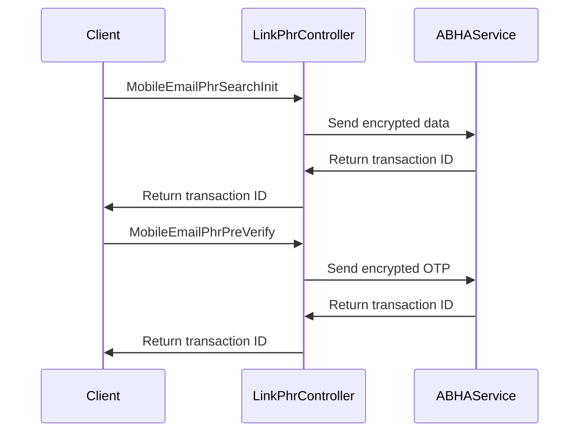

# Understanding Link PHR Controller

The Link PHR Controller is responsible for handling requests related to linking Personal Health Records (PHR) with the ABHA (Ayushman Bharat Health Account) address. It acts as an intermediary between the client and the ABHA service, facilitating various operations required for linking PHR addresses.

## Endpoints

The controller includes several endpoints such as <SwmToken path="src/In.ProjectEKA.HipService/Creation/LinkPhrController.cs" pos="44:10:10" line-data="        public async Task&lt;ActionResult&gt; MobileEmailPhrSearchInit(">`MobileEmailPhrSearchInit`</SwmToken>, <SwmToken path="src/In.ProjectEKA.HipService/Creation/LinkPhrController.cs" pos="89:10:10" line-data="        public async Task&lt;ActionResult&gt; MobileEmailPhrPreVerify(">`MobileEmailPhrPreVerify`</SwmToken>, <SwmToken path="src/In.ProjectEKA.HipService/Creation/LinkPhrController.cs" pos="125:10:10" line-data="        public async Task&lt;ActionResult&gt; GetUserTokenForMobileEmailPhr(">`GetUserTokenForMobileEmailPhr`</SwmToken>, <SwmToken path="src/In.ProjectEKA.HipService/Creation/LinkPhrController.cs" pos="168:10:10" line-data="        public async Task&lt;ActionResult&gt; LinkABHAAddress(">`LinkABHAAddress`</SwmToken>, and <SwmToken path="src/In.ProjectEKA.HipService/Creation/LinkPhrController.cs" pos="243:10:10" line-data="        public async Task&lt;ActionResult&gt; GetAuthModeForHealthId(">`GetAuthModeForHealthId`</SwmToken>. Each of these endpoints handles specific tasks in the linking process, such as initiating a search for PHR addresses, pre-verifying OTPs, obtaining user tokens, linking ABHA addresses, and retrieving authentication modes for health IDs.

### <SwmToken path="src/In.ProjectEKA.HipService/Creation/LinkPhrController.cs" pos="44:10:10" line-data="        public async Task&lt;ActionResult&gt; MobileEmailPhrSearchInit(">`MobileEmailPhrSearchInit`</SwmToken>

The <SwmToken path="src/In.ProjectEKA.HipService/Creation/LinkPhrController.cs" pos="44:10:10" line-data="        public async Task&lt;ActionResult&gt; MobileEmailPhrSearchInit(">`MobileEmailPhrSearchInit`</SwmToken> method initiates a search for PHR addresses using mobile or email. It encrypts the input data and sends a request to the ABHA service. The response is logged and processed to update the transaction dictionary with the transaction ID.

<SwmSnippet path="/src/In.ProjectEKA.HipService/Creation/LinkPhrController.cs" line="43">

---

This code snippet shows the implementation of the <SwmToken path="src/In.ProjectEKA.HipService/Creation/LinkPhrController.cs" pos="44:10:10" line-data="        public async Task&lt;ActionResult&gt; MobileEmailPhrSearchInit(">`MobileEmailPhrSearchInit`</SwmToken> method, which handles the search initiation for PHR addresses.

```c#
        [Route(MOBILE_EMAIL_INIT)]
        public async Task<ActionResult> MobileEmailPhrSearchInit(
            [FromHeader(Name = CORRELATION_ID)] string correlationId, [FromBody] MobileEmailPhrSearchInitRequest phrSearchInitRequest)
        {
            string sessionId = HttpContext.Items[SESSION_ID] as string;
            try
            {
                logger.Log(LogLevel.Information,
                    LogEvents.LinkingPhr,
                    "Search for phr-address to gateway: {@GatewayResponse}",
                    phrSearchInitRequest);
                logger.Log(LogLevel.Information,
                    LogEvents.LinkingPhr, $"correlationId: {{correlationId}}," +
                                        $" mobile/email: {{input}}",
                     correlationId, phrSearchInitRequest.input);
                string text = await EncryptText(phrSearchInitRequest.input);
                using (var response = await gatewayClient.CallABHAService(HttpMethod.Post,gatewayConfiguration.AbhaAddressServiceUrl, 
                    MOBILE_EMAIL_INIT, new MobileEmailPhrSearchInitRequest(text), correlationId))
                {
                    var responseContent = await response.Content.ReadAsStringAsync().ConfigureAwait(false);
                    if (response.IsSuccessStatusCode)
```

---

</SwmSnippet>

### <SwmToken path="src/In.ProjectEKA.HipService/Creation/LinkPhrController.cs" pos="89:10:10" line-data="        public async Task&lt;ActionResult&gt; MobileEmailPhrPreVerify(">`MobileEmailPhrPreVerify`</SwmToken>

The <SwmToken path="src/In.ProjectEKA.HipService/Creation/LinkPhrController.cs" pos="89:10:10" line-data="        public async Task&lt;ActionResult&gt; MobileEmailPhrPreVerify(">`MobileEmailPhrPreVerify`</SwmToken> method handles the <SwmToken path="src/In.ProjectEKA.HipService/Creation/LinkPhrController.cs" pos="99:12:14" line-data="                    &quot;Request for phr-address otp pre-verification to gateway: {@GatewayResponse}&quot;,">`pre-verification`</SwmToken> of OTPs for PHR addresses. It encrypts the OTP and sends a request to the ABHA service. The response is logged and processed to update the transaction dictionary with the transaction ID.

<SwmSnippet path="/src/In.ProjectEKA.HipService/Creation/LinkPhrController.cs" line="88">

---

This code snippet shows the implementation of the <SwmToken path="src/In.ProjectEKA.HipService/Creation/LinkPhrController.cs" pos="89:10:10" line-data="        public async Task&lt;ActionResult&gt; MobileEmailPhrPreVerify(">`MobileEmailPhrPreVerify`</SwmToken> method, which handles the OTP <SwmToken path="src/In.ProjectEKA.HipService/Creation/LinkPhrController.cs" pos="99:12:14" line-data="                    &quot;Request for phr-address otp pre-verification to gateway: {@GatewayResponse}&quot;,">`pre-verification`</SwmToken> for PHR addresses.

```c#
        [Route(MOBILE_EMAIL_PRE_VERIFICATION)]
        public async Task<ActionResult> MobileEmailPhrPreVerify(
            [FromHeader(Name = CORRELATION_ID)] string correlationId, [FromBody] MobileEmailPhrPreVerificationRequest otpVerifyRequest)
        {
            string sessionId = HttpContext.Items[SESSION_ID] as string;

            var txnId = TxnDictionary.ContainsKey(sessionId) ? TxnDictionary[sessionId] : null;
            try
            {
                logger.Log(LogLevel.Information,
                    LogEvents.LinkingPhr,
                    "Request for phr-address otp pre-verification to gateway: {@GatewayResponse}",
                    otpVerifyRequest);
                string text = await EncryptText(otpVerifyRequest.otp);
                using (var response = await gatewayClient.CallABHAService(HttpMethod.Post,gatewayConfiguration.AbhaAddressServiceUrl,
                    MOBILE_EMAIL_PRE_VERIFICATION, new MobileEmailPhrPreVerificationRequest(txnId,text), correlationId))
                {
                    var responseContent = await response.Content.ReadAsStringAsync().ConfigureAwait(false);
                    if (response.IsSuccessStatusCode)
                    {
                        var verificationResponse =
```

---

</SwmSnippet>

### <SwmToken path="src/In.ProjectEKA.HipService/Creation/LinkPhrController.cs" pos="125:10:10" line-data="        public async Task&lt;ActionResult&gt; GetUserTokenForMobileEmailPhr(">`GetUserTokenForMobileEmailPhr`</SwmToken>

The <SwmToken path="src/In.ProjectEKA.HipService/Creation/LinkPhrController.cs" pos="125:10:10" line-data="        public async Task&lt;ActionResult&gt; GetUserTokenForMobileEmailPhr(">`GetUserTokenForMobileEmailPhr`</SwmToken> method retrieves a user token for a PHR address. It sends a request to the ABHA service and processes the response to update the health ID token dictionary with the received token.

<SwmSnippet path="/src/In.ProjectEKA.HipService/Creation/LinkPhrController.cs" line="124">

---

This code snippet shows the implementation of the <SwmToken path="src/In.ProjectEKA.HipService/Creation/LinkPhrController.cs" pos="125:10:10" line-data="        public async Task&lt;ActionResult&gt; GetUserTokenForMobileEmailPhr(">`GetUserTokenForMobileEmailPhr`</SwmToken> method, which retrieves a user token for a PHR address.

```c#
        [Route(MOBILE_EMAIL_GET_USERTOKEN)]
        public async Task<ActionResult> GetUserTokenForMobileEmailPhr(
            [FromHeader(Name = CORRELATION_ID)] string correlationId, [FromBody] MobileEmailPhrGetUserTokenRequest userTokenRequest)
        {
            string sessionId = HttpContext.Items[SESSION_ID] as string;

            var txnId = TxnDictionary.ContainsKey(sessionId) ? TxnDictionary[sessionId] : null;
            try
            {
                logger.Log(LogLevel.Information,
                    LogEvents.LinkingPhr,
                    "Request for phr-address user token to gateway: {@GatewayResponse}",
                    userTokenRequest);
                using (var response = await gatewayClient.CallABHAService(HttpMethod.Post,gatewayConfiguration.AbhaAddressServiceUrl,
                    MOBILE_EMAIL_GET_USERTOKEN, new MobileEmailPhrGetUserTokenRequest(userTokenRequest.phrAddress,txnId), correlationId))
                {
                    var responseContent = await response.Content.ReadAsStringAsync().ConfigureAwait(false);
                    if (response.IsSuccessStatusCode)
                    {
                        var tokenResponse =
                            JsonConvert.DeserializeObject<MobileEmailPhrGetUserTokenResponse>(responseContent);
```

---

</SwmSnippet>

### <SwmToken path="src/In.ProjectEKA.HipService/Creation/LinkPhrController.cs" pos="168:10:10" line-data="        public async Task&lt;ActionResult&gt; LinkABHAAddress(">`LinkABHAAddress`</SwmToken>

The <SwmToken path="src/In.ProjectEKA.HipService/Creation/LinkPhrController.cs" pos="168:10:10" line-data="        public async Task&lt;ActionResult&gt; LinkABHAAddress(">`LinkABHAAddress`</SwmToken> method links a PHR address with an ABHA address. It sends a request to the ABHA service and processes the response to return the link response.

<SwmSnippet path="/src/In.ProjectEKA.HipService/Creation/LinkPhrController.cs" line="167">

---

This code snippet shows the implementation of the <SwmToken path="src/In.ProjectEKA.HipService/Creation/LinkPhrController.cs" pos="168:10:10" line-data="        public async Task&lt;ActionResult&gt; LinkABHAAddress(">`LinkABHAAddress`</SwmToken> method, which links a PHR address with an ABHA address.

```c#
        [Route(LINK_PHR_ADDRESS)]
        public async Task<ActionResult> LinkABHAAddress(
            [FromHeader(Name = CORRELATION_ID)] string correlationId, [FromBody] PhrAddressLinkRequest phrAddressLinkRequest)
        {
            string sessionId = HttpContext.Items[SESSION_ID] as string;

            var txnId = TxnDictionary.ContainsKey(sessionId) ? TxnDictionary[sessionId] : null;
            try
            {
                logger.Log(LogLevel.Information,
                    LogEvents.LinkingPhr,
                    "Request for link phr-address to gateway: {@GatewayResponse}",
                    phrAddressLinkRequest);
                using (var response = await gatewayClient.CallABHAService(HttpMethod.Post,gatewayConfiguration.AbhaAddressServiceUrl,
                    LINK_PHR_ADDRESS, new PhrAddressLinkRequest(phrAddressLinkRequest.action,txnId), correlationId, HealthIdTokenDictionary[sessionId]))
                {
                    var responseContent = await response.Content.ReadAsStringAsync().ConfigureAwait(false);
                    if (response.IsSuccessStatusCode)
                    {
                        var linkResponse =
                            JsonConvert.DeserializeObject<PhrAddressLinkResponse>(responseContent);
```

---

</SwmSnippet>

### <SwmToken path="src/In.ProjectEKA.HipService/Creation/LinkPhrController.cs" pos="243:10:10" line-data="        public async Task&lt;ActionResult&gt; GetAuthModeForHealthId(">`GetAuthModeForHealthId`</SwmToken>

The <SwmToken path="src/In.ProjectEKA.HipService/Creation/LinkPhrController.cs" pos="243:10:10" line-data="        public async Task&lt;ActionResult&gt; GetAuthModeForHealthId(">`GetAuthModeForHealthId`</SwmToken> method retrieves the authentication modes available for a health ID. It sends a request to the ABHA service and processes the response to update the health ID number dictionary with the received health ID number.

<SwmSnippet path="/src/In.ProjectEKA.HipService/Creation/LinkPhrController.cs" line="242">

---

This code snippet shows the implementation of the <SwmToken path="src/In.ProjectEKA.HipService/Creation/LinkPhrController.cs" pos="243:10:10" line-data="        public async Task&lt;ActionResult&gt; GetAuthModeForHealthId(">`GetAuthModeForHealthId`</SwmToken> method, which retrieves the authentication modes available for a health ID.

```c#
        [Route(TRANSACTION_INIT)]
        public async Task<ActionResult> GetAuthModeForHealthId(
            [FromHeader(Name = CORRELATION_ID)] string correlationId, [FromQuery(Name = "authMode")] string authMode)
        {
            string sessionId = HttpContext.Items[SESSION_ID] as string;
            
            try
            {
                logger.Log(LogLevel.Information,
                    LogEvents.LinkingPhr,
                    "Request for health id transaction to gateway with auth-mode: {@GatewayResponse}", authMode);
                using (var response = await gatewayClient.CallABHAService(HttpMethod.Post,gatewayConfiguration.AbhaAddressServiceUrl,
                    TRANSACTION_INIT, new HealthIdNumberRequest(authMode,HealthIdNumberDictionary[sessionId]), correlationId))
                {
                    var responseContent = await response.Content.ReadAsStringAsync().ConfigureAwait(false);
                    if (response.IsSuccessStatusCode)
                    {
                        var txnResponse =
                            JsonConvert.DeserializeObject<TransactionInitResponse>(responseContent);
                        TxnDictionary[sessionId] = txnResponse.transactionId;
                        return Accepted();
```

---

</SwmSnippet>



&nbsp;

*This is an auto-generated document by Swimm 🌊 and has not yet been verified by a human*

<SwmMeta version="3.0.0" repo-id="Z2l0aHViJTNBJTNBaGlwLXNlcnZpY2UlM0ElM0FTd2ltbS1EZW1v" repo-name="hip-service"><sup>Powered by [Swimm](/)</sup></SwmMeta>
