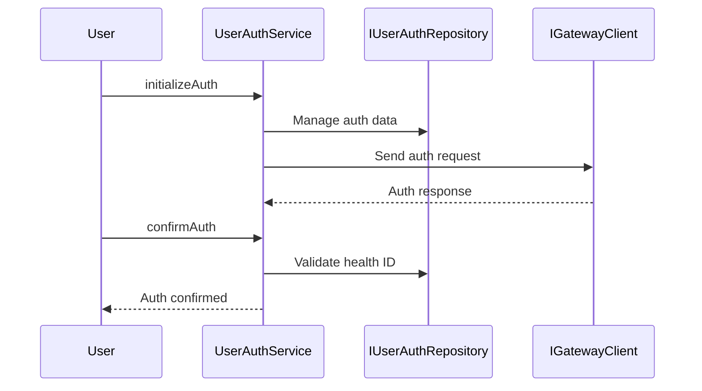

## Overview

The <SwmToken path="src/In.ProjectEKA.HipService/UserAuth/UserAuthService.cs" pos="22:5:5" line-data="    public class UserAuthService : IUserAuthService">`UserAuthService`</SwmToken> is responsible for handling user authentication processes. It interacts with the <SwmToken path="src/In.ProjectEKA.HipService/UserAuth/UserAuthService.cs" pos="24:5:5" line-data="        private readonly IUserAuthRepository userAuthRepository;">`IUserAuthRepository`</SwmToken> to manage user authentication data and uses the <SwmToken path="src/In.ProjectEKA.HipService/UserAuth/UserAuthService.cs" pos="26:5:5" line-data="        private readonly IGatewayClient gatewayClient;">`IGatewayClient`</SwmToken> to communicate with external gateways for authentication requests. The service includes methods for initializing authentication, confirming authentication, and fetching patient details. Additionally, it validates health IDs and handles errors related to authentication processes.

## Main Functions

The <SwmToken path="src/In.ProjectEKA.HipService/UserAuth/UserAuthService.cs" pos="22:5:5" line-data="    public class UserAuthService : IUserAuthService">`UserAuthService`</SwmToken> includes several main functions such as <SwmToken path="src/In.ProjectEKA.HipService/UserAuth/UserAuthService.cs" pos="38:11:11" line-data="        public Tuple&lt;GatewayFetchModesRequestRepresentation, ErrorRepresentation&gt; FetchModeResponse(">`FetchModeResponse`</SwmToken>, <SwmToken path="src/In.ProjectEKA.HipService/UserAuth/UserAuthService.cs" pos="61:10:10" line-data="        public async Task&lt;ErrorRepresentation&gt; AuthInit(AuthInitRequest authInitRequest,string correlationId,BahmniConfiguration bahmniConfiguration,GatewayConfiguration gatewayConfiguration)">`AuthInit`</SwmToken>, <SwmToken path="src/In.ProjectEKA.HipService/UserAuth/UserAuthService.cs" pos="121:11:11" line-data="        public Tuple&lt;AuthConfirmPatient, ErrorRepresentation&gt; GetPatientDetailsForDirectAuth(">`GetPatientDetailsForDirectAuth`</SwmToken>, <SwmToken path="src/In.ProjectEKA.HipService/UserAuth/UserAuthService.cs" pos="178:15:15" line-data="         public async Task&lt;Tuple&lt;AuthConfirmResponse, ErrorRepresentation&gt;&gt; AuthConfirm(AuthConfirmRequest authConfirmRequest,string correlationId,GatewayConfiguration gatewayConfiguration)">`AuthConfirm`</SwmToken>, <SwmToken path="src/In.ProjectEKA.HipService/UserAuth/UserAuthService.cs" pos="282:15:15" line-data="        public async Task&lt;Tuple&lt;AuthConfirm, ErrorRepresentation&gt;&gt; OnAuthConfirmResponse(">`OnAuthConfirmResponse`</SwmToken>, <SwmToken path="src/In.ProjectEKA.HipService/UserAuth/UserAuthService.cs" pos="331:10:10" line-data="        public async Task&lt;ErrorRepresentation&gt; AuthNotify(AuthNotifyRequest request)">`AuthNotify`</SwmToken>, and <SwmToken path="src/In.ProjectEKA.HipService/UserAuth/UserAuthService.cs" pos="357:7:7" line-data="        public async Task Dump(NdhmDemographics ndhmDemographics)">`Dump`</SwmToken>. We will dive deeper into the <SwmToken path="src/In.ProjectEKA.HipService/UserAuth/UserAuthService.cs" pos="61:10:10" line-data="        public async Task&lt;ErrorRepresentation&gt; AuthInit(AuthInitRequest authInitRequest,string correlationId,BahmniConfiguration bahmniConfiguration,GatewayConfiguration gatewayConfiguration)">`AuthInit`</SwmToken> and <SwmToken path="src/In.ProjectEKA.HipService/UserAuth/UserAuthService.cs" pos="178:15:15" line-data="         public async Task&lt;Tuple&lt;AuthConfirmResponse, ErrorRepresentation&gt;&gt; AuthConfirm(AuthConfirmRequest authConfirmRequest,string correlationId,GatewayConfiguration gatewayConfiguration)">`AuthConfirm`</SwmToken> functions.

### <SwmToken path="src/In.ProjectEKA.HipService/UserAuth/UserAuthService.cs" pos="61:10:10" line-data="        public async Task&lt;ErrorRepresentation&gt; AuthInit(AuthInitRequest authInitRequest,string correlationId,BahmniConfiguration bahmniConfiguration,GatewayConfiguration gatewayConfiguration)">`AuthInit`</SwmToken>

The <SwmToken path="src/In.ProjectEKA.HipService/UserAuth/UserAuthService.cs" pos="61:10:10" line-data="        public async Task&lt;ErrorRepresentation&gt; AuthInit(AuthInitRequest authInitRequest,string correlationId,BahmniConfiguration bahmniConfiguration,GatewayConfiguration gatewayConfiguration)">`AuthInit`</SwmToken> function initializes the authentication process. It validates the health ID, constructs the authentication request, and sends it to the gateway. It also handles the response from the gateway and updates the <SwmToken path="src/In.ProjectEKA.HipService/UserAuth/UserAuthService.cs" pos="85:4:4" line-data="                    if (UserAuthMap.RequestIdToErrorMessage.ContainsKey(requestId))">`UserAuthMap`</SwmToken> accordingly.

<SwmSnippet path="/src/In.ProjectEKA.HipService/UserAuth/UserAuthService.cs" line="61">

---

The <SwmToken path="src/In.ProjectEKA.HipService/UserAuth/UserAuthService.cs" pos="61:10:10" line-data="        public async Task&lt;ErrorRepresentation&gt; AuthInit(AuthInitRequest authInitRequest,string correlationId,BahmniConfiguration bahmniConfiguration,GatewayConfiguration gatewayConfiguration)">`AuthInit`</SwmToken> function initializes the authentication process by sending data to the gateway and handling the response. It logs the request and response details and handles any errors that occur during the process.

```c#
        public async Task<ErrorRepresentation> AuthInit(AuthInitRequest authInitRequest,string correlationId,BahmniConfiguration bahmniConfiguration,GatewayConfiguration gatewayConfiguration)
        {
            var (gatewayAuthInitRequestRepresentation, error) = AuthInitResponse(authInitRequest, bahmniConfiguration);
            if (error != null)
                return error;
            Guid requestId = gatewayAuthInitRequestRepresentation.requestId;
            var cmSuffix = gatewayConfiguration.CmSuffix;

            try
            {
                logger.Log(LogLevel.Information,
                    LogEvents.UserAuth,
                    "Request for auth-init to gateway: {@GatewayResponse}",
                    gatewayAuthInitRequestRepresentation.dump(gatewayAuthInitRequestRepresentation));
                logger.Log(LogLevel.Information, LogEvents.UserAuth, $"cmSuffix: {{cmSuffix}}," +
                                                                     $" correlationId: {{correlationId}}, " +
                                                                     $"healthId: {{healthId}}, requestId: {{requestId}}",
                    cmSuffix, correlationId, gatewayAuthInitRequestRepresentation.query.id, requestId);
                await gatewayClient.SendDataToGateway(PATH_AUTH_INIT, gatewayAuthInitRequestRepresentation, cmSuffix,
                    correlationId);
                var i = 0;
```

---

</SwmSnippet>

### <SwmToken path="src/In.ProjectEKA.HipService/UserAuth/UserAuthService.cs" pos="178:15:15" line-data="         public async Task&lt;Tuple&lt;AuthConfirmResponse, ErrorRepresentation&gt;&gt; AuthConfirm(AuthConfirmRequest authConfirmRequest,string correlationId,GatewayConfiguration gatewayConfiguration)">`AuthConfirm`</SwmToken>

The <SwmToken path="src/In.ProjectEKA.HipService/UserAuth/UserAuthService.cs" pos="178:15:15" line-data="         public async Task&lt;Tuple&lt;AuthConfirmResponse, ErrorRepresentation&gt;&gt; AuthConfirm(AuthConfirmRequest authConfirmRequest,string correlationId,GatewayConfiguration gatewayConfiguration)">`AuthConfirm`</SwmToken> function confirms the authentication process. It validates the health ID and constructs the authentication confirmation request. It sends the request to the gateway and handles the response, updating the <SwmToken path="src/In.ProjectEKA.HipService/UserAuth/UserAuthService.cs" pos="85:4:4" line-data="                    if (UserAuthMap.RequestIdToErrorMessage.ContainsKey(requestId))">`UserAuthMap`</SwmToken> with the access token and patient details.

<SwmSnippet path="/src/In.ProjectEKA.HipService/UserAuth/UserAuthService.cs" line="178">

---

The <SwmToken path="src/In.ProjectEKA.HipService/UserAuth/UserAuthService.cs" pos="178:15:15" line-data="         public async Task&lt;Tuple&lt;AuthConfirmResponse, ErrorRepresentation&gt;&gt; AuthConfirm(AuthConfirmRequest authConfirmRequest,string correlationId,GatewayConfiguration gatewayConfiguration)">`AuthConfirm`</SwmToken> function confirms the authentication process by sending the confirmation request to the gateway and handling the response. It logs the request and response details and updates the <SwmToken path="src/In.ProjectEKA.HipService/UserAuth/UserAuthService.cs" pos="85:4:4" line-data="                    if (UserAuthMap.RequestIdToErrorMessage.ContainsKey(requestId))">`UserAuthMap`</SwmToken> with the access token and patient details.

```c#
         public async Task<Tuple<AuthConfirmResponse, ErrorRepresentation>> AuthConfirm(AuthConfirmRequest authConfirmRequest,string correlationId,GatewayConfiguration gatewayConfiguration)
        {
            var (gatewayAuthConfirmRequestRepresentation, error) = AuthConfirmResponse(authConfirmRequest);
            if (error != null)
                return new Tuple<AuthConfirmResponse, ErrorRepresentation>(null, new ErrorRepresentation(new Error(ErrorCode.BadRequest,error.Error.Message)));
            var requestId = gatewayAuthConfirmRequestRepresentation.requestId;
            var cmSuffix = gatewayConfiguration.CmSuffix;

            try
            {
                logger.Log(LogLevel.Information,
                    LogEvents.UserAuth,
                    "Request for auth-confirm to gateway: {@GatewayResponse}",
                    gatewayAuthConfirmRequestRepresentation.dump(gatewayAuthConfirmRequestRepresentation));
                logger.Log(LogLevel.Information,
                    LogEvents.UserAuth, $" : {{cmSuffix}}, correlationId: {{correlationId}}," +
                                        $" authCode: {{authCode}}, transactionId: {{transactionId}} requestId: {{requestId}}",
                    cmSuffix, correlationId, gatewayAuthConfirmRequestRepresentation.credential.authCode,
                    gatewayAuthConfirmRequestRepresentation.transactionId, requestId);
                await gatewayClient.SendDataToGateway(PATH_AUTH_CONFIRM, gatewayAuthConfirmRequestRepresentation
                    , cmSuffix, correlationId);
```

---

</SwmSnippet>

## User Authentication Endpoints

The <SwmToken path="src/In.ProjectEKA.HipService/UserAuth/UserAuthService.cs" pos="22:5:5" line-data="    public class UserAuthService : IUserAuthService">`UserAuthService`</SwmToken> exposes several endpoints for user authentication.

### initializeAuth

The `initializeAuth` endpoint is responsible for starting the authentication process for a user. It interacts with the <SwmToken path="src/In.ProjectEKA.HipService/UserAuth/UserAuthService.cs" pos="24:5:5" line-data="        private readonly IUserAuthRepository userAuthRepository;">`IUserAuthRepository`</SwmToken> to manage user authentication data and uses the <SwmToken path="src/In.ProjectEKA.HipService/UserAuth/UserAuthService.cs" pos="26:5:5" line-data="        private readonly IGatewayClient gatewayClient;">`IGatewayClient`</SwmToken> to communicate with external gateways for authentication requests.

### confirmAuth

The `confirmAuth` endpoint is used to confirm the authentication of a user. It validates the provided health ID and handles any errors related to the authentication process. This endpoint ensures that the user is properly authenticated before accessing protected resources.



&nbsp;

*This is an auto-generated document by Swimm 🌊 and has not yet been verified by a human*

<SwmMeta version="3.0.0" repo-id="Z2l0aHViJTNBJTNBaGlwLXNlcnZpY2UlM0ElM0FTd2ltbS1EZW1v" repo-name="hip-service"><sup>Powered by [Swimm](/)</sup></SwmMeta>
