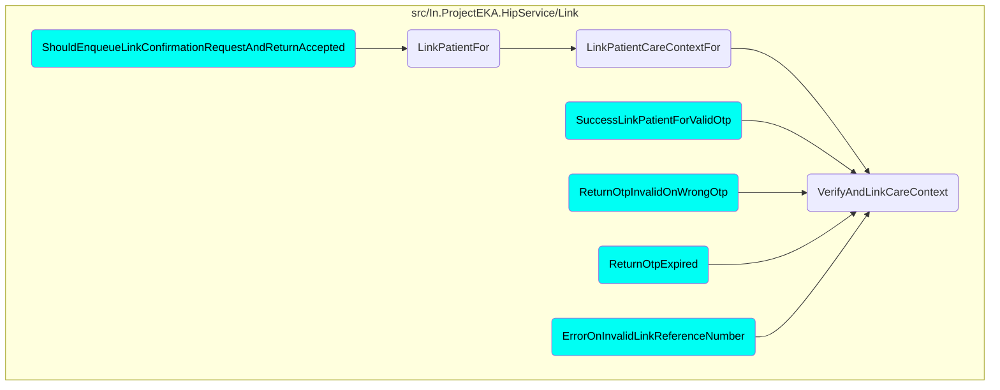
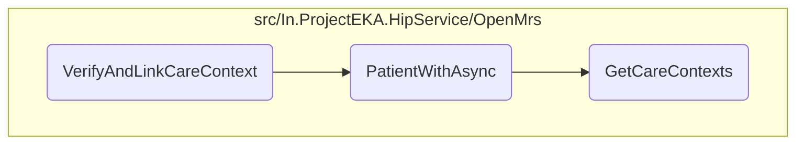

This document explains the process of verifying and linking patient care contexts. The process involves verifying the patient's information, retrieving patient details, checking care contexts, and updating the link request status.

The flow starts with verifying the patient's information using a link reference number and a token to ensure the patient is authenticated. Then, the patient's details, including care contexts and phone number, are retrieved. The retrieved care contexts are checked against the patient's profile, and if they match, the link request status is updated to indicate successful linking. Finally, the linked accounts are saved, and a confirmation response is returned. If any errors occur, appropriate error messages are provided.

# Where is this flow used?

This flow is used multiple times in the codebase as represented in the following diagram:



# Flow drill down



## Verifying and Linking Care Contexts

First, the <SwmToken path="src/In.ProjectEKA.HipService/Link/LinkPatient.cs" pos="133:1:1" line-data="            VerifyAndLinkCareContext(">`VerifyAndLinkCareContext`</SwmToken> function is responsible for verifying the patient's information using a link reference number and a token. This step ensures that the patient requesting the link is authenticated and authorized.

Next, the function retrieves the patient's information using the <SwmToken path="src/In.ProjectEKA.HipService/Link/LinkPatient.cs" pos="148:11:11" line-data="            var patient = await patientRepository.PatientWithAsync(linkEnquires.PatientReferenceNumber);">`PatientWithAsync`</SwmToken> method. This method fetches the patient's details, including care contexts and phone number, based on the patient's identifier.

Then, the function checks if the retrieved care contexts match the ones in the patient's profile. If they match, it updates the link request status to true, indicating that the care contexts have been successfully linked.

<SwmSnippet path="/src/In.ProjectEKA.HipService/Link/LinkPatient.cs" line="132">

---

Finally, the function saves the linked accounts and returns a confirmation response. If any errors occur during the process, appropriate error messages are returned to inform the user.

```c#
        public virtual async Task<ValueTuple<PatientLinkConfirmationRepresentation, string, ErrorRepresentation>>
            VerifyAndLinkCareContext(
            LinkConfirmationRequest request)
        {
            var (linkEnquires, exception) =
                await linkPatientRepository.GetPatientFor(request.LinkReferenceNumber);
            var cmId = "";
            if (exception != null)
                return (null,cmId,
                    new ErrorRepresentation(new Error(ErrorCode.NoLinkRequestFound, ErrorMessage.NoLinkRequestFound)));
            cmId = linkEnquires.ConsentManagerId;

            var errorResponse = await patientVerification.Verify(request.LinkReferenceNumber, request.Token);
            if (errorResponse != null)
                return (null,cmId, new ErrorRepresentation(errorResponse.toError()));

            var patient = await patientRepository.PatientWithAsync(linkEnquires.PatientReferenceNumber);
            return await patient.Map( async patient =>
                {
                    var savedLinkRequests = await linkPatientRepository.Get(request.LinkReferenceNumber);
                    savedLinkRequests.MatchSome(linkRequests =>
```

---

</SwmSnippet>

&nbsp;

*This is an auto-generated document by Swimm 🌊 and has not yet been verified by a human*

<SwmMeta version="3.0.0" repo-id="Z2l0aHViJTNBJTNBaGlwLXNlcnZpY2UlM0ElM0FTd2ltbS1EZW1v" repo-name="hip-service"><sup>Powered by [Swimm](/)</sup></SwmMeta>
