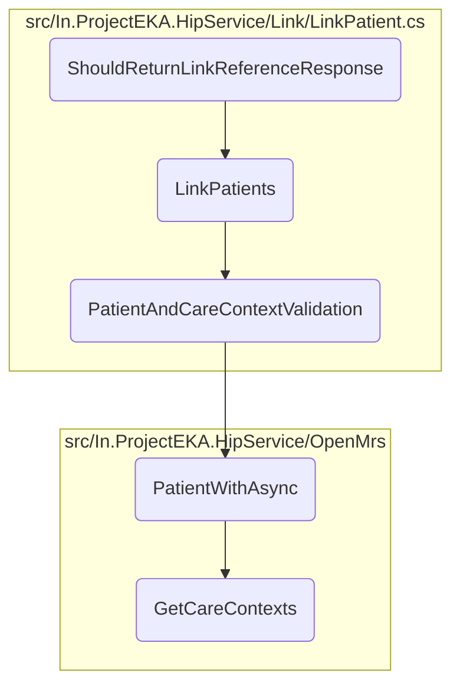

This document explains the process of verifying the entire flow of linking a patient to their care contexts and generating a link reference response. It involves setting up necessary mock objects, initiating the link request, and asserting the response.

The flow starts by setting up mock objects and expectations. Then, it initiates a link request for the patient. Finally, it checks if the response contains the correct link reference number, authentication type, communication hint, and medium.

# Flow drill down



<SwmSnippet path="/test/In.ProjectEKA.HipServiceTest/Link/LinkPatientTest.cs" line="69">

---

## <SwmToken path="test/In.ProjectEKA.HipServiceTest/Link/LinkPatientTest.cs" pos="70:7:7" line-data="        private async void ShouldReturnLinkReferenceResponse()">`ShouldReturnLinkReferenceResponse`</SwmToken>

The <SwmToken path="test/In.ProjectEKA.HipServiceTest/Link/LinkPatientTest.cs" pos="70:7:7" line-data="        private async void ShouldReturnLinkReferenceResponse()">`ShouldReturnLinkReferenceResponse`</SwmToken> method is a test case that verifies the entire flow of linking a patient to their care contexts and generating a link reference response. It sets up the necessary mock objects and expectations, initiates the link request, and asserts that the response contains the correct link reference number, authentication type, communication hint, and medium.

```c#
        [Fact]
        private async void ShouldReturnLinkReferenceResponse()
        {
            const string linkReferenceNumber = "linkreference";
            const string authType = "MEDIATED";
            const string programRefNo = "129";
            const string medium = "MOBILE";

            var patientReferenceRequest = getPatientReferenceRequest(programRefNo);
            guidGenerator.Setup(x => x.NewGuid()).Returns(linkReferenceNumber);
            patientVerification.Setup(x => x.SendTokenFor(new Session(linkReferenceNumber
                    , new Communication(CommunicationMode.MOBILE, testPatient.PhoneNumber)
                    , new OtpGenerationDetail(TestBuilder.Faker().Random.Word(), OtpAction.LINK_PATIENT_CARECONTEXT.ToString()))))
                .ReturnsAsync((OtpMessage) null);
            var initiatedLinkRequest = new InitiatedLinkRequest(patientReferenceRequest.RequestId,
                                                                patientReferenceRequest.TransactionId,
                                                                linkReferenceNumber,
                                                                false,
                                                                It.IsAny<string>());
            linkRepository.Setup(x => x.SaveRequestWith(linkReferenceNumber,
                    patientReferenceRequest.Patient.ConsentManagerId,
```

---

</SwmSnippet>

&nbsp;

*This is an auto-generated document by Swimm 🌊 and has not yet been verified by a human*

<SwmMeta version="3.0.0" repo-id="Z2l0aHViJTNBJTNBaGlwLXNlcnZpY2UlM0ElM0FTd2ltbS1EZW1v" repo-name="hip-service"><sup>Powered by [Swimm](/)</sup></SwmMeta>
